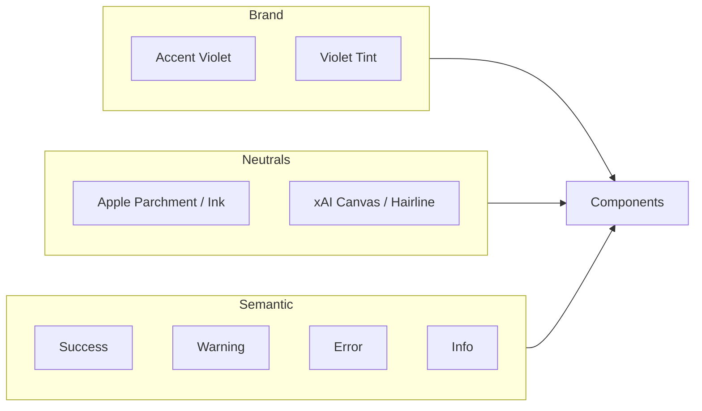

# 03b — Design References, Tokens & Wireframes

**Status:** draft  
**Sources:** [Apple getdesign](../package/templates/apple.md), [xAI getdesign](../package/templates/x.ai.md), iA Writer, Drafts, Things, internal mockups  
**Icons:** [Lucide](https://lucide.dev/icons/) only — no emojis, no custom SVG shapes

## Context

Rhodes needs a concrete visual system: color tokens (Light from Apple, Dark from xAI), a violet accent (mockup „Ask AI“), component states, and ASCII wireframes for every major UI state.

## Decision

- **Accent:** restrained violet `#7C5CF6` (not neon)
- **One right panel** with segmented tabs — never two or three simultaneous sidebars
- **Header:** two thematic zones (context left · actions right)
- **Icons:** Lucide React (`lucide-react`) — standard names only

---

## 1. Color system overview

Rhodes replaces Apple Action Blue and xAI white-primary with a **violet accent family**. Neutrals and structure come from Apple (light) and xAI (dark). Semantic colors stay muted — no SaaS rainbow.



### 1.1 Brand violet (derived from mockup)

| Token | Hex | Role |
|-------|-----|------|
| `--color-accent` | `#7C5CF6` | Primary actions, links, focus ring, insight dot |
| `--color-accent-hover` | `#6B4CE0` | Button/link hover |
| `--color-accent-active` | `#5B3FCC` | Button pressed |
| `--color-accent-muted` | `#EDE9FE` | Selected row bg (light) |
| `--color-accent-muted-strong` | `#DDD6FE` | Active tab bg (light) |
| `--color-accent-on-dark` | `#A78BFA` | Links/accents on dark canvas |
| `--color-accent-subtle` | `#F5F3FF` | Insight highlight, AI text tint bg |

**Complementary pair (UI use, not literal wheel):** violet + warm neutral gold for rare emphasis (`--color-complement` `#B8956A` — sparingly, e.g. „pinned“). Primary complement in UI is **cool gray-violet** (`--color-secondary`).

### 1.2 Primary / secondary / tertiary

| Role | Light | Dark | Use |
|------|-------|------|-----|
| **Primary** | `--color-accent` | `--color-accent-on-dark` | CTA, primary buttons, active nav |
| **Secondary** | `#6E6E73` | `#7D8187` | Secondary buttons, muted labels (Apple ink-muted / xAI body-mid) |
| **Tertiary** | `#AEAEB2` | `#5C5F66` | Placeholders, disabled text |
| **Surface-raised** | `#FFFFFF` | `#1A1C20` | Cards, panels |
| **Surface-sunken** | `#F5F5F7` | `#0A0A0A` | Page background |

### 1.3 Status colors (restrained)

| Status | Light | Dark | Lucide icon |
|--------|-------|------|-------------|
| Success | `#2E7D32` bg `#E8F5E9` | `#4ADE80` bg `#14532D` | `circle-check` |
| Warning | `#B45309` bg `#FEF3C7` | `#FBBF24` bg `#78350F` | `triangle-alert` |
| Error | `#C13515` bg `#FEE2E2` | `#F87171` bg `#7F1D1D` | `circle-x` |
| Info | `#2563EB` bg `#DBEAFE` | `#60A5FA` bg `#1E3A5F` | `info` |
| Draft | `--color-secondary` | `--color-secondary` | `file-pen` |
| In progress | `--color-accent` | `--color-accent-on-dark` | `loader` |

Status pills: `rounded-full`, 12px caption, icon 14px left — never full-width colored bars.

---

## 2. CSS custom properties — full mapping

### 2.1 Light theme (`:root`, from Apple)

```css
:root,
[data-theme="light"] {
  /* Canvas & surfaces — Apple parchment system */
  --color-bg: #F5F5F7;              /* apple canvas-parchment */
  --color-bg-elevated: #FFFFFF;      /* apple canvas */
  --color-surface: #FAFAFC;          /* apple surface-pearl */
  --color-surface-hover: #F0F0F2;    /* apple divider-soft */
  --color-border: #E0E0E0;           /* apple hairline */
  --color-border-subtle: #F0F0F0;    /* apple divider-soft */

  /* Text — Apple ink */
  --color-text: #1D1D1F;              /* apple ink */
  --color-text-secondary: #6E6E73;   /* apple ink-muted-48 */
  --color-text-tertiary: #AEAEB2;
  --color-text-inverse: #FFFFFF;

  /* Brand violet */
  --color-accent: #7C5CF6;
  --color-accent-hover: #6B4CE0;
  --color-accent-active: #5B3FCC;
  --color-accent-muted: #EDE9FE;
  --color-accent-subtle: #F5F3FF;
  --color-accent-on-accent: #FFFFFF;

  /* Links */
  --color-link: var(--color-accent);
  --color-link-hover: var(--color-accent-hover);
  --color-link-visited: #6B4CE0;

  /* Focus */
  --color-focus-ring: rgba(124, 92, 246, 0.45);
  --focus-ring-width: 2px;
  --focus-ring-offset: 2px;

  /* Editor */
  --color-editor-bg: #FFFFFF;
  --color-editor-selection: rgba(124, 92, 246, 0.18);
  --color-editor-cursor: var(--color-accent);

  /* Shadows — Apple: no chrome shadows; only floating UI */
  --shadow-float: 0 4px 24px rgba(0, 0, 0, 0.08);
  --shadow-header: 0 1px 0 var(--color-border-subtle);

  /* Radius — Apple rounded */
  --radius-sm: 8px;
  --radius-md: 11px;
  --radius-lg: 18px;
  --radius-pill: 9999px;

  /* Typography */
  --font-ui: "SF Pro Text", -apple-system, BlinkMacSystemFont, "Segoe UI", sans-serif;
  --font-editor: var(--font-ui);
  --font-mono: "SF Mono", ui-monospace, Menlo, monospace;
}
```

### 2.2 Dark theme (`[data-theme="dark"]`, from xAI)

```css
[data-theme="dark"] {
  /* Canvas — xAI near-black */
  --color-bg: #0A0A0A;               /* xAI canvas */
  --color-bg-elevated: #141416;
  --color-surface: #1A1C20;          /* xAI canvas-soft */
  --color-surface-hover: #212327;
  --color-border: #212327;           /* xAI hairline */
  --color-border-subtle: #1A1C20;

  /* Text — xAI */
  --color-text: #FFFFFF;             /* xAI ink */
  --color-text-secondary: #DADBDF;   /* xAI body */
  --color-text-tertiary: #7D8187;   /* xAI mute */
  --color-text-inverse: #0A0A0A;

  /* Brand violet — lighter on dark */
  --color-accent: #A78BFA;
  --color-accent-hover: #B89FFC;
  --color-accent-active: #8B6FE8;
  --color-accent-muted: #2E1065;
  --color-accent-subtle: #1E1B2E;
  --color-accent-on-accent: #0A0A0A;

  --color-link: var(--color-accent);
  --color-link-hover: var(--color-accent-hover);
  --color-link-visited: #8B6FE8;

  --color-focus-ring: rgba(167, 139, 250, 0.5);

  --color-editor-bg: #0A0A0A;
  --color-editor-selection: rgba(167, 139, 250, 0.25);
  --color-editor-cursor: var(--color-accent);

  --shadow-float: 0 8px 32px rgba(0, 0, 0, 0.45);
  --shadow-header: 0 1px 0 var(--color-border);
}
```

### 2.3 Spacing (Apple scale, unchanged from 03a)

```css
--space-xs: 4px;
--space-sm: 8px;
--space-md: 16px;
--space-lg: 24px;
--space-xl: 40px;
--space-2xl: 64px;
--header-height: 48px;
--panel-width-sm: 320px;
--panel-width-md: 420px;
--editor-max-width: 720px;
```

---

## 3. Components — buttons, links, inputs

### 3.1 Buttons

| Variant | Light | Dark | Lucide (optional) |
|---------|-------|------|-------------------|
| **Primary** | bg `--color-accent`, text white | bg `--color-accent`, text `--color-text-inverse` | — |
| **Secondary** | bg transparent, border `--color-border`, text `--color-text` | border `--color-border`, text `--color-text-secondary` | — |
| **Ghost** | bg transparent, text `--color-text-secondary` | same | — |
| **Danger** | bg `#C13515`, text white | bg `#7F1D1D`, text `#FCA5A5` | `trash-2` |
| **Icon** | 40×40, `--radius-sm`, ghost hover | same | per action |

**Interaction states (all buttons):**

| State | Effect |
|-------|--------|
| Default | As above |
| Hover | `background: accent-hover` or `surface-hover`; `transition: 150ms ease` |
| Active | `scale(0.98)`; accent-active |
| Focus-visible | `box-shadow: 0 0 0 var(--focus-ring-width) var(--color-focus-ring)` |
| Disabled | `opacity: 0.4`; `pointer-events: none` |
| Loading | Lucide `loader-circle` spin; label opacity 0.6 |

Padding: primary `11px 22px` (Apple pill), icon-only `10px`.

### 3.2 Links

| Type | Style |
|------|-------|
| Inline (editor) | `color: --color-link`, underline on hover only |
| Nav link | `color: --color-text-secondary`, hover `--color-text` |
| Active nav | `color: --color-accent`, `font-weight: 500` |
| Breadcrumb | `chevron-right` separator, 14px, tertiary color |

### 3.3 Inputs

| State | Border | Background |
|-------|--------|------------|
| Default | `--color-border` | `--color-bg-elevated` |
| Hover | `--color-border` darker 1 step | `--color-surface` |
| Focus | `--color-accent` 1px + focus ring | `--color-bg-elevated` |
| Error | status error border | error tint bg |
| Disabled | `--color-border-subtle` | `--color-surface` |

Search input: Lucide `search` left, `⌘K` hint right (text, not emoji), `--radius-md`.

---

## 4. Icon system (Lucide only)

Install: `lucide-react`. Use stroke width `1.75`, size `20` in header, `18` in panels, `16` in lists.

### Header

| Action | Lucide name |
|--------|-------------|
| Scope / space | `chevron-down` + space label |
| Documents list | `files` |
| Search | `search` |
| Library | `book-open` |
| New document | `plus` |
| Profile | `circle-user` (avatar replaces when set) |
| Theme toggle | `sun` / `moon` |
| Sidebar close | `panel-right-close` |

### Editor bubble menu

| Action | Lucide name |
|--------|-------------|
| Ask AI | `sparkles` |
| Bold | `bold` |
| Italic | `italic` |
| Link | `link` |
| Quote / cite | `quote` |
| Heading | `heading` |

### Right panel tabs

| Tab | Lucide name |
|-----|-------------|
| Insights | `lightbulb` |
| Ask | `message-square` |
| Properties | `sliders-horizontal` |

### Documents / Library

| Action | Lucide name |
|--------|-------------|
| Recent | `clock` |
| All | `layout-list` |
| Import | `upload` |
| PDF | `file-text` |
| Filter | `list-filter` |

**Rule:** Never use emoji. Never invent custom SVG paths. If Lucide has no match, use the closest semantic icon or text label.

---

## 5. Header anatomy

Two zones, 48px height, `--shadow-header` on scroll.

```
┌─────────────────────────────────────────────────────────────────────────────┐
│  CONTEXT (left)                          │  ACTIONS (right)                  │
│  [chevron-down Private] · [files Docs] · │  [search] [book-open] [plus]     │
│  Document title (inline edit)            │  [circle-user] [sun/moon]         │
└─────────────────────────────────────────────────────────────────────────────┘
```

| Zone | Items | Behavior |
|------|-------|----------|
| **Scope** | `chevron-down` + space name | Dropdown: **Personal** (1+ private spaces, + New personal space) · **Team** (+ New team space) |
| **Documents** | `files` + „Documents“ | Opens Documents view (State D) |
| **Title** | Current doc title | Inline edit; hidden in Documents/Library full views |
| **Search** | `search` | Opens Cmd+K overlay (State H) |
| **Library** | `book-open` | Opens Library view (State F) |
| **New** | `plus` | Menu: Blank, From template |
| **Profile** | Avatar or `circle-user` | Dropdown → Settings, Sign out |
| **Mode** | `sun` / `moon` | Toggle light/dark/system |

**Zen mode:** header hides when scrolling down in the editor; reappears when scrolling back to the document start or when the pointer enters the top 8px edge.

**Properties trigger:** In document meta row next to scope (`Private` / shared status) — `sliders-horizontal` + „Properties“ opens right panel on Properties tab. Not in app header.

---

## 6. Right panel — one sidebar, three tabs

**Never** open Insights + Properties + Ask as separate columns.

```
┌──────────────────────────┐
│ [Insights] [Ask] [Props] │  ← segmented control, 40px
├──────────────────────────┤
│                          │
│   Tab content            │
│                          │
└──────────────────────────┘
```

| Tab | Width | Opens when |
|-----|-------|------------|
| **Insights** | 320px default, 45% expanded | `• N` clicked or auto-suggest |
| **Ask** | 320px | User selects Ask tab or bubble „sparkles“ |
| **Properties** | 320px | Properties link in document meta (next to scope) or Properties tab when panel open |

Switching tabs preserves panel open state. `panel-right-close` or Escape closes entire panel.

Editor reflows: `max-width` stays 720px centered in **remaining** viewport width.

---

## 7. Wireframes by UI state

### State A — Editor (default, zen)

```
┌─────────────────────────────────────────────────────────────────────────────┐
│ Private ▾   Documents   Q3 Product Spec          search  book  +  user  sun │  hidden on type
├─────────────────────────────────────────────────────────────────────────────┤
│                                                                             │
│                         [← breadcrumb optional]                             │
│                         Q3 Product Spec                                     │
│                         Updated 8 min ago · Private · Properties            │
│                         ─────────────────                                   │
│                                                                             │
│                         Objective and scope                                 │
│                         Body text at 18px, max 720px...                   │
│                                                                             │
│                                                                    ● 3      │  insight dot
└─────────────────────────────────────────────────────────────────────────────┘
```

- Lucide insight dot: small `lightbulb` in violet circle, not emoji bullet
- No sidebars open

---

### State A2 — Editor + floating bubble (text selected)

```
│                         ...align with international█                      │
│                    ┌──────────────────────────────────────┐               │
│                    │ sparkles Ask │ B I link quote │ ...    │               │
│                    └──────────────────────────────────────┘               │
```

- `--shadow-float`, `--radius-md`, bg `--color-bg-elevated`
- `sparkles` + „Ask“ opens right panel on **Ask** tab

---

### State B — Editor + right panel (Insights tab)

```
├──────────────────────────────────────────────┬────────────────────────────┤
│                                              │ Insights  Ask  Properties  │
│              (editor, narrower)              ├────────────────────────────┤
│                                              │ 94%  Reforge Growth.pdf    │
│                                              │ Why: matches your ARR...   │
│                                              │ ─────────────────────────  │
│                                              │ 87%  Post-Experiment Q2    │
│                                              │ [panel-right-close]        │
└──────────────────────────────────────────────┴────────────────────────────┘
```

Expanded insight: panel 45%, split shows source preview + „quote“ action.

---

### State C — Editor + right panel (Properties tab)

```
├──────────────────────────────────────────────┬────────────────────────────┤
│                                              │ Insights  Ask  Properties* │
│              (editor)                        ├────────────────────────────┤
│                                              │ Status    [In progress ▾]  │
│                                              │ Tags      feature +        │
│                                              │ Due       Nov 10           │
│                                              │ History   View versions →  │
└──────────────────────────────────────────────┴────────────────────────────┘
```

---

### State C2 — Editor + right panel (Ask tab)

```
├──────────────────────────────────────────────┬────────────────────────────┤
│                                              │ Insights  Ask*  Properties │
│              (editor)                        ├────────────────────────────┤
│                                              │ Ask about this workspace   │
│                                              │ ─────────────────────────  │
│                                              │ User: Summarize connections│
│                                              │ AI: Based on [Source]...   │
│                                              │ [message input]      send  │
└──────────────────────────────────────────────┴────────────────────────────┘
```

`send` uses Lucide `arrow-up` in primary circle button.

---

### State D — Documents view (Recent / All / Search)

Full canvas replaces editor. Header title zone shows „Documents“.

```
├─────────────────────────────────────────────────────────────────────────────┤
│ Private ▾   Documents*   ···                    search  book  +  user  sun │
├─────────────────────────────────────────────────────────────────────────────┤
│  [clock Recent*]  [layout-list All]              [list-filter] [search...]  │
├─────────────────────────────────────────────────────────────────────────────┤
│  Today                                                                      │
│  ┌─────────────────────────────────────────────────────────────────────┐   │
│  │ Q3 Product Spec          Updated 8m ago        In progress          │   │
│  │ Meeting Notes — Growth   Updated 2h ago        Draft                  │   │
│  └─────────────────────────────────────────────────────────────────────┘   │
│  Yesterday                                                                  │
│  │ Post-Experiment Valid.   Updated 1d ago                                 │   │
└─────────────────────────────────────────────────────────────────────────────┘
```

- Row click → opens editor (State A)
- No left sidebar; tabs are horizontal under header
- Search field filters list inline (or opens Cmd+K)

---

### State F — Library view

```
├─────────────────────────────────────────────────────────────────────────────┤
│ Private ▾   Documents   Library*                  search  book  +  user  sun│
├─────────────────────────────────────────────────────────────────────────────┤
│  ┌ ─ ─ ─ ─ ─ ─ ─ ─ ─ ─ ─ ─ ─ ─ ─ ─ ─ ─ ─ ─ ─ ─ ─ ─ ─ ─ ─ ─ ─ ─ ─ ─ ┐   │
│  │  upload   Drop PDF, DOCX, or TXT — or click to browse              │   │
│  └ ─ ─ ─ ─ ─ ─ ─ ─ ─ ─ ─ ─ ─ ─ ─ ─ ─ ─ ─ ─ ─ ─ ─ ─ ─ ─ ─ ─ ─ ─ ─ ─ ┘   │
│  Sources                                                                    │
│  │ file-text  Reforge Growth.pdf     12 MB    Ready    Nov 2              │   │
│  │ file-text  AARRR Framework.pdf    4 MB     Indexing …                  │   │
└─────────────────────────────────────────────────────────────────────────────┘
```

---

### State G — Profile / Settings overlay

```
├─────────────────────────────────────────────────────────────────────────────┤
│  arrow-left  Settings                                                       │
├──────────────┬──────────────────────────────────────────────────────────────┤
│ Profile      │  Display name    [____________]                              │
│ Security     │  Email           kalle@… (locked)                            │
│ Preferences  │  Language        [English ▾]                               │
│ Spaces       │  Theme           ( ) System (•) Light ( ) Dark               │
│ Team         │                                                              │
│ Billing      │                                                              │
│ Privacy      │                                                              │
└──────────────┴──────────────────────────────────────────────────────────────┘
```

- `arrow-left` returns to editor
- Left nav only inside Settings overlay (exception to no-left-sidebar rule)

---

### State H — Cmd+K command palette

Centered modal, `--shadow-float`, `--radius-lg`, max-width 560px.

```
│                    ┌────────────────────────────────────┐                   │
│                    │ search  Search or type a command... │                   │
│                    ├────────────────────────────────────┤                   │
│                    │ RECENT                                             │                   │
│                    │ file    Q3 Product Spec                            │                   │
│                    │ ACTIONS                                            │                   │
│                    │ plus    New document                               │                   │
│                    │ upload  Import file                                │                   │
│                    │ files   Open documents                             │                   │
│                    │ sparkles Ask about workspace                       │                   │
│                    └────────────────────────────────────┘                   │
```

- Overlay dims bg `rgba(0,0,0,0.4)` light / `0.6` dark
- Arrow keys navigate; Enter executes

---

## 8. Motion & interaction summary

| Element | Property | Value |
|---------|----------|-------|
| Header hide/show | `transform: translateY` | 200ms ease-out |
| Right panel | `transform: translateX` | 250ms ease-out |
| Cmd+K modal | `opacity` + `scale(0.98→1)` | 150ms ease-out |
| Button press | `transform: scale(0.98)` | 100ms |
| Insight dot appear | `opacity` + `scale` | 400ms once |
| List row hover | `background: surface-hover` | 150ms |
| Tab switch | cross-fade content | 150ms |

`prefers-reduced-motion: reduce` → all durations `0ms`.

---

## 9. Typography (final)

| Role | Size | Weight | Tracking |
|------|------|--------|----------|
| Document title | 28px | 600 | -0.02em |
| Editor H2 | 22px | 600 | -0.01em |
| Editor body | 18px | 400 | 0 |
| UI body | 15px | 400 | -0.01em (Apple) |
| Caption / meta | 13px | 400 | 0 |
| Panel tab | 13px | 500 | 0 |
| Button | 15px | 500 | 0 |

Light: SF Pro / system stack. Dark: Inter fallback (xAI pattern) until custom font decision.

---

## 10. Mapping to implementation

| Artifact | Path (planned) |
|----------|----------------|
| CSS variables | `rhodes-app/src/styles/tokens.css` |
| Lucide wrapper | `rhodes-app/src/components/ui/icon.tsx` |
| Header | `rhodes-app/src/components/chrome/app-header.tsx` |
| Right panel | `rhodes-app/src/components/chrome/right-panel.tsx` |
| Bubble menu | TipTap `BubbleMenu` + Lucide icons |

---

## Open questions

- Custom font for editor (iA-style mono option)?
- ~~Documents view: full replace vs slide-over editor?~~ **Resolved:** full canvas (see State D, F)
- ~~Insight dot: always `lightbulb` or count badge `3` in violet pill?~~ **Resolved:** `lightbulb` icon + count in violet pill (see `ui-mock/`)

## UI mock prototype

Interactive prototype: [../ui-mock/](../ui-mock/) — Vite + React, clickable views and sticker sheet.

## Dependencies

- [03-ux-ui-design.md](03-ux-ui-design.md)
- [03a-design-language.md](03a-design-language.md)
- [06-ai-chat.md](06-ai-chat.md)
- [11-editor-tiptap.md](11-editor-tiptap.md)
- [20-workflows.md](20-workflows.md)
- [23-user-settings-and-spaces.md](23-user-settings-and-spaces.md)
