# 05 — AI and RAG

**Status:** draft

## Context

Rhodes core value is semantic connection while writing. This requires embeddings, vector search, and local LLM generation — all on CPU-only VPS hardware.

## Decision

- **RAG stack:** pgvector retrieval + Ollama generation (no cloud LLM in V1)
- **CPU-only:** quantized models, Redis queue, streaming responses
- **Embeddings:** `nomic-embed-text`, 768 dimensions
- **Self-extending:** auto-index on document save and library upload (no web crawl)

## Specification

### RAG architecture

```mermaid
flowchart TD
  subgraph write [While Writing]
    Editor[Editor] -->|3s debounce| EmbedReq[Embed Request]
    EmbedReq --> OllamaEmbed[Ollama nomic-embed-text]
    OllamaEmbed --> RPC[match_workspace_knowledge]
    RPC --> Results[Top K Chunks]
    Results --> LLMGen[Ollama 3B/8B]
    LLMGen --> Sidebar[Insight Sidebar]
  end

  subgraph ingest [On Ingest]
    Upload[File Upload] --> Tika[Apache Tika]
    Tika --> Chunk[Chunker]
    Chunk --> BatchEmbed[Batch Embed Queue]
    BatchEmbed --> Summary[LLM Summary]
    Summary --> DB[(Postgres)]
  end
```



### Model roster (CPU-only)

| Role | Model | RAM | Notes |
|------|-------|-----|-------|
| Embeddings | `nomic-embed-text` | ~500 MB | 768D, multilingual |
| Fast tasks | `llama3.2:3b-instruct-q4_K_M` | ~2 GB | "Why relevant?", short summaries |
| Chat / long summary | `llama3.1:8b-instruct-q4_K_M` | ~5 GB | Streaming, 2–3 tok/s on 8 vCPU |
| Fallback | `mistral:7b-instruct-q4_K_M` | ~4.5 GB | If Llama quality insufficient |

**Ollama config:**
```
OLLAMA_MAX_LOADED_MODELS=1
OLLAMA_NUM_PARALLEL=2
```

Only one inference model loaded at a time; embedding model stays resident.

### CPU constraints

| Constraint | Mitigation |
|------------|------------|
| Slow inference (8–20s) | Stream tokens; show "Thinking…" in sidebar |
| Concurrent users | Redis queue (BullMQ), max 2 parallel LLM jobs |
| RAM pressure | Q4 quantization; unload inference model when idle 10min |
| Timeout | 30s hard limit → fallback to retrieval-only (no generated text) |

### Retrieval parameters

| Parameter | Default | Notes |
|-----------|---------|-------|
| `match_threshold` | 0.72 | Tune per workspace size |
| `match_count` | 8 | Show top 4 in UI |
| Debounce (writing) | 3000ms | Never block editor |
| Chunk size | 512 tokens | 64 token overlap |
| Re-embed on save | If plain text diff > 15% | Avoid unnecessary work |

### Generation guardrails

**"Why relevant?" prompt rules:**
1. Only reference provided chunks — no hallucinated sources
2. Max 1 sentence, <120 characters
3. Respond in document or user locale
4. Include source reference inline

**Summary on ingest:**
- Exactly 5 bullet points
- Language = detected document language

### Self-extending RAG

| Trigger | Action |
|---------|--------|
| Document save (debounced) | Re-embed if content changed significantly |
| Library upload complete | Chunk → embed → summarize |
| Nightly cron | Re-process `embedding_status = failed` |
| Model version change | Background migration job, `embedding_model_version` column |

**Not in V1:** web crawling, email ingestion, automatic external API feeds.

### Optional reranking (V1.5)

Cross-encoder rerank top-20 to top-4 before LLM. Evaluate `bge-reranker-base` on CPU if precision insufficient.

## Open questions

- Switch to `mxbai-embed-large` (1024D) for better multilingual retrieval?
- Per-workspace match_threshold tuning in admin?

## Dependencies

- [04-data-model.md](04-data-model.md)
- [06-ai-chat.md](06-ai-chat.md)
- [13-infrastructure-vps.md](13-infrastructure-vps.md)
- [16-ingestion-pipeline.md](16-ingestion-pipeline.md)
- [21-i18n.md](21-i18n.md)
- [adr/002-ollama-cpu-only.md](adr/002-ollama-cpu-only.md)
- [adr/004-embedding-model-768d.md](adr/004-embedding-model-768d.md)
