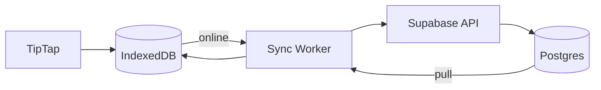

# 12 — Offline Sync

**Status:** draft

## Context

The PRD requires offline writing with conflict-free sync. IndexedDB is specified but no conflict strategy is defined.

## Decision

**Local-first with server-authoritative merge:** IndexedDB as write buffer; Last-Write-Wins (LWW) per document field with vector clock lite (`updated_at` + `client_id`).

## Specification

### Architecture



### IndexedDB schema (client)

```
rhodes-db/
├── documents/{id}     — content, title, updated_at, sync_status
├── outbox/            — pending mutations queue
└── meta/              — last_sync_cursor, active_space_id
```

### Sync protocol

1. **On edit:** write to IndexedDB immediately; add to outbox
2. **On online:** process outbox FIFO → PATCH document API
3. **On pull:** fetch documents where `updated_at > last_cursor`
4. **Conflict:** if server `updated_at` > local when pushing:
   - Compare `content_plain` hash
   - If different: save local as `document_versions` branch, apply server, notify user once

### Conflict UX

Toast (once per conflict):
> "This document was updated elsewhere. Your version was saved to history."

Link opens version history in ⓘ sidebar.

### Offline indicators

| State | UI |
|-------|-----|
| Online | No indicator |
| Offline | Subtle dot in header + one-time toast |
| Syncing | Brief spinner in header (only if outbox > 0) |
| Conflict resolved | Toast with history link |

### Scope

- Offline: **documents only** in V1 (not library uploads)
- Library upload queues in outbox when offline → processes on reconnect

### Not in V1

- CRDT / Yjs real-time collaboration
- Operational transform

## Open questions

- Full workspace snapshot in IndexedDB vs active doc only?
- Service Worker for true PWA install?

## Dependencies

- [04-data-model.md](04-data-model.md)
- [09-document-history.md](09-document-history.md)
- [11-editor-tiptap.md](11-editor-tiptap.md)
