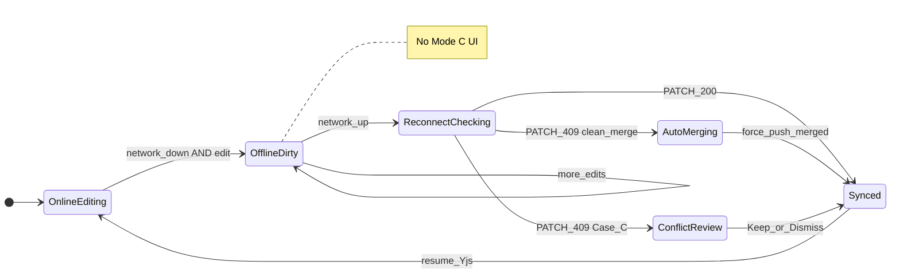
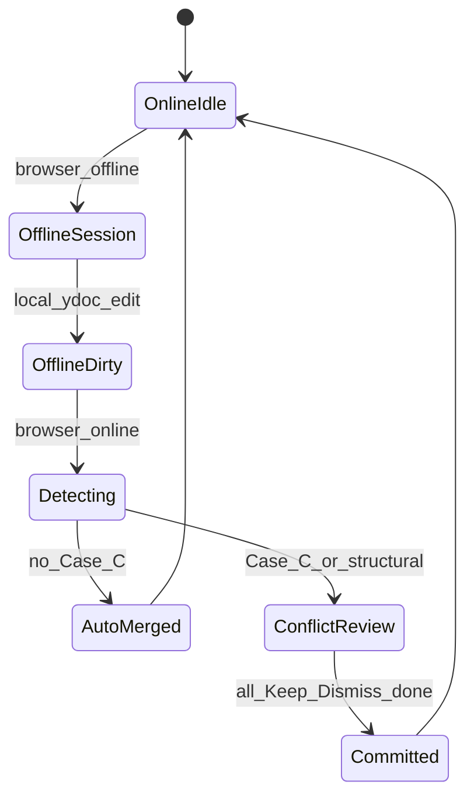
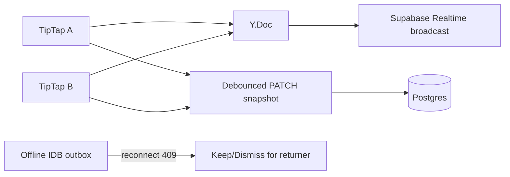

# 12 — Offline Sync & Live Collaboration

**Status:** draft

## Context

Rhodes needs offline writing and Google Docs–style live co-editing when multiple users are online on the same document.

## Decision

Two complementary systems:

1. **Live collaboration (both online):** TipTap + **Yjs** over Supabase Realtime broadcast (`ydoc:{documentId}`). Peers see each other’s keystrokes and carets in place. Postgres `documents.content` remains the durable snapshot (debounced PATCH).
2. **Offline outbox (Wave A):** IndexedDB write buffer + `expected_updated_at` OCC. Conflict Compare UI is **only for the reconnecting offline client** after a 409 — not for online peers.

O-007 (Yjs) is **in scope** for this milestone.

## Reconnect state machine


```mermaid
stateDiagram-v2
  direction LR
  [*] --> OnlineEditing
  OnlineEditing --> OfflineDirty: network_down AND edit
  OfflineDirty --> OfflineDirty: more_edits
  note right of OfflineDirty: No Mode C UI
  OfflineDirty --> ReconnectChecking: network_up
  ReconnectChecking --> Synced: PATCH_200
  ReconnectChecking --> AutoMerging: PATCH_409 clean_merge
  ReconnectChecking --> ConflictReview: PATCH_409 Case_C
  AutoMerging --> Synced: force_push_merged
  ConflictReview --> Synced: Keep_or_Dismiss
  Synced --> OnlineEditing: resume_Yjs
```

| Phase | UI |
|-------|-----|
| `offline_dirty` | Sync indicator only — **never** conflict float |
| `reconnect_checking` | “Checking for conflicts…” banner |
| `auto_merging` | Silent merge + push (no float) |
| `conflict_review` | Thin status bar + **inline** highlighted spans with variant rows below blocks |

### Yjs offline conflict (runtime truth)

**Baseline for this rewrite:** `b6897c3` on `feature/phase-09-offline-wave-a`.

Live collab offline conflicts are **not** driven by outbox HTTP 409. They are driven by the Yjs provider + `useOfflineYjsConflict` on the **reconnecting returner only**.


```mermaid
stateDiagram-v2
  [*] --> OnlineIdle
  OnlineIdle --> OfflineSession: browser_offline
  OfflineSession --> OfflineDirty: local_ydoc_edit
  OfflineDirty --> Detecting: browser_online
  Detecting --> AutoMerged: no_Case_C
  Detecting --> ConflictReview: Case_C_or_structural
  ConflictReview --> Committed: all_Keep_Dismiss_done
  AutoMerged --> OnlineIdle
  Committed --> OnlineIdle
```

#### Flags and storage

| Layer | Flag / key | Meaning |
|-------|------------|---------|
| Hook | `offlineSessionActiveRef` | This tab has an offline editing session |
| Hook | `mineSnapshotLockedRef` | Mine frozen for review / reconnect |
| Hook | `conflictReviewArmedRef` | Detection already opened review |
| Hook | `reviewPending` | Conflict float / inline UI active |
| Provider | `offlineSessionPending` | Defer peer updates from go-offline |
| Provider | `offlineReviewActive` | Review shield; blocks outbound y-updates + persist on returner |
| Provider | `deferPeerUpdates` | Queue peer sync/update instead of applying |
| Awareness | `conflictReviewPending` | Peers can see returner is reviewing |
| IDB | `offline_base:` / `offline_mine:` | Snapshots for detection |
| sessionStorage | `rhodes:offline-session:{docId}` | Resume marker for this page load |

#### Versions used in detection

| Version | Source |
|---------|--------|
| **Base** | Yjs state when the tab went offline |
| **Mine** | Yjs state after offline edits (refreshed on each local edit) |
| **Peer / theirs** | Base ⊕ deferred peer updates (peer-only contribution) |
| **Merged** | Live mine doc ⊕ deferred peer updates (shadow, detection only) |

#### Product contract (A–D)

| ID | Requirement |
|----|-------------|
| **A** | Conflict UI only when a real Case C / structural conflict exists |
| **B** | Float + Diff Modal name only peers who touched that block |
| **C** | After resolve / auto-merge, every client shows the same body |
| **D** | After last Keep/Dismiss, conflict UI and inline decorations fully tear down |

#### Convergence model (shipped)

1. During review: Keep/Dismiss record **decisions as data** only; live Y.Doc stays on the mine shield.
2. After all decisions: **absorb** deferred peer CRDT history → one body rewrite on the returner → broadcast as a **normal `y-update`**.
3. Peers apply that update like any other edit. Do **not** force-replace peer fragments. `y-block-resolved` is retired (no-op stub only).
4. Clean auto-merge (no Case C): `releaseDeferredPeerUpdates` → broadcast pending local updates → clear IDB snapshots.
5. Teardown is atomic via `endConflictReviewSession` — clears `reviewPending`, clusters, reviews, shield, and decorations together.

#### Manual UAT gates (S1–S9 + A–D)

| ID | Scenario | Expect |
|----|----------|--------|
| S1 | A offline edits; nobody else changes | No float; A's edits on all clients |
| S2 | A edits blk1; B edits blk2 | No float; both edits present |
| S3 | A and B rewrite same span | Float; Keep→A; Dismiss→B; all clients identical |
| S4 | A edits blk1; B deletes blk1 | Float with delete copy; Keep/Dismiss converge |
| S5 | A deletes blk1; B edits blk1 | Float; Keep→gone; Dismiss→B text |
| S6 | B adds blk while A offline | No float; A's edits + B's new block |
| S7 | B and C both edit same block | Parties = only who touched; one commit |
| S8 | Idle C online; only B conflicts | Parties = A+B only (**not** C) |
| S9 | Second offline cycle after resolve | Clean baseline; no stuck UI |
| **A** | Solo / non-overlap | No conflict UI |
| **B** | Attribution | Float/modal names only touchers |
| **C** | After resolve | Identical body on all clients (~2s) |
| **D** | After last Keep/Dismiss | No phantoms/strikethrough; editor editable |

#### UI (accepted for M1)

- Document conflict float (Keep / Dismiss / Show me)
- Conflict compare modal (base-aligned Your version vs peer columns)
- Inline highlights + phantom segments via `ConflictInlineExtension`

---

### Yjs offline conflict review (legacy note)

When a user edits offline while peers edit online, the **reconnecting client** enters `conflict_review`:

- Peer Yjs updates are **deferred** on the returner; outbound sync is **blocked** until resolved.
- Peers see `conflictReviewPending` via awareness; only the **returner** pauses persist during their own review.
- Inline UI: float + compare modal + highlighted spans (not variant rows below blocks).
- Resolution decisions are recorded per block; a **single commit** converges all clients via normal Yjs updates.
- Presence (`nudgeLocalAwareness`) continues during offline session/review so carets return after reconnect.


## Three-version merge (offline 409)

At 409 time an immutable **ConflictBundle** is stored in IndexedDB:

- **Base** — last synced body when the tab went offline
- **Mine** — outbox payload at 409
- **Theirs** — server body at 409

Per block:

| Case | Rule | UI |
|------|------|-----|
| A | Only mine changed vs base | Auto-keep mine |
| B | Only theirs changed vs base | Auto-keep theirs |
| C | Both changed (overlapping text) | Keep / Dismiss |

Same-block **prepend + append** edits merge at word level without Case C.

## Comments (orthogonal to body)

- Canonical store: `documents.metadata.comments`
- On 409: union comments from mine + theirs metadata
- After body merge: **re-anchor** by `blockId` + `anchorText` (never paint stale positions)
- Orphaned threads stay in metadata but skip highlights

## Architecture


```mermaid
flowchart LR
  TipTapA[TipTap A] --> YDoc[Y.Doc]
  TipTapB[TipTap B] --> YDoc
  YDoc --> Broadcast[Supabase Realtime broadcast]
  TipTapA --> Snapshot[Debounced PATCH snapshot]
  TipTapB --> Snapshot
  Snapshot --> PG[(Postgres)]
  Offline[Offline IDB outbox] -->|reconnect 409| Compare[Keep/Dismiss for returner]
```

### Live collab rules

| Situation | Behavior |
|-----------|----------|
| A and B both online | Yjs merges; CollaborationCursor carets; **no** Mode C / Compare |
| Remote Postgres UPDATE while Yjs active | Update OCC clock only — do **not** LWW-replace the editor |
| Snapshot PATCH 409 while Yjs active | Rebase `expected_updated_at` and retry — no Compare banner |

### Offline rules

| Situation | Behavior |
|-----------|----------|
| User offline | Local IDB + outbox; writing only (no AI/Insights required) |
| Reconnect, outbox 409, clean merge | Auto-push merged body — **no** float |
| Reconnect, outbox 409, Case C | **That user** sees Keep / Dismiss |
| Always-online peer | Uninterrupted; not asked to resolve the offline user’s conflict |

### IndexedDB schema (client)

```
rhodes-db/
├── documents/{id}       — content, title, updated_at, sync_status
├── outbox/              — pending mutations queue
├── conversations/{id}   — encrypted Ask history (client-only; never synced)
├── vault/{userId}       — per-user AES-GCM DEK (device-local)
└── meta/                — client_id, conflict_bundle:{id}, offline_sync_phase:{id}
```

### Sync protocol (offline)

1. **On edit (offline or pending):** write IndexedDB; enqueue outbox; phase → `offline_dirty`
2. **On online:** push outbox FIFO → PATCH (`expected_updated_at`)
3. **409:** store ConflictBundle; decide auto-merge vs Mode C
4. **On resolve:** Keep/Dismiss re-merge from bundle; re-anchor comments; force push

### Automated QA

```bash
cd apps/web
pnpm test:offline          # unit: merge, snapshots, comments (18 tests)
pnpm test:e2e:offline      # browser: set RHODES_E2E_DOC_ID first
```

E2E env vars:

- `RHODES_E2E_DOC_ID` — document UUID to open (logged-in session cookies in browser profile)
- `RHODES_E2E_DOC_URL` — full editor URL alternative
- `RHODES_E2E_CONFLICT=1` — enable C1 two-user conflict spec

### Manual UAT

1. Both online: A types in a paragraph → B sees characters in the same place (no Accept).
2. Both online: A adds a block → B sees it without conflict UI.
3. A offline edits; B online edits **different blocks**; A returns → auto-merge, no float; B’s edits kept.
4. A offline edits block X; B edits block X overlapping → only A sees Mode C on X.
5. A offline adds comment; B adds comment elsewhere → both survive after merge with correct authors.

## Not claimed

- Offline AI / Insights
- Perfect CRDT persistence across all devices without snapshot (Yjs room is ephemeral; Postgres snapshot is durable)

## Dependencies

- [04-data-model.md](04-data-model.md)
- [09-document-history.md](09-document-history.md)
- [11-editor-tiptap.md](11-editor-tiptap.md)
- [19-open-decisions.md](19-open-decisions.md) — O-007
