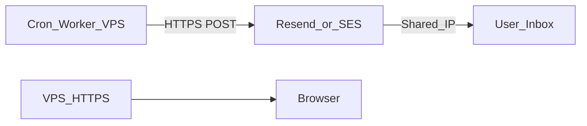

# 14 — Email Delivery

**Status:** draft

## Context

Rhodes sends transactional email: Knowledge Bridge reports, team invites, password reset. Self-hosted SMTP from the app VPS risks destroying IP reputation for HTTPS/API traffic too.

## Decision

Use a **managed email relay** (Resend for MVP, AWS SES EU for scale). The VPS never sends SMTP — only HTTPS API calls.

## Specification

### Why not self-hosted (Postal / Mailcow)

| Risk | Impact |
|------|--------|
| New IP has zero reputation | Gmail/Outlook spam folder |
| 2–4 week IP warmup required | Delayed launch |
| Spam complaint on VPS IP | Affects `rhodes.app` HTTPS reputation |
| Hetzner may block port 25 | SMTP won't work |
| Ops burden | Patches, bounce handling, blacklist monitoring |

### Recommended providers

| Provider | When | IP model | GDPR |
|----------|------|----------|------|
| **Resend** | MVP | Shared pre-warmed pool ([docs](https://resend.mintlify.dev/docs/knowledge-base/how-do-dedicated-ips-work)) | US, DPA available |
| **AWS SES** `eu-central-1` | Scale | Shared pool, €0.10/1k | EU region |

This is a **deliberate exception** to full self-hosting. See [adr/005-managed-email-relay.md](adr/005-managed-email-relay.md).

### IP reputation protection checklist

1. **Separate subdomain:** `notify.rhodes.app` — never root domain
2. **Transactional only:** no marketing blasts
3. **Shared IP pool** of provider — no own IP warmup
4. **DNS:** SPF + DKIM + DMARC on notify subdomain
5. **Suppression list:** hard bounces → never resend
6. **Rate limit:** max 1 Knowledge Bridge email / user / week
7. **List-Unsubscribe** header + one-click opt-out in profile
8. **Monitor:** bounce rate <2%, complaint rate <0.1%

### Architecture



VPS IP handles **only HTTPS**. Mail never originates from VPS IP.

### Email types (V1)

| Type | Trigger | Frequency |
|------|---------|-----------|
| Knowledge Bridge | Weekly cron, similarity >85% | Max 1/user/week |
| Team invite | Admin invites member | On demand |
| Password reset | Supabase Auth | On demand |
| Email verification | Supabase Auth (via relay SMTP) | On signup |
| Welcome | Signup | Once |

### Implementation

```typescript
// Resend example — never nodemailer + port 25
await resend.emails.send({
  from: 'Rhodes <bridge@notify.rhodes.app>',
  to: user.email,
  subject: localizedSubject,
  html: renderTemplate('knowledge-bridge', { locale, matches }),
  headers: { 'List-Unsubscribe': unsubscribeUrl },
});
```

### Knowledge Bridge content

- Deep link to document with insight pre-opened
- 1–3 match summaries (from retrieval, not hallucinated)
- Unsubscribe link (required)

### Migration path

Resend → SES: same DNS pattern on subdomain; swap API client; domain reputation transfers if DKIM aligned.

GoTrue SMTP uses same relay credentials — see [22-authentication-and-accounts.md](22-authentication-and-accounts.md).

## Open questions

- Resend vs SES for MVP if founder already has AWS account?
- Double opt-in for Knowledge Bridge on signup?

## Dependencies

- [13-infrastructure-vps.md](13-infrastructure-vps.md)
- [15-security-and-privacy.md](15-security-and-privacy.md)
- [17-business-model.md](17-business-model.md)
- [21-i18n.md](21-i18n.md)
- [adr/005-managed-email-relay.md](adr/005-managed-email-relay.md)
- [22-authentication-and-accounts.md](22-authentication-and-accounts.md)
