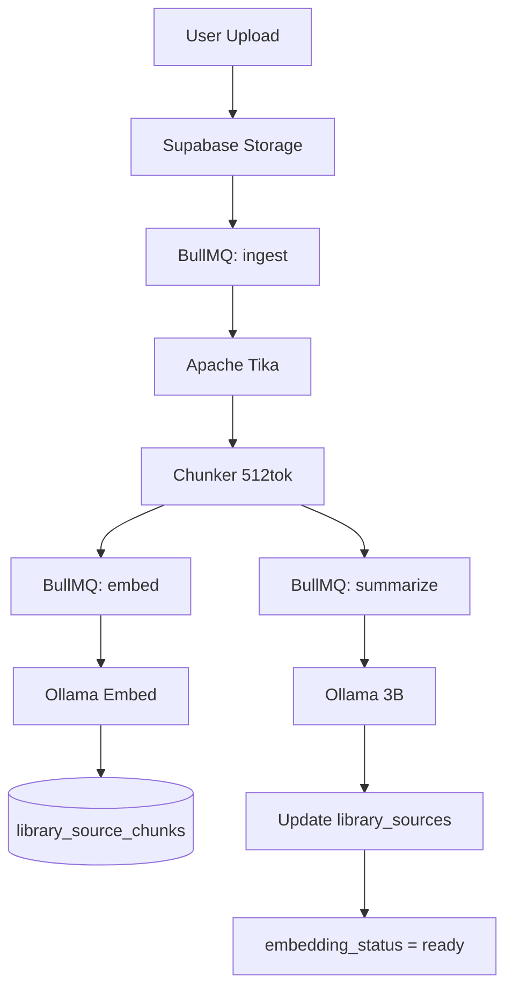

# 16 — Ingestion Pipeline

**Status:** draft

## Context

Library files (PDF, DOCX, TXT) must be extracted, chunked, embedded, and summarized before appearing in semantic search and insights.

## Decision

Async worker pipeline via Redis (BullMQ): Tika extraction → chunking → batch embed → LLM summary.

## Specification

### Flow



### Upload

1. Client uploads to `storage/{workspace_id}/library/{uuid}/{filename}`
2. Insert `library_sources` row (`embedding_status = pending`)
3. Enqueue `ingest` job

### Extraction (Apache Tika)

- Container: `apache/tika:latest-full` on port 9998 (internal only)
- Input: file bytes from storage
- Output: plain text + page boundaries where available
- Timeout: 60s per file; retry 2× on failure

### Chunking

| Parameter | Value |
|-----------|-------|
| Chunk size | ~2000 chars (`LIBRARY_CHUNK_CHARS`) |
| Overlap | ~256 chars |
| Metadata | `chunk_metadata` JSONB (file type, citation locator, heading path, display labels) |

Per-format extractors prefer structure-aware segments (PDF pages, DOCX paragraphs, PPT slides, XLS sheet rows, MD headings) before generic splitting. Locators are format-specific — page numbers only where the format has pages.

### Embedding

- Batch up to 32 chunks per Ollama request
- Store in `library_source_chunks` with `vector(768)` + `chunk_metadata`
- Update `embedding_status` → `processing` → `ready`

### Summary

- First 8000 chars of extracted text → `llama3.2:3b` 
- Output: 5 bullet points in detected language
- Store in `library_sources.summary`

### Performance target (from PRD)

Full pipeline for typical PDF (<20 pages): **<15 seconds** on 8 vCPU.

### Failure handling

| Failure | Action |
|---------|--------|
| Tika timeout | `embedding_status = failed`; user toast "Could not read file" |
| Ollama OOM | Requeue with backoff |
| Partial embed | Mark ready with warning; retry failed chunks nightly |
| Worker crash | Docker `restart: always` + BullMQ stall reclaim (job attempts ×3) |

### Document chunks (workspace docs)

TipTap content → structured segments → `document_chunks` (same metadata shape as library). Whole-doc `documents.embedding` remains as a secondary signal.

On document save (debounced):
1. Update `content_plain`
2. If diff >15% → `document-embed` job rewrites `document_chunks`

### Bulk re-index (metadata upgrade)

Do **not** wipe storage. Re-run in place:

```bash
pnpm library:reindex          # re-ingest ready library sources
pnpm documents:reindex        # enqueue document-embed for all docs with content
```

Optional filters: `--workspace=<uuid>`, `--limit=N`, `--concurrency=2` (library).

## Open questions

- OCR for scanned PDFs (Tesseract sidecar)?
- Max file size per tier?

## Dependencies

- [04-data-model.md](04-data-model.md)
- [05-ai-and-rag.md](05-ai-and-rag.md)
- [13-infrastructure-vps.md](13-infrastructure-vps.md)
