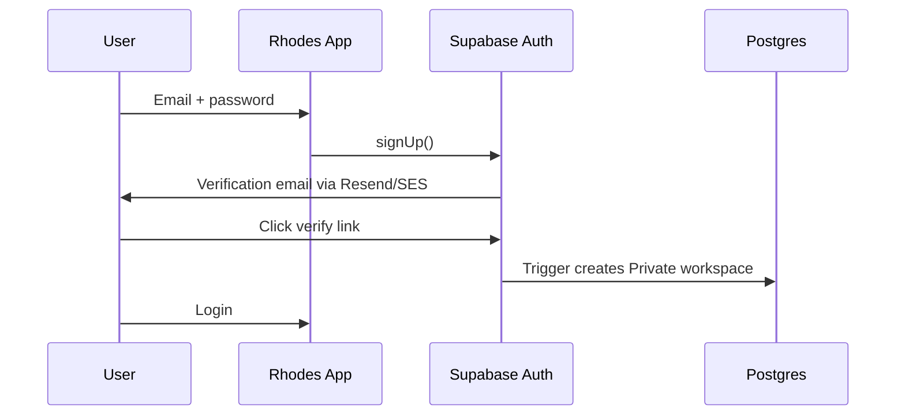
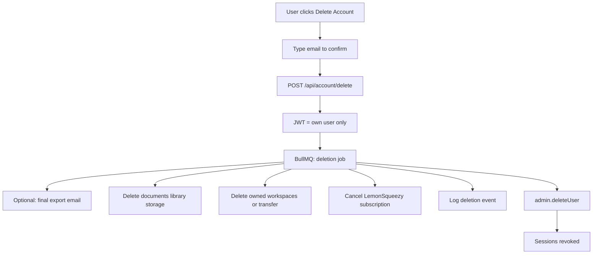

# 22 — Authentication and Accounts

**Status:** draft

## Context

Rhodes requires secure user identity: registration, login, session management, password recovery, optional MFA, and GDPR-compliant account deletion. As a self-hosted app, we use **Supabase Auth (GoTrue)** on our VPS — not a third-party auth SaaS.

## Decision

Use **Supabase Auth** end-to-end via `@supabase/supabase-js` and `@supabase/ssr` for Next.js. Custom account deletion API with cascading data purge (auth alone is insufficient for GDPR).

## Specification

### What Supabase Auth provides (self-hosted)

[Supabase Auth](https://github.com/supabase/auth) (GoTrue) is a production-ready auth server included in the self-hosted Supabase stack:

| Feature | Supabase | Rhodes V1 |
|---------|----------|-----------|
| Email + password signup/login | Yes | Yes |
| Email verification | `GOTRUE_MAILER_AUTOCONFIRM` config | Yes (confirm before login) |
| Magic link | Yes | V1.5 |
| Password reset | `/recover` flow | Yes |
| JWT + refresh tokens | Yes | Yes |
| OAuth (Google, Apple, etc.) | `GOTRUE_EXTERNAL_*` env vars | V1.5 |
| TOTP MFA | Enabled by default | V1.5 |
| Phone MFA | SMS provider required | No |
| WebAuthn | Supported | V2 |
| Admin user delete API | `DELETE /auth/v1/admin/users/{id}` | Via our wrapper |
| RLS integration | `auth.uid()` in policies | Yes |

Self-hosted config via `docker-compose.yml` / `.env` — not the Supabase Cloud dashboard. See [Supabase self-hosting auth config](https://supabase.com/docs/guides/self-hosting/auth/config).

### Libraries

| Library | Role | Required |
|---------|------|----------|
| [`@supabase/supabase-js`](https://supabase.com/docs/reference/javascript/introduction) | Client auth, DB, storage | Yes |
| [`@supabase/ssr`](https://supabase.com/docs/guides/auth/server-side/nextjs) | Next.js App Router cookie sessions | Yes |
| [`zod`](https://github.com/colinhacks/zod) | Validate signup/login form inputs | Yes |
| [`helmet`](https://github.com/helmetjs/helmet) | Security headers on API routes | Yes |
| [`rate-limiter-flexible`](https://github.com/animir/node-rate-limiter-flexible) | Brute-force protection on auth endpoints | Yes |

**Not needed for V1:**
- NextAuth / Auth.js — redundant with Supabase
- Clerk / Auth0 — contradicts self-hosted philosophy
- Passport.js — Supabase handles flows

### Auth flows

#### Registration



1. `supabase.auth.signUp({ email, password })`
2. Verification email via configured SMTP (use same [managed relay](14-email-delivery.md) as app mail)
3. DB trigger on `auth.users` insert → create Private workspace + owner membership (see [07-individual-vs-team.md](07-individual-vs-team.md))
4. Rate limit: 5 signups / IP / hour

#### Login

1. `supabase.auth.signInWithPassword({ email, password })`
2. Session stored in httpOnly cookies via `@supabase/ssr`
3. Redirect to editor (last document)
4. Rate limit: 10 attempts / email / 15 min → temporary lockout

#### Password reset

1. `supabase.auth.resetPasswordForEmail(email, { redirectTo })`
2. User clicks link → `/auth/reset-password` page
3. `supabase.auth.updateUser({ password })`

#### Logout

1. `supabase.auth.signOut()` — revokes refresh tokens
2. Clear IndexedDB local cache for active space
3. Redirect to login

#### MFA (V1.5)

Supabase TOTP is [enabled by default](https://supabase.com/docs/guides/self-hosting/self-hosted-phone-mfa) on self-hosted:

1. User enrolls in Settings → Security → `supabase.auth.mfa.enroll({ factorType: 'totp' })`
2. QR code for authenticator app
3. Login requires second factor if enrolled

### Session security

| Setting | Value |
|---------|-------|
| JWT expiry | 1 hour (default) |
| Refresh token | Rotating, httpOnly cookie |
| Cookie flags | `Secure`, `SameSite=Lax` |
| CSRF | Supabase SSR middleware handles |

### Account deletion (GDPR Art. 17)

**Critical:** Deleting `auth.users` alone leaves PII in `documents`, `library_sources`, storage, and LemonSqueezy. Must cascade.



**Implementation:**

```typescript
// Server-only — service role key
async function deleteAccount(userId: string) {
  // 1. Cancel subscription (see 25-billing-lemonsqueezy.md)
  await cancelSubscription(userId);
  // 2. Delete storage files for owned workspaces
  await purgeUserStorage(userId);
  // 3. CASCADE via FK handles documents, chunks, versions
  // 4. Remove workspace_members rows; delete workspaces where owner
  await db.deleteOwnedWorkspaces(userId);
  // 5. Audit log (retain anonymized entry)
  await audit.log({ action: 'account_deleted', userId });
  // 6. Supabase admin API
  await supabaseAdmin.auth.admin.deleteUser(userId);
}
```

- **Grace period:** 7-day soft delete (account disabled, data marked) → hard delete (optional, legal review)
- **Team spaces:** If sole owner, prompt to transfer ownership or delete team before account deletion
- **Auth:** User can only delete own account; admin endpoint separate for support

### GDPR libraries (evaluation)

| Library | Fit for Rhodes | Notes |
|---------|----------------|-------|
| **Custom + BullMQ** | **Recommended** | Postgres FK cascades + explicit storage purge; full control |
| [@nestarc/data-subject](https://github.com/nestarc/data-subject) | No | NestJS + Prisma only |
| [privacy-pal](https://github.com/privacy-pal/privacy-pal) | No | NoSQL (Mongo/Firestore) |
| [GhostProtocol](https://github.com/Debjyoti-19/GhostProtocol) | Overkill | Enterprise compliance orchestration |

Rhodes uses **Postgres + Supabase** — a custom deletion saga in the worker is the right fit. See [24-privacy-user-tools.md](24-privacy-user-tools.md) for user-facing export.

### Auth UI pages (V1)

| Route | Purpose |
|-------|---------|
| `/auth/login` | Email + password |
| `/auth/register` | Sign up |
| `/auth/forgot-password` | Reset request |
| `/auth/reset-password` | New password form |
| `/auth/verify` | Email confirmation callback |

Minimal chrome — same design language as editor ([03a-design-language.md](03a-design-language.md)). Not part of main app shell until authenticated.

### Environment variables (self-hosted GoTrue)

```env
GOTRUE_SITE_URL=https://rhodes.app
GOTRUE_DISABLE_SIGNUP=false
GOTRUE_EXTERNAL_EMAIL_ENABLED=true
GOTRUE_MAILER_AUTOCONFIRM=false
GOTRUE_SMTP_HOST=smtp.resend.com          # or SES SMTP
GOTRUE_SMTP_USER=resend
GOTRUE_SMTP_PASS=re_...
GOTRUE_SMTP_ADMIN_EMAIL=auth@notify.rhodes.app
```

## Open questions

- Social login (Google) in V1 or V1.5?
- 7-day soft delete vs immediate hard delete?
- Passkeys / WebAuthn timeline?

## Dependencies

- [04-data-model.md](04-data-model.md)
- [07-individual-vs-team.md](07-individual-vs-team.md)
- [14-email-delivery.md](14-email-delivery.md)
- [15-security-and-privacy.md](15-security-and-privacy.md)
- [23-user-settings-and-spaces.md](23-user-settings-and-spaces.md)
- [24-privacy-user-tools.md](24-privacy-user-tools.md)
- [25-billing-lemonsqueezy.md](25-billing-lemonsqueezy.md)
