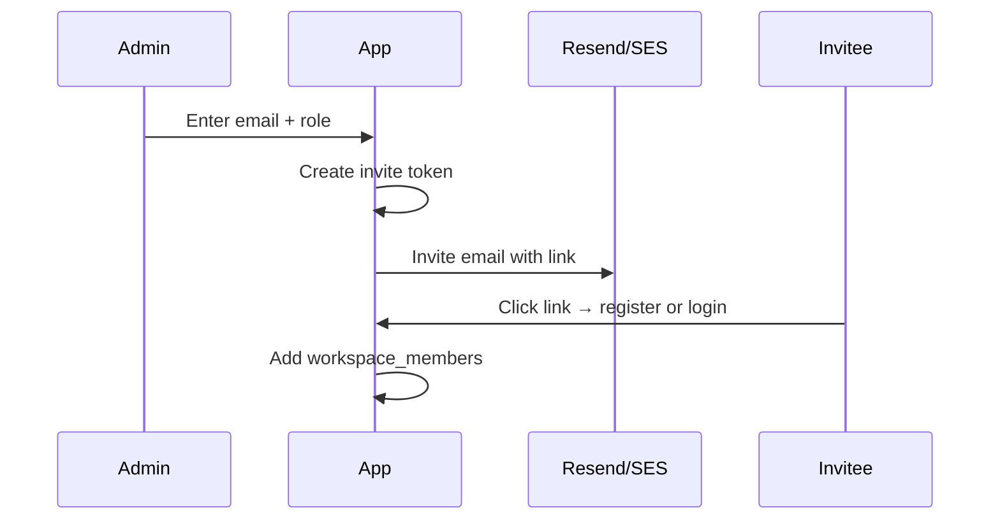

# 23 — User Settings and Spaces

**Status:** draft

## Context

Users need a dedicated settings area for profile, security, language/theme, workspace (scope) management, and team administration — without cluttering the editor-first UI.

## Decision

Settings open as an **on-demand overlay** (full-screen or slide-over) from the avatar menu — not a permanent settings sidebar. Scope (workspace) management is a first-class section within settings.

## Specification

### Entry point

**Avatar menu** (header, always reachable):

```
┌─────────────────────┐
│ kalle@example.com   │
├─────────────────────┤
│ Settings…           │
│ Theme ▸ Light/Dark  │
│ Language ▸          │
├─────────────────────┤
│ Sign out            │
└─────────────────────┘
```

`Settings…` opens the settings overlay. Editor remains mounted underneath.

### Settings sections

| Section | Contents | All users | Team Owner/Admin |
|---------|----------|-----------|------------------|
| **Profile** | Display name, email (read-only), avatar, locale | Yes | Yes |
| **Security** | Change password, MFA enroll (V1.5), active sessions | Yes | Yes |
| **Preferences** | Theme, editor font size, Knowledge Bridge email toggle | Yes | Yes |
| **Spaces** | List Personal + Team spaces; switch default; create personal or team | Yes | Yes |
| **Team** | Members, invites, roles — per team space | — | Owner/Admin |
| **Billing** | Plan, usage, upgrade, portal | Yes | Owner |
| **Privacy** | Export data, delete account | Yes | Yes |

See [24-privacy-user-tools.md](24-privacy-user-tools.md) for Privacy section detail.  
See [25-billing-lemonsqueezy.md](25-billing-lemonsqueezy.md) for Billing section.

### Profile

| Field | Editable | Storage |
|-------|----------|---------|
| Display name | Yes | `profiles.display_name` |
| Email | No (contact support) | `auth.users.email` |
| Avatar | Yes (upload) | Supabase Storage `avatars/{user_id}` |
| Language | Yes | `users.locale` — see [21-i18n.md](21-i18n.md) |
| Timezone | Yes (V1.5) | `profiles.timezone` |

```sql
create table profiles (
  id uuid primary key references auth.users(id) on delete cascade,
  display_name text,
  avatar_url text,
  timezone text default 'UTC',
  created_at timestamptz default now(),
  updated_at timestamptz default now()
);
```

### Security

| Action | Implementation |
|--------|----------------|
| Change password | `supabase.auth.updateUser({ password })` — requires current password |
| Enable MFA | `supabase.auth.mfa.enroll()` — V1.5 |
| View sessions | List from `auth.sessions` via admin API or custom `user_sessions` log |
| Sign out everywhere | `supabase.auth.signOut({ scope: 'global' })` |

### Spaces management

**List view** — all workspaces user belongs to, grouped by type:

| Space | Type | Role | Actions |
|-------|------|------|---------|
| Private | Personal | Owner | Rename, delete (if not last personal) |
| Book Draft | Personal | Owner | Rename, delete |
| Growth Engine | Team | Admin | Manage team, rename, delete |
| Product | Team | Member | Leave |

#### Create personal space

1. Settings → Spaces → "New personal space", or header scope switcher → Personal → "New personal space"
2. Enter name → `workspaces` insert (`is_team_workspace = false`)
3. User is sole Owner — no invites, no members UI
4. Gated by plan limit (default space at signup counts toward limit on Free)

#### Create team space

1. Settings → Spaces → "Create team space"
2. Enter name → `workspaces` insert (`is_team_workspace = true`)
3. Creator becomes Owner
4. Gated by [billing tier](25-billing-lemonsqueezy.md) (Team plan required)

#### Delete space

| Type | Who | Behavior |
|------|-----|----------|
| Personal | Owner | Delete if user has another personal space; otherwise blocked |
| Team | Owner | Confirm dialog → cascade delete all docs, library, members |
| Team | Member | "Leave space" only |

Deletion requires typing space name to confirm.

#### Switch active space

- Also available in header dropdown (faster)
- Settings shows same list with "Active" indicator

### Team management (Team spaces only)

Visible when user is Owner or Admin of selected team space.

#### Invite member



1. Admin enters email + role (Admin / Member)
2. `workspace_invites` row with expiring token (7 days)
3. Email via [managed relay](14-email-delivery.md)
4. Accept → `workspace_members` insert; delete invite

```sql
create table workspace_invites (
  id uuid primary key default uuid_generate_v4(),
  workspace_id uuid references workspaces(id) on delete cascade not null,
  email text not null,
  role text check (role in ('admin', 'member')) default 'member',
  invited_by uuid references auth.users(id),
  token text unique not null,
  expires_at timestamptz not null,
  accepted_at timestamptz,
  created_at timestamptz default now()
);
```

#### Manage members

| Action | Who |
|--------|-----|
| Change role | Owner |
| Remove member | Owner, Admin |
| Transfer ownership | Owner only |

Removed member loses access immediately (RLS). Their private space unaffected.

### Settings UX rules

- On-demand overlay — closes back to editor
- Breadcrumb: Settings → Section
- No nested SaaS sidebar — flat section list on left (settings only exception to "no left sidebar" rule, because it's transient)
- Mobile: full-screen sheet

### Workflows

| Task | Steps |
|------|-------|
| Change language | Avatar → Settings → Profile → Language → Save |
| Create personal space | Scope switcher → New personal space → name → Create |
| Create team | Settings → Spaces → Create team → name → Create |
| Invite colleague | Settings → Team → Invite → email → Send |
| Leave team | Settings → Spaces → Team → Leave |
| Delete team space | Settings → Spaces → Team → Delete → confirm name |

## Open questions

- Custom roles beyond Owner/Admin/Member?
- Invite link without email (shareable URL)?

## Dependencies

- [03-ux-ui-design.md](03-ux-ui-design.md)
- [07-individual-vs-team.md](07-individual-vs-team.md)
- [14-email-delivery.md](14-email-delivery.md)
- [20-workflows.md](20-workflows.md)
- [22-authentication-and-accounts.md](22-authentication-and-accounts.md)
- [24-privacy-user-tools.md](24-privacy-user-tools.md)
- [25-billing-lemonsqueezy.md](25-billing-lemonsqueezy.md)
