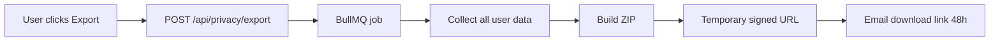

# 24 — Privacy User Tools

**Status:** draft

## Context

GDPR requires users to access, export, and delete their personal data. Rhodes must offer **user-facing privacy controls** in Settings — not only backend compliance. Users need transparency and self-service.

## Decision

Build a **Privacy** section in Settings with data export, processing info, email consent toggles, and account deletion entry point. Backend deletion saga documented in [22-authentication-and-accounts.md](22-authentication-and-accounts.md).

## Specification

### Privacy settings UI

**Settings → Privacy**

| Tool | Description | GDPR basis |
|------|-------------|------------|
| **Download my data** | ZIP export of all user data | Art. 20 portability |
| **Delete my account** | Starts deletion flow | Art. 17 erasure |
| **Email preferences** | Knowledge Bridge on/off | Art. 7 consent |
| **Processing info** | Link to privacy policy | Art. 13/14 transparency |
| **Audit log** (Team tier) | Own login/export events | Accountability |

### Data export



**Export includes:**

| Data | Format |
|------|--------|
| Profile | `profile.json` |
| All accessible documents | `documents/{id}.json` + plain text |
| Document versions | `versions/{id}/` |
| Library sources metadata | `library.json` |
| Library files | Original PDFs/DOCX from storage |
| Workspace memberships | `memberships.json` |
| Audit events (own) | `audit.json` |
| Subscription info | `billing.json` (no card data) |

**Libraries:**

| Approach | Recommendation |
|----------|----------------|
| **Custom worker + `archiver`** | **Yes** — `npm install archiver`; stream to temp storage |
| [@nestarc/data-subject](https://github.com/nestarc/data-subject) | No — NestJS/Prisma |
| [privacy-pal](https://github.com/privacy-pal/privacy-pal) | No — NoSQL |

```typescript
import archiver from 'archiver';
// Worker gathers rows via service role, pipes to ZIP, uploads to storage
// Signed URL expires in 48h
```

- Rate limit: 1 export / user / 24h
- Email link when ready (async — large libraries take time)
- Log `audit_events: data_export_requested`, `data_export_completed`

### Account deletion (user-facing)

**Settings → Privacy → Delete account**

1. Warning screen: what will be deleted (list spaces owned, team impact)
2. If team Owner with members: must transfer ownership or delete team first
3. Type email address to confirm
4. Optional: "Download my data first" link
5. `POST /api/account/delete` → see [22-authentication-and-accounts.md](22-authentication-and-accounts.md)

**User sees:**
> "Your account will be deleted within 7 days. You can cancel by logging in before [date]."

Or immediate deletion if legal prefers no grace period (see [19-open-decisions.md](19-open-decisions.md)).

### Email consent

| Toggle | Default | Effect |
|--------|---------|--------|
| Knowledge Bridge weekly email | On (opt-out) | Controls cron inclusion |
| Product updates | Off (opt-in) | Future marketing — off in V1 |
| Team invite emails | Required | Cannot disable (transactional) |

Stored in `profiles.email_preferences jsonb`.

Unsubscribe link in every non-transactional email → deep link to Settings → Privacy.

### Privacy policy & legal pages

| Page | Route | Status |
|------|-------|--------|
| Privacy Policy | `/privacy` | Draft (legal TBD) |
| Terms of Service | `/terms` | Draft |
| Imprint | `/imprint` | Draft (DE requirement) |

Reuse Quinsy/Clara placeholder pattern until legal entity confirmed.

### What Supabase does NOT provide

Supabase Auth handles identity only. It does **not**:
- Export application data (documents, library)
- Cascade delete app tables on `deleteUser`
- Provide a privacy dashboard UI
- Manage consent records for app-specific emails

All of the above is **Rhodes application code**.

### Security requirements

| Requirement | Implementation |
|-------------|----------------|
| Export auth | JWT must match requested user |
| Download URL | Signed, 48h expiry, single-use optional |
| Deletion auth | Re-authenticate (password) before delete |
| Audit trail | Append-only `audit_events`; survive deletion anonymized |
| No IDOR | Never accept `userId` from client body — use `auth.uid()` |

### Anonymization vs deletion

| Data | On account delete |
|------|-------------------|
| User PII (email, name) | Hard delete |
| Documents in owned private space | Hard delete |
| Documents in team space (user authored) | Keep doc; set `created_by` null + "Deleted user" |
| Audit logs | Anonymize `user_id` to hash |
| LemonSqueezy customer | Delete via API |

## Open questions

- 7-day grace period for deletion — legal sign-off?
- Export include AI chat history when added (V1.5)?

## Dependencies

- [15-security-and-privacy.md](15-security-and-privacy.md)
- [22-authentication-and-accounts.md](22-authentication-and-accounts.md)
- [23-user-settings-and-spaces.md](23-user-settings-and-spaces.md)
- [25-billing-lemonsqueezy.md](25-billing-lemonsqueezy.md)
