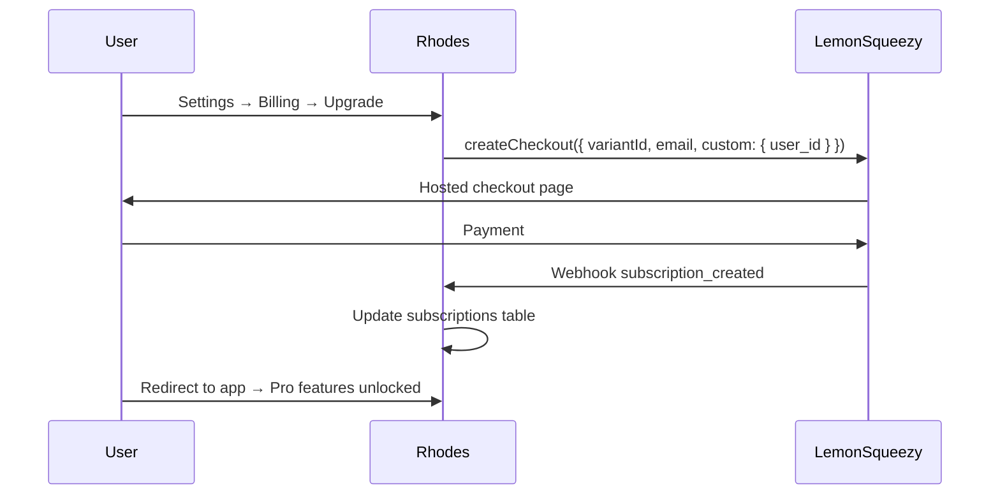

# 25 — Billing (LemonSqueezy)

**Status:** draft

## Context

Rhodes monetizes via Free, Pro, and Team tiers. LemonSqueezy handles payments, tax, and subscription lifecycle. The PRD specifies webhook validation via HMAC — this doc details full integration.

## Decision

Use **LemonSqueezy** as Merchant of Record with official SDK `@lemonsqueezy/lemonsqueezy.js` for API calls and `crypto.timingSafeEqual` for webhook verification.

## Specification

### Libraries

| Library | Role |
|---------|------|
| [`@lemonsqueezy/lemonsqueezy.js`](https://www.npmjs.com/package/@lemonsqueezy/lemonsqueezy.js) | Official SDK — customers, subscriptions, checkouts, cancel |
| Node `crypto` | Webhook HMAC verification ([docs](https://docs.lemonsqueezy.com/guides/tutorials/webhooks-nextjs)) |
| `zod` | Validate webhook payload shape |

**Not recommended:** unofficial `lemonsqueezy.ts` wrappers.

### Setup

```typescript
import { lemonSqueezySetup } from '@lemonsqueezy/lemonsqueezy.js';

lemonSqueezySetup({
  apiKey: process.env.LEMONSQUEEZY_API_KEY!,
  onError: (error) => console.error('LemonSqueezy error:', error),
});
```

### Environment variables

```env
LEMONSQUEEZY_API_KEY=...
LEMONSQUEEZY_STORE_ID=...
LEMONSQUEEZY_WEBHOOK_SECRET=...
LEMONSQUEEZY_VARIANT_PRO_MONTHLY=...
LEMONSQUEEZY_VARIANT_TEAM_SEAT_MONTHLY=...
```

### Database schema

```sql
create table subscriptions (
  id uuid primary key default uuid_generate_v4(),
  user_id uuid references auth.users(id) on delete cascade not null,
  lemonsqueezy_customer_id text,
  lemonsqueezy_subscription_id text unique,
  variant_id text not null,
  status text not null check (status in (
    'on_trial', 'active', 'paused', 'past_due', 'unpaid', 'cancelled', 'expired'
  )),
  tier text not null check (tier in ('free', 'pro', 'team')),
  seats int default 1,
  current_period_end timestamptz,
  created_at timestamptz default now(),
  updated_at timestamptz default now()
);

create index idx_subscriptions_user on subscriptions(user_id);
```

Free tier users have no `subscriptions` row (or `tier = free` default on profile).

### Products / variants

| Tier | LemonSqueezy product | Billing |
|------|---------------------|---------|
| Free | — | No subscription |
| Pro | Pro Monthly / Annual | Per user |
| Team | Team Seat Monthly | Per seat, min 3 |

### Checkout flow



```typescript
import { createCheckout } from '@lemonsqueezy/lemonsqueezy.js';

await createCheckout(storeId, {
  checkoutOptions: {
    embed: false,
    media: false,
    logo: true,
  },
  checkoutData: {
    email: user.email,
    custom: { user_id: user.id },
  },
  productOptions: {
    redirectUrl: `${SITE_URL}/settings/billing?success=1`,
  },
  variantId: process.env.LEMONSQUEEZY_VARIANT_PRO_MONTHLY!,
});
```

### Webhook handler

**Route:** `POST /api/webhooks/lemonsqueezy`

```typescript
import crypto from 'crypto';
import { NextRequest, NextResponse } from 'next/server';

export async function POST(request: NextRequest) {
  const secret = process.env.LEMONSQUEEZY_WEBHOOK_SECRET!;
  const rawBody = await request.text();
  const signature = request.headers.get('x-signature') ?? '';

  const hmac = crypto.createHmac('sha256', secret);
  const digest = Buffer.from(hmac.update(rawBody).digest('hex'), 'utf8');
  const sig = Buffer.from(signature, 'utf8');

  if (!crypto.timingSafeEqual(digest, sig)) {
    return NextResponse.json({ error: 'Invalid signature' }, { status: 401 });
  }

  const payload = JSON.parse(rawBody);
  const eventName = payload.meta.event_name;

  // Idempotency: check payload.meta.event_name + subscription_id in webhook_events table
  await handleWebhookEvent(eventName, payload);

  return NextResponse.json({ received: true });
}
```

### Subscribed webhook events

| Event | Action |
|-------|--------|
| `subscription_created` | Insert `subscriptions`, set tier |
| `subscription_updated` | Update status, seats, period end |
| `subscription_cancelled` | Set `cancelled`, downgrade at period end |
| `subscription_expired` | Downgrade to free |
| `subscription_payment_failed` | Set `past_due`, notify user email |

### Feature gating

See [17-business-model.md](17-business-model.md) for tier limits.

```typescript
function getUserTier(userId: string): 'free' | 'pro' | 'team' {
  const sub = await db.subscriptions.findActive(userId);
  if (!sub || sub.status === 'cancelled') return 'free';
  return sub.tier;
}
```

Gate checks in API middleware and client-side UI (server validates always).

### Billing settings UI

**Settings → Billing** (see [23-user-settings-and-spaces.md](23-user-settings-and-spaces.md))

| State | UI |
|-------|-----|
| Free | Current plan, Upgrade to Pro / Team buttons |
| Pro | Plan name, renewal date, Manage subscription, Cancel |
| Team | Seats used/allocated, Add seats, per-seat cost, Manage |

**Manage subscription:** LemonSqueezy customer portal URL (or `getSubscription` + redirect).

```typescript
import { getSubscription } from '@lemonsqueezy/lemonsqueezy.js';
// Portal: subscription.data.attributes.urls.customer_portal
```

### Team seat billing

- Seat count = `workspace_members` count in team spaces owned by billing user
- Webhook `subscription_updated` syncs `seats` from LemonSqueezy
- Adding member when at seat limit → prompt to add seats in Billing

### Account deletion integration

On account delete ([22-authentication-and-accounts.md](22-authentication-and-accounts.md)):

```typescript
import { cancelSubscription } from '@lemonsqueezy/lemonsqueezy.js';
await cancelSubscription(subscriptionId);
```

### Testing

- LemonSqueezy test mode + test cards
- Webhook replay via [docs](https://docs.lemonsqueezy.com/help/webhooks) simulator
- Store raw webhooks in `webhook_events` for debugging

## Open questions

- Annual pricing variants at launch?
- Team plan: one subscription per org or per workspace owner?

## Dependencies

- [17-business-model.md](17-business-model.md)
- [22-authentication-and-accounts.md](22-authentication-and-accounts.md)
- [23-user-settings-and-spaces.md](23-user-settings-and-spaces.md)
- [24-privacy-user-tools.md](24-privacy-user-tools.md)
