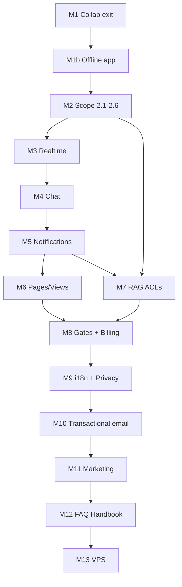

# 28 — Product roadmap to production

**Status:** accepted — **canonical living roadmap**  
**Last updated:** July 27, 2026  
**Current milestone:** **M1b** — Encrypted, owner-opt-in offline app shell (Phase 25)  
**Branch:** `main` (M1 merged; `feature/phase-09-offline-wave-a` closed)

> **This document is the single source of truth** for Rhodes’ path from today’s local Docker build to public production.  
> Executable phase checklists live in [`implementation_plan/`](../implementation_plan/00-README.md). Product specs live in [`docs/`](README.md).

---

## At a glance

| Milestone | Focus | Phase(s) |
|-----------|--------|----------|
| **M1** | Editor + Yjs collab + open-doc offline | 09 |
| **M1b** | Encrypted, owner-opt-in offline app shell | 25 |
| **M2** | Org / Team / Private scopes, picker, settings, roles | 15 |
| **M3** | App-wide realtime (lists, views, metadata) | 24 |
| **M4** | Rhodes Chat (doc, scope, DM, forwards) | 16–19 |
| **M5** | In-app notifications | 20 |
| **M6** | Pages / Views + use-case templates | 22 |
| **M7** | Library + document RAG sharing ACLs | 21 |
| **M8** | Feature gates + billing (paired) | 23 + 11 |
| **M9** | i18n + GDPR / privacy | 10 + 12 |
| **M10** | Transactional email | 12a |
| **M11** | Marketing site | 14 |
| **M12** | FAQ / Handbook + Cmd+K + Ask product-help | 26 |
| **M13** | VPS production (last) | 12b + 13 + 13b |

**Public launch path:** M8 (sellable on Docker) → M9 → M10 → M11 → **M12** → **M13 VPS**

---

## Guiding principles

| Principle | Implication |
|-----------|-------------|
| **Local Docker = production for dev** | Every increment ships on `docker compose`; no VPS dependency until M13. |
| **Small increments** | Prefer 1–3 day slices with a demoable outcome. |
| **Realtime before views** | M3 before M6 — one bus for lists, chat, notifications, view filters. |
| **Scopes before sharing** | M2 before M7 RAG ACLs. |
| **Sellable before hosted** | M8 monetization on Docker (gates + LemonSqueezy test mode). |
| **Email after features** | M10 after M9 — stable templates; M2–M8 use invite-by-link. |
| **Marketing after core** | M11 when product is demo-ready. |
| **Handbook before VPS** | M12 required before M13 public cutover. |
| **Encrypt everything cached** | All offline IDB data AES-GCM — private and team docs. |
| **Offline is opt-in** | Owner-only “Available offline” per document (M1b). |

---

## Dependency graph

---

## M1 — Editor + collab exit (Phase 09) — **COMPLETE**

| ID | Deliverable |
|----|-------------|
| M1.1 | UAT steps 1–5 pass ([12-offline-sync.md](12-offline-sync.md)) — ✅ |
| M1.2 | `pnpm test:offline` green — ✅ 70 tests |
| M1.3 | Merge to `dev` — ✅ merged `dev` → `main` at `c779c77` (July 26, 2026) |

**Execution plan:** [09-m1-exit-collab-offline.md](../implementation_plan/09-m1-exit-collab-offline.md)

### What M1 delivers vs defers

| In scope | Deferred to M1b |
|----------|-----------------|
| Edit open document offline (Yjs + IDB) | Browse doc list offline |
| Re-open if already in IndexedDB | Open never-cached docs |
| Offline conflict review (returner) | Create/delete offline |
| Title/metadata outbox | Full app shell; encryption policy |

**Note:** IndexedDB `documents` store is **plaintext today** — acceptable for M1 UAT only. M1b.1 encrypts before broader offline.

---

## M1b — Offline app (Phase 25)

### Offline definition (locked)

Rhodes is **online-first**. Offline = **opt-in, owner-controlled, encrypted cache**.

| Rule | Policy |
|------|--------|
| **Encryption** | All IDB document data AES-GCM (body, metadata, index, outbox, assets, library queue). |
| **Who** | Only **document owner** (`created_by`) may set **Available offline**. |
| **Opt-in** | Owner toggles per document while online → encrypted download. |
| **Works offline** | Shell; owned + offline-available docs; pending edits; sync on reconnect. |
| **Online-only** | `OfflineUnavailable` UI for Views, Library, Ask, Insights, Chat, settings, etc. |

| ID | Deliverable |
|----|-------------|
| M1b.1 | Encrypt all offline stores (block team cache until done) |
| M1b.2 | Owner-only “Available offline” flag + UI |
| M1b.3 | Offline shell + `OfflineUnavailable` component |
| M1b.4 | Offline create/delete/rename (owned docs) |
| M1b.5 | Encrypted image asset cache + upload queue |
| M1b.6 | Encrypted library upload queue (not browse) |

**Phase doc:** [implementation_plan/25-offline-app-shell.md](../implementation_plan/25-offline-app-shell.md) — sliced into small independently-committable steps per wave; see also [docs/31-offline-security-and-privacy.md](31-offline-security-and-privacy.md) for the key derivation and IndexedDB storage decisions it implements.

**Precursor slice (M1.1, before M1b.1):** [implementation_plan/09.1-realtime-transport-hardening.md](../implementation_plan/09.1-realtime-transport-hardening.md) — Realtime `httpSend()` transport fix — ✅ complete (UAT July 27, 2026).

**Post-M1b quality pass:** [implementation_plan/09.2-offline-conflict-quality.md](../implementation_plan/09.2-offline-conflict-quality.md) — multi-conflict classification fix + debug log cleanup ([techncial-dept.md](../techncial-dept.md) TD-001, TD-002). **Start only after M1b exit criteria.**

---

## M2 — Scope & org platform (Phase 15)

**Until M10:** invites via **copy-link** + in-app accept (no email templates).

| ID | Topic |
|----|-------|
| M2.1 | Post-signup org onboarding |
| M2.2 | Org/Team/Private data model + RLS |
| M2.3 | Scope picker v2 (multi-org, filtered teams, solo-pro-as-org) |
| M2.4 | Scope settings catalog (RAG, chat, views, templates, offline, gates) |
| M2.5 | Org/Team/Private creation flows + sharing defaults |
| M2.6 | Roles matrix + invite-by-link |

**Phase doc (to write):** [implementation_plan/15-scopes-org-teams-settings.md](../implementation_plan/15-scopes-org-teams-settings.md)

---

## M3 — App-wide realtime (Phase 24)

| ID | Deliverable |
|----|-------------|
| M3.1 | Realtime bus + channel conventions |
| M3.2 | Live document/workspace feed |
| M3.3 | View-context router |
| M3.4 | Library / insights / metadata hooks |

**Phase doc (to write):** [implementation_plan/24-app-wide-realtime.md](../implementation_plan/24-app-wide-realtime.md)

---

## M4 — Rhodes Chat (Phases 16–19)

M4.1 Chat component → M4.5 shareable messages. Ask stays client-only (D-013).

---

## M5 — Notifications (Phase 20)

In-app center on M3 bus. Email digests in M10.

---

## M6 — Pages / Views (Phase 22)

After M5. Workshop: `docs/29-use-cases-views-templates.md` (to write). Online-only when offline (M1b.3).

---

## M7 — RAG sharing ACLs (Phase 21)

Library item + document RAG visibility: private, team(s), org-wide, org-private, person.  
**Phase doc (to write):** [implementation_plan/21-library-rag-scopes.md](../implementation_plan/21-library-rag-scopes.md)

---

## M8 — Monetization (Phases 23 + 11)

Gates + LemonSqueezy test mode on Docker. Locked features **visible but inactive**.

---

## M9 — Locale & compliance (Phases 10 + 12)

i18n + GDPR before EU marketing and before M10 email.

---

## M10 — Transactional email (Phase 12a)

After M9, before M11. Invites, auth, billing, notification digests. Mailpit locally.

**Phase doc (to write):** [implementation_plan/12-email-transactional.md](../implementation_plan/12-email-transactional.md)

---

## M11 — Marketing (Phase 14)

After M10. Placeholder Help nav until M12.

---

## M12 — FAQ / Handbook (Phase 26)

**Blocks M13 public launch.**

| Surface | Behavior |
|---------|----------|
| Marketing `/help` | Public FAQ + task guides |
| In-app | Help menu, Settings links, deep links |
| Cmd+K | Documents + Help grouped results |
| Ask | Product-help RAG (how-to questions) |

| ID | Deliverable |
|----|-------------|
| M12.1–M12.7 | Content plan, authoring, site, in-app, Cmd+K, Ask, maintenance process |

**Phase doc (to write):** [implementation_plan/26-product-handbook-and-help-rag.md](../implementation_plan/26-product-handbook-and-help-rag.md)

---

## M13 — VPS (Phases 12b + 13 + 13b) — LAST

Coolify, DNS, TLS, O-019 storage, prod email relay. Requires M12 handbook live.

---

## Ongoing

Sticker sheet / design system (O-011–O-014) across all milestones.

---

## Phase number index

| Phase | Topic | Milestone |
|-------|-------|-----------|
| 09 | Offline editor + Yjs collab | M1 |
| 25 | Offline app shell | M1b |
| 15 | Scopes, org, settings | M2 |
| 24 | App-wide realtime | M3 |
| 16–19 | Rhodes Chat | M4 |
| 20 | Notifications | M5 |
| 22 | Pages/Views | M6 |
| 21 | RAG ACLs | M7 |
| 23 + 11 | Gates + billing | M8 |
| 10 + 12 | i18n + privacy | M9 |
| 12a | Transactional email | M10 |
| 14 | Marketing | M11 |
| 26 | Handbook + product-help RAG | M12 |
| 12b + 13 + 13b | VPS | M13 |

---

## Related docs backlog

| Doc | Milestone |
|-----|-----------|
| [09-m1-exit-collab-offline.md](../implementation_plan/09-m1-exit-collab-offline.md) | M1 — exists |
| [implementation_plan/25-offline-app-shell.md](../implementation_plan/25-offline-app-shell.md) | M1b — exists |
| [implementation_plan/09.1-realtime-transport-hardening.md](../implementation_plan/09.1-realtime-transport-hardening.md) | M1.1 — exists |
| [docs/31-offline-security-and-privacy.md](31-offline-security-and-privacy.md) | M1b — exists |
| [techncial-dept.md](../techncial-dept.md) | Living — debt register |
| [implementation_plan/09.2-offline-conflict-quality.md](../implementation_plan/09.2-offline-conflict-quality.md) | Post-M1b — planned |
| `docs/30-scope-settings-matrix.md` | M2.4 |
| `implementation_plan/24-app-wide-realtime.md` | M3 |
| `docs/29-use-cases-views-templates.md` | M6 |
| `implementation_plan/21-library-rag-scopes.md` | M7 |
| `implementation_plan/12-email-transactional.md` | M10 |
| `implementation_plan/26-product-handbook-and-help-rag.md` | M12 |

---

## Maintenance

When a milestone ships or sequencing changes:

1. Update **Current milestone** at the top of this file.
2. Update [implementation_plan/00-README.md](../implementation_plan/00-README.md) current focus.
3. Move completed work summary into phase docs as needed.

---

## Dependencies

- [implementation_plan/00-README.md](../implementation_plan/00-README.md) — executable phase plans
- [18-non-functional-requirements.md](18-non-functional-requirements.md) — DoD
- [19-open-decisions.md](19-open-decisions.md) — decision log
