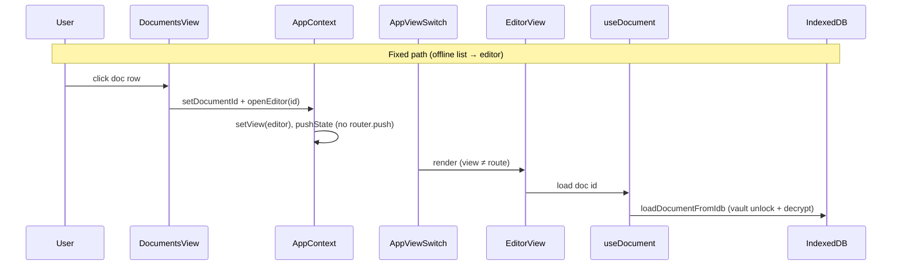

# Offline Document Loading

Research and implementation notes for opening documents while offline (cold open from the documents list).

## Problem

Clicking a document in the list while offline showed Chrome `ERR_INTERNET_DISCONNECTED` — a full browser error page — before any editor or IndexedDB code ran.

### Root cause (primary)

`openEditor` used `router.push("/editor?doc=…")`, which triggers a Next.js App Router soft navigation and fetches an RSC flight payload (`?_rsc=…`). With DevTools offline and no service worker, that fetch fails and the browser shows its native offline error.

The document UUID and IndexedDB cache were never the issue: the same id is used for server rows, `documents` store keys, and outbox entries.

### Secondary issues

1. **Yjs cold open offline** — `useYjsCollaboration` is disabled when `browserOffline`, so body text comes only from the encrypted JSON snapshot in IndexedDB. If the JSON projection lags behind CRDT edits, cold offline open can show an empty body even when `yjs_state` exists in IDB.
2. **Silent decrypt failures** — `getOfflineDocument` previously caught all errors and returned `null`, making vault-lock and decrypt failures indistinguishable from “not cached”.

## Architecture

## Source selection

| Layer | Online | Offline |
|-------|--------|---------|
| Document list | `GET /app/api/documents` | `listOfflineDocumentsForWorkspace` |
| Single doc | `GET /app/api/documents/:id` + reconcile | `loadDocumentFromIdb` |
| Eager cache on open | `syncOfflineDocumentAccess` | n/a |
| Editor body (live) | Yjs + Supabase realtime | JSON from IDB (Yjs local-only: follow-up) |

### IDB read prerequisites

1. Row in `rhodes-db` → `documents` store (key = document UUID)
2. `ensureDocsVaultUnlocked(userId)` loaded DEK `${userId}:docs` from `vault` store
3. `decryptDocsJson` decrypts `content_enc`, `content_plain_enc`, `metadata_enc`

### Typed load results

`loadDocumentFromIdb` returns:

- `{ ok: true, source: "idb", document }`
- `{ ok: false, reason: "not_cached" | "vault_locked" | "decrypt_failed" | "idb_unavailable", detail? }`

User-facing messages are mapped in `loadDocumentErrorMessage`.

**Diagnostic:** `await __rhodesInspectDoc('UUID')` in dev (`offline-doc-debug.ts`).

## Implementation (phased)

### Phase 1 — Offline-safe navigation ✅

- `openEditor` / `setView`: when `navigator.onLine === false`, use `setViewState` + `history.pushState` instead of `router.push`
- `AppViewSwitch`: render `EditorView` when `view !== routeView` (client view ahead of Next route)
- `useEditorSession`: fall back to `AppContext.documentId` when URL search params are stale after pushState
- `popstate` listener syncs view + doc id on back/forward

### Phase 2 — Explicit IDB loader ✅

- `lib/offline/load-document.ts` — `loadDocumentFromIdb` with vault await + typed errors
- `getOfflineDocumentStrict` in `documents-cache.ts` — throws `OfflineDocumentReadError`
- `useDocument` — uses typed loader for offline path and surfaces vault/decrypt errors

### Phase 3 — Offline Yjs local-only (deferred)

Enable `useYjsCollaboration` in local-only mode when offline if JSON body is blank but `yjs_state` exists.

### Phase 4 — E2E

- `offline-list-open.spec.ts`: cache doc online → offline → click list row → editor opens without Chrome error

## Verification

1. DevTools Network: click doc offline → no failed `?_rsc=` before `/app/api/documents`
2. Online cache doc → go offline → click list item → editor renders
3. `__rhodesInspectDoc` shows `decrypted: true`; vault locked shows meaningful error
4. Regression: `pnpm test:offline` (stay-on-editor path)

## Related

- [12-offline-sync.md](./12-offline-sync.md)
- [implementation_plan/25-offline-app-shell.md](../implementation_plan/25-offline-app-shell.md)
- TD-004 in `techncial-dept.md`
