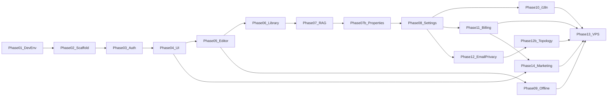

# Rhodes Implementation Plan — Index

**Status:** accepted  
**Last updated:** July 11, 2026  
**Current focus:** Phase 07b — Properties, scope intelligence, and views  
**Git remote:** [github.com/kallekormann/rhodes](https://github.com/kallekormann/rhodes.git)  
**Branches:** `dev` (integration) → `main` (release/stable)

---

## Purpose

This folder contains the **executable implementation plan** for building Rhodes: a Docker-first, self-hosted team second brain. Each phase is one markdown file with objectives, tasks, file checklists, env vars, testing criteria, and exit gates.

**Canonical product specs** remain in [`../docs/`](../docs/). **UI reference** is [`../ui-mock/`](../ui-mock/) + [`../docs/26-ui-mock-reference.md`](../docs/26-ui-mock-reference.md).

---

## Strategy

1. **Local Docker first** — full stack on developer machine; same service topology as VPS.
2. **Feature phases 01–10** — build core product locally against specs and ui-mock.
3. **Integration phases 11–12** — billing and email/privacy built locally with test/stub modes.
4. **Phase 12b** — distributed Docker topology (optional 3-server prod: app / data / storage); monolith remains default for dev.
5. **Phase 13 (VPS)** — deploy to Hetzner + Coolify when mature; **distributed 3-role prod** from day 1 ([13b](13b-scale-ready-production-infra.md)); monolith for dev only.

---

## Phase index

| Phase | Document | Summary | Est. duration |
|-------|----------|---------|---------------|
| 01 | [01-repo-and-dev-environment.md](01-repo-and-dev-environment.md) | Git, Docker compose, dev scripts | 2–3 days |
| 02 | [02-monorepo-scaffolding-and-database.md](02-monorepo-scaffolding-and-database.md) | pnpm monorepo, Next.js, worker, migrations | 3–5 days |
| 03 | [03-authentication-and-tenancy.md](03-authentication-and-tenancy.md) | Supabase Auth, RLS, workspace bootstrap | 4–6 days |
| 04 | [04-ui-foundation.md](04-ui-foundation.md) | Port design system + app shell from ui-mock | 5–7 days |
| 05 | [05-documents-and-tiptap-editor.md](05-documents-and-tiptap-editor.md) | Document CRUD, TipTap editor | ✅ complete |
| 05b | [05b-editor-block-drag-and-comments.md](05b-editor-block-drag-and-comments.md) | Block drag-drop, comment marks | ✅ complete |
| 05d | [05d-sidebar-comments.md](05d-sidebar-comments.md) | Sidebar comments panel + bidirectional linking | ✅ complete |
| 05c | [05c-metadata-properties-and-polish.md](05c-metadata-properties-and-polish.md) | Metadata, properties, template fields, signed URLs | ✅ complete |
| 06 | [06-library-and-ingestion-pipeline.md](06-library-and-ingestion-pipeline.md) | Upload, worker, Tika, embeddings | ✅ complete |
| 07 | [07-ai-rag-and-insights.md](07-ai-rag-and-insights.md) | Ollama, RAG, Ask, Properties Manage + AI auto-fill | ✅ complete |
| 07b | [07b-properties-scope-and-views.md](07b-properties-scope-and-views.md) | Properties tab UX, builder, scope views, metadata intelligence | **next** |
| 07b-ux | [07b-ux-properties-studio.md](07b-ux-properties-studio.md) | **UX design session** — Properties Studio look & behavior (gate before UI polish) | **review** |
| 08 | [08-settings-teams-metadata-templates.md](08-settings-teams-metadata-templates.md) | Settings, teams, templates, version history | planned |
| 09 | [09-offline-sync.md](09-offline-sync.md) | IndexedDB, outbox, conflict handling | 5–7 days |
| 10 | [10-internationalization.md](10-internationalization.md) | EN + ES/DE/FR/IT | 3–5 days |
| 11 | [11-billing-lemonsqueezy.md](11-billing-lemonsqueezy.md) | Subscriptions, webhooks, feature gates | 4–6 days |
| 12 | [12-email-privacy-and-security.md](12-email-privacy-and-security.md) | Email relay, GDPR, hardening | 4–6 days |
| 12b | [12b-distributed-docker-topology.md](12b-distributed-docker-topology.md) | App / Data / Storage Compose profiles; monolith or 3-server prod | 4–6 days |
| 13 | [13-vps-production-and-integration.md](13-vps-production-and-integration.md) | Coolify deploy, integration testing (13A launch) | 5–7 days |
| 13b | [13b-scale-ready-production-infra.md](13b-scale-ready-production-infra.md) | Scale-ready workers, queues, observability, 10k+ path (with 13) | 6–10 days |
| 14 | [14-marketing-website.md](14-marketing-website.md) | Decoupled marketing site, demos, pricing, legal | 7–10 days |

**Total estimate:** ~14–18 weeks for a solo developer; parallelize UI + backend + marketing where phases allow.

### Phase 05 completion summary (July 2026)

| Slice | Delivered |
|-------|-----------|
| **05 core** | Document CRUD, TipTap editor, bubble/slash menus, templates, share/archive |
| **05b** | Block drag-and-drop (0-based position fix; no phantom blocks) |
| **05d** | Sidebar comments (ADR 008), threaded replies, panel ↔ highlight linking |
| **05c** | Schema-driven Properties tab, template description/use cases/default properties, signed URL refresh on load |

**Migration:** `00014_template_metadata_and_schema_seed.sql` — `templates.metadata` + default workspace metadata schemas.

**Deferred to Phase 07b:** Properties Manage UX redesign (slide-over builder, radio/toggle types, scope snapshot, saved views).  
**Deferred to Phase 08:** metadata admin in Settings, share-with-team (needs invites), full saved-views polish.

### Phase 06 completion summary (July 2026)

| Slice | Delivered |
|-------|-----------|
| **Upload + list API** | PDF/DOCX/TXT → `library-files` storage + `library_sources` row |
| **Worker pipeline** | ingest (Tika) → embed (Ollama) + summarize in parallel |
| **Library UI** | Functional drop zone, status pills, polling, retry on failed |

**Migration:** `00015_library_files_storage.sql`

**Manual QA:** Run Docker stack (Redis, Tika, Ollama, worker) and upload a PDF to verify end-to-end `pending → ready`.

---

## Dependency graph



Phases 09, 10, 11, 12, 14 can run in parallel after Phase 08 (Phase 14 can start after Phase 04 using ui-mock tokens). **Phase 12b runs after Phase 12 and before Phase 13.** Phase 14 deploys with Phase 13.

---

## Repository layout (target)

```
rhodes/
├── apps/
│   ├── web/                 # Next.js 15 App Router (product)
│   ├── marketing/           # Next.js marketing site (decoupled)
│   └── worker/              # BullMQ jobs
├── packages/
│   ├── db/                  # Migrations, types, RLS helpers
│   ├── shared/              # Zod schemas, constants
│   └── ai/                  # Ollama client, RAG, prompts
├── docker/
│   ├── docker-compose.yml
│   ├── docker-compose.dev.yml
│   ├── docker-compose.prod.yml
│   └── .env.example
├── supabase/
│   ├── migrations/
│   └── config.toml
├── docs/
├── ui-mock/
├── implementation_plan/       # This folder
├── scripts/
├── .github/workflows/
├── pnpm-workspace.yaml
└── README.md
```

---

## Git workflow

| Branch | Purpose |
|--------|---------|
| `main` | Stable; tagged releases; VPS production deploys |
| `dev` | Integration branch; daily merges |
| `feature/*` | One feature or phase slice; PR → `dev` |

**Merge gate:** Phase exit criteria met + PR review + CI green before merging `dev` → `main`.

---

## Local vs VPS matrix

| Concern | Local dev | VPS (Phase 13) |
|---------|-----------|----------------|
| Topology | Monolith (all Compose services on one host) | Monolith **or** distributed (app + data + storage servers) — see [12b](12b-distributed-docker-topology.md) |
| TLS | `http://localhost` | Caddy + Let's Encrypt on `rhodes.quinsy.app` (or `rhodes.app` if O-018 resolves) |
| Email | Mailpit (capture) | Resend or AWS SES EU |
| Billing webhooks | ngrok / cloudflared tunnel | Live `https://rhodes.quinsy.app/app/api/webhooks/lemonsqueezy` |
| Ollama | Docker container (or host on Mac via `OLLAMA_HOST`) | Docker container |
| Supabase | Official Docker stack | Same stack via Coolify |
| Secrets | `.env` (gitignored) | Coolify env vars |

**Portability rule:** `docker compose -f docker-compose.yml -f docker-compose.dev.yml up` locally (monolith); production uses `docker-compose.prod.yml` plus optional profile overlays from Phase 12b (`app` / `data` / `storage`). Same images, different placement and env.

---

## Implementation principles

1. **Mock is law for UI** — deviations logged in [`../docs/19-open-decisions.md`](../docs/19-open-decisions.md).
2. **Same Docker services locally and on VPS** — only env overlays differ.
3. **No cloud LLM in V1** — Ollama only ([ADR 001](../docs/adr/001-full-vps-self-hosted.md)).
4. **Service role key server-only** — never in client bundle.
5. **Each phase has exit criteria** — do not start next phase until met.
6. **Billing/email full-stack tests** — stubbed locally (Phases 11–12), validated on VPS (Phase 13).

---

## Prerequisites (developer machine)

| Requirement | Minimum | Recommended |
|-------------|---------|-------------|
| Docker Desktop | 4 GB RAM allocated | 8 GB RAM allocated |
| System RAM | 16 GB | 32 GB |
| Disk | 40 GB free | 80 GB free (Ollama models) |
| Node.js | 20 LTS | 22 LTS |
| pnpm | 9.x | latest |
| Git | 2.x | latest |

---

## Quick start (after Phase 01)

```bash
git clone https://github.com/kallekormann/rhodes.git
cd rhodes
git checkout dev
cp docker/.env.example docker/.env
./scripts/dev-up.sh
./scripts/pull-models.sh
pnpm install
pnpm dev
```

---

## Related documents

- [Product spec index](../docs/README.md)
- [Infrastructure](../docs/13-infrastructure-vps.md)
- [NFR / Definition of Done](../docs/18-non-functional-requirements.md)
- [Open decisions](../docs/19-open-decisions.md)
- [UI mock reference](../docs/26-ui-mock-reference.md)
