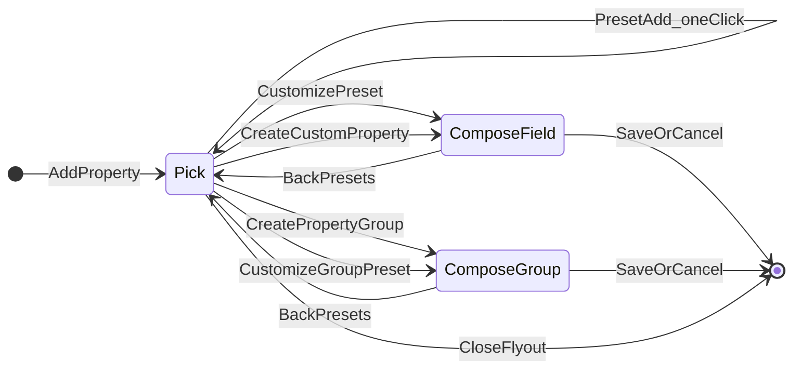
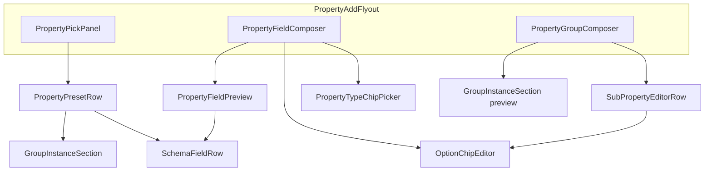

# 07b UX Session — Properties Studio

**Status:** signed off — **pivoted 2026-07-13** to In-Context Inspector flyout (replaces permanent 3-column studio)  
**Parent:** [07b-properties-scope-and-views.md](07b-properties-scope-and-views.md)  
**Sticker sheet:** `/sticker-sheet` → Properties Studio section (components must exist there before ship)

---

## Why this session exists

The current Properties Studio implementation is **functionally correct but visually junior**. Symptoms:

| Symptom | Root cause |
|---------|------------|
| Feels like three unrelated panels glued together | **Superseded:** permanent 3-column studio — presets, schema list, and editor compete for attention |
| No clear left→right hierarchy | Navigate → Select → Edit does not apply when all three are visible at once |
| Editor blocks document focus | Creation UI occupies space even when user is only filling values |
| Presets look like a form builder, not Rhodes | Preview + actions stacked awkwardly; too many bordered boxes |
| Editor idle state is a list of rows | Admin UI reads as CRUD table, not "design your workspace schema" |
| `PropertyDefinitionRow` reused everywhere | Same component for builder, admin, and nested sub-fields — no role distinction |
| Too many borders, not enough typography | Hierarchy from boxes instead of type scale + spacing |
| Presets wrapped in bordered cards | Must use bare `props-list` — same as document panel |
| Done uses `size="small"`; Manage uses default | Action bars must share one pattern and button size |
| Editor browse renders `PropertyDefinitionRow` inputs | Browse is a **schema index**, not a second Properties tab |

**Rule:** Implement per **D13** order below. Retire `PropertiesStudioLayout` 3-column shell and `Manage properties` / `Done` mode transition.

---

## Why the 3-column studio was rejected

A 3-column layout works when there is a clear **left → right hierarchy** (e.g. navigate → select → edit). In Properties Studio, **presets** (pick a template) and **editor** (create from scratch) are **different actions at the same level** — putting them beside a schema list forces the user to scan three competing surfaces and breaks the mental model.

| 3-column problem | Flyout solution |
|------------------|-----------------|
| Presets + list + editor always visible | Only document sidebar by default; add UI is **temporary** |
| User doesn't know where to look first | One focus: the document. Add flow is an explicit side quest |
| Editor eats horizontal space permanently | Flyout exists only while adding/editing a definition |
| "Manage mode" feels like leaving the document | Stay in Properties tab; flyout slides in from the right |

**Reference pattern:** Notion property picker, Figma inspect panel, Webflow add-field drawer — **in-context inspector with flyout**.

---

## Plane 1 — Strategy

### Product goal
Let workspace admins define **how documents are described** in a scope — so filtering, views, and AI can reason about content consistently.

### User goal (end)
*"I want our team to tag documents the same way, without thinking about databases or JSON."*

### Experience goal
- **Confident** — I see exactly how a property will appear on a document
- **Fast** — common setups take one click; custom setups feel guided, not like a settings form
- **Safe** — I can try presets and customize without breaking existing documents

### Application posture
**In-context inspector** — user stays on the document in the normal 352px Properties panel. Schema authoring is a **temporary flyout** that slides in from the right when they choose to add or edit a workspace property. No fullscreen studio, no `Manage` / `Done` mode switch.

### Primary persona
**Scope admin** — sets up properties once per workspace. Not the casual document author (they only fill values in normal Properties tab).

---

## Plane 2 — Scope

### In scope (07b UX)
- Normal Properties tab (read/write values on open document)
- **Workspace schema section** in the same tab (list, remove, edit entry point)
- **Property add flyout** — presets + custom composer (temporary drawer)
- Single fields + property groups (repeatable instances)
- Live update: new schema rows appear in document values immediately

### Out of scope (defer)
- Saved views UI (separate slice)
- Scope snapshot charts
- Drag-to-reorder schema
- Property permissions per role
- AI-suggested schema

---

## Plane 3 — Structure

### Layout model: 2 + flyout (not 3 permanent columns)

```
DEFAULT (always)                         FLYOUT OPEN (temporary)
────────────────                         ──────────────────────
┌ app header ─────────────────────────┐  ┌ app header ────────────────┐
│ editor canvas    │ Properties 352px │  │ editor    │ Props │ Flyout │
│                  │ tab bar          │  │           │ values│ presets│
│                  │ document values  │  │           │ schema│   or   │
│                  │ workspace schema │  │           │ list  │ editor │
│                  │ [+ Add property] │  │           │       │  [×]  │
└──────────────────┴──────────────────┘  └───────────┴───────┴────────┘
```

| Surface | Width | When visible |
|---------|-------|--------------|
| **Editor canvas** | flex | Always |
| **Properties panel** | `--panel-width-sm` (352px) | When panel open on Properties tab |
| **Property add flyout** | `320px` (token: `--panel-flyout-width`) | Only while adding/editing a definition |

**Banned:** `100vw` studio shell, `Manage properties` → `Done` mode, permanent center + right columns.

### Properties tab anatomy (single column)

```
┌─ tab bar (48px) ────────────────────────┐
│ Insights · Ask · Properties · [×]       │
├─────────────────────────────────────────┤
│ SYSTEM                                  │
│ Created · Created by · Word count       │
├─────────────────────────────────────────┤
│ THIS DOCUMENT                           │
│ Status ▾ · Priority · …  (props-list)   │
├─────────────────────────────────────────┤
│ WORKSPACE PROPERTIES                    │
│ Status · Single select        ··· Remove│  ← PropertySchemaIndexRow
│ KPI · Group · 3 fields        ··· Remove│
├─────────────────────────────────────────┤
│ scope snapshot (optional)                 │
├─────────────────────────────────────────┤
│ panel-actionbar                         │
│              [ + Add property ]         │  ← primary · default
└─────────────────────────────────────────┘
```

- **THIS DOCUMENT** — interactive `SchemaFieldRow` values on the open doc.
- **WORKSPACE PROPERTIES** — schema index (`PropertySchemaIndexRow`); tap row to edit → opens flyout in compose mode.
- **+ Add property** — opens flyout in **pick** mode (replaces retired `Manage properties`).

### Flyout — two states only

| State | User intent | Flyout content |
|-------|-------------|----------------|
| **Pick** | Choose a preset or start custom | Scrollable preset list + footer CTA |
| **Compose** | Define field or group | Composer (field or group) + Save/Cancel |

**Pick → Compose** is inline inside the flyout (`←` back to presets). **No third "browse" column** — workspace list lives in the main Properties tab.

```
PICK (default on open)                 COMPOSE (custom or customize)
┌─ Add property ───────────── [×] ┐   ┌─ New property ────────── [×] ┐
│ Presets (scroll)                 │   │ [← Presets]                    │
│                                  │   │ Label · Type chips · Options   │
│  dl.props-list + preview rows    │   │ Preview (props-list)           │
│  [Add] Customize per row         │   │                                │
│                                  │   │ [Cancel]  [Save property]      │
├──────────────────────────────────┤   └────────────────────────────────┘
│ Create custom property           │
│ Create property group            │   ← secondary links, not competing columns
└──────────────────────────────────┘
```

### Flyout interactions

| User action | Result |
|-------------|--------|
| **+ Add property** (panel footer) | Flyout opens — **Pick** state |
| Tap preset **Add** | Schema created; flyout closes; row appears in WORKSPACE + THIS DOCUMENT |
| Tap preset **Customize** | Flyout → **Compose**, pre-filled |
| **Create custom property** (flyout footer) | Flyout → **Compose**, empty field |
| **Create property group** (flyout footer) | Flyout → **Compose**, group mode |
| Tap workspace row **Edit** (or row click) | Flyout → **Compose**, pre-filled (P2 if edit deferred: remove-only in V1) |
| **Save** | Schema saved; flyout closes |
| **Cancel** / **×** / `Escape` | Flyout closes (confirm if dirty) |
| Remove (workspace list) | Confirm dialog; no flyout |

### Motion

| Action | Motion |
|--------|--------|
| Open flyout | Slide in from right, 200ms ease-out; panel stays 352px, flyout adds beside it (total ~672px) OR flyout overlays panel right edge — **prefer push**: panel + flyout, editor canvas unchanged |
| Pick → Compose | Cross-fade content inside flyout header title updates |
| Close flyout | Slide out 150ms; focus returns to **+ Add property** button |

### App header

Always visible. Flyout is below header, same as Properties panel (`top: var(--header-height)`). No scroll-to-hide while flyout open.

### Column headers in flyout

Flyout header uses **same chrome as tab bar row**: `panel-column-header` 48px, title `13px` medium — e.g. `Add property`, `New property`, `New group`.

---

## UI element definitions (flows a–d)

This section specifies **exact UI elements** for each property-definition flow inside `PropertyAddFlyout`. Flows (b) and (c) share `PropertyFieldComposer`; flows (b) and (d) share seed-from-preset vs empty; flow (a) never opens compose.

### Flyout state machine

All four flows live in one drawer. Two top-level states; customize/custom/group are **compose variants**.



| Flow | Entry | Flyout state | Compose variant |
|------|-------|--------------|-----------------|
| **(a) Select preset** | `Add` on `PropertyPresetRow` | Pick | — (no compose) |
| **(b) Customize preset** | `Customize` on row | Compose | `field` or `group`, `seed=preset` |
| **(c) Simple property** | Footer "Create custom property" | Compose | `field`, `seed=empty` |
| **(d) Group property** | Footer "Create property group" or group preset Customize | Compose | `group`, `seed=empty\|preset` |

### `PropertyAddFlyout` shell

Wires Pick vs Compose; owns header title, close, and body swap.

| Prop / state | Values |
|--------------|--------|
| `open` | Controlled by Properties tab `+ Add property` and close actions |
| `mode` | `pick` \| `compose` |
| `composeKind` | `field` \| `group` (when `mode=compose`) |
| `seed` | `preset` \| `empty` \| `schema` (P2) |
| `presetLabel` | Optional — preset id for customize |

**Header titles by flow:**

| Flow | Header title | Back control |
|------|--------------|--------------|
| (a) Pick | `Add property` | — (only × close) |
| (b) Customize field | `Customize {label}` | `← Presets` ghost small |
| (b) Customize group | `Customize {group_label}` | `← Presets` ghost small |
| (c) Custom field | `New property` | `← Presets` ghost small |
| (d) Custom group | `New group` | `← Presets` ghost small |
| (d) Customize group | `Customize {group_label}` | `← Presets` ghost small |

**Shell element tree:**

```
PropertyAddFlyout
├── panel-column-header
│   ├── [← Presets]          ghost · small   (compose only)
│   ├── span title           13px medium
│   └── IconButton ×         ghost           (close)
├── .property-flyout__body   scroll
│   ├── PropertyPickPanel              (mode=pick)
│   ├── PropertyFieldComposer          (mode=compose, kind=field)
│   └── PropertyGroupComposer          (mode=compose, kind=group)
└── footer
    ├── .property-flyout__pick-footer   (mode=pick)
    └── panel-actionbar                  (mode=compose)
```

| Element | Class / component | Spec |
|---------|-------------------|------|
| Shell | `PropertyAddFlyout` | Fixed right drawer; `--panel-flyout-width: 320px`; slide 200ms; focus trap |
| Header | `panel-column-header` | 48px; title 13px medium |
| Scroll body | `.property-flyout__body` | `flex:1; overflow-y:auto; padding: space-md` |
| Pick footer | `.property-flyout__pick-footer` | Border-top; secondary-small CTAs |
| Compose footer | `panel-actionbar` | Cancel `secondary default` + Save `primary default` |

**Reuse:** `SchemaFieldRow`, `props-list`, `Button`, `Input`, `Toggle`, `IconButton`.

**Retire in compose:** `PropertyDefinitionRow` textarea options + type `Dropdown` → `PropertyTypeChipPicker` + `OptionChipEditor`.

---

### (a) Select a preset

**Intent:** One-click add — user sees document-faithful preview and adds without compose.

**Panel:** `PropertyPickPanel`

**Wireframe:**

```
┌─ Add property ─────────────────────── [×] ┐
│ Fields                                    │
│ ┌ props-list ─────────────────────────┐  │
│ │ Status              [ draft ▾ ]     │  │
│ └─────────────────────────────────────┘  │
│ Status · Single select    [ Add ] Customize│
│ ─────────────────────────────────────────  │
│ Groups                                    │
│ ┌ props-list (group preview) ──────────┐  │
│ │ KPI / Name / Baseline …             │  │
│ └─────────────────────────────────────┘  │
│ KPI · 3 sub-fields        [ Add ] Customize│
├──────────────────────────────────────────┤
│ [ Create custom property ]               │
│ [ Create property group ]                  │
└──────────────────────────────────────────┘
```

**Section structure:**

```
panel-column-header                 "Add property"    [×]
property-flyout__body
  section.property-pick__section
    h5.props-list__section-title    "Fields"
    PropertyPresetRow × N           PROPERTY_PRESETS
  section.property-pick__section
    h5.props-list__section-title    "Groups"
    PropertyPresetRow × N           PROPERTY_GROUP_PRESETS
property-flyout__pick-footer
  Button "Create custom property"   secondary · small
  Button "Create property group"    secondary · small
```

#### `PropertyPresetRow` (refactor from `PropertyPresetItem`)

| # | Element | Component | Notes |
|---|---------|-----------|-------|
| 1 | Preview block | `dl.props-list` | No card border — on flyout bg |
| 2 | Field preview | `SchemaFieldRow` `preview` | Single-field presets |
| 2b | Group preview | `GroupInstanceSection` `preview` | One non-interactive instance |
| 3 | Meta line | `span.property-preset-row__meta` | `{label} · {type}` or `{group} · {n} sub-fields` |
| 4 | Add | `Button` `secondary` `small` | Creates schema; closes flyout |
| 5 | Added | `Button` `secondary` `small` `disabled` | When key already exists |
| 6 | Customize | `Button` `ghost` `small` | → flow (b) |

**Interaction:** Tap **Add** only — no navigation. Row appears under **THIS DOCUMENT** and **WORKSPACE PROPERTIES**.

**Evolve from:** `PropertyPresetItem` — remove `property-preset-item__preview` card wrapper; keep preview helpers (`fieldPresetToPreviewFields`, etc.).

---

### (b) Customize a preset

**Intent:** Start from template; edit label, type, or options before save.

**Panel:** `PropertyFieldComposer` or `PropertyGroupComposer` with `seed=preset`.

**Wireframe (field):**

```
┌─ [← Presets]  Customize Status ─────── [×] ┐
│ Label    [ Status                        ]  │
│ Key: status                                 │
│ Type     [Text][Number][■ Select][Date]…    │
│ Options  [draft ×][in_progress ×][+ add]    │
│ Preview                                     │
│ ┌ props-list ────────────────────────────┐  │
│ │ Status              [ draft ▾ ]       │  │
│ └───────────────────────────────────────┘  │
├─────────────────────────────────────────────┤
│              [ Cancel ]  [ Save property ]  │
└─────────────────────────────────────────────┘
```

#### `PropertyFieldComposer` elements

| # | Label | Component | Validation |
|---|-------|-----------|------------|
| 1 | Label | `Input` `variant=plain` | Required |
| 2 | Key hint | `span.caption` | `Key: {fieldKeyFromLabel(label)}` |
| 3 | Type | **`PropertyTypeChipPicker`** | Icon chips by category |
| 4 | Options | **`OptionChipEditor`** | When type ∈ `select`, `multi_select`, `radio`; min 1 |
| 5 | Unit | `Input` placeholder `Unit` | When type = `number` |
| 6 | Preview | **`PropertyFieldPreview`** | `dl.props-list` + `SchemaFieldRow` bound to draft |
| 7 | Error | `p.property-composer__error` | Inline |
| 8 | Footer | `panel-actionbar` | Cancel · **Save property** |

**`PropertyTypeChipPicker` groups:**

| Category | Types |
|----------|-------|
| Text | `text`, `textarea`, `url` |
| Number | `number` |
| Choice | `select`, `radio`, `multi_select`, `toggle` |
| Date | `date`, `date_range` |
| Other | `tags` |

Each chip: Lucide icon + short label; selected = accent border (`tag--active` pattern).

**`OptionChipEditor`:** Wrapped chips with × remove; trailing add control; **no `<textarea>`**.

**Group customize:** Same as (d) with `initialSeed` from `PROPERTY_GROUP_PRESETS`.

**Evolve from:** `PropertyBuilderColumn`, `PropertyGroupBuilderColumn` — flyout embed, chip pickers, `default` footer buttons.

---

### (c) Define a simple label+value property

**Intent:** Blank-slate single field — same UI as (b), empty defaults.

**Entry:** Pick footer **Create custom property**.

| Field | Default |
|-------|---------|
| `label` | `""` |
| `fieldType` | `text` |
| `options` | `[]` |
| `unit` | `""` |

**Header:** `New property`

**Component:** `PropertyFieldComposer` with `seed=empty` — identical element tree to (b).

**Preview:** Show preview block when `label.trim()` non-empty; else caption *"Preview appears when you add a label."*

---

### (d) Define a group property

**Intent:** Named block with multiple sub-fields; optional repeat on document.

**Entry:** Pick footer **Create property group**, or **Customize** on group preset.

**Panel:** `PropertyGroupComposer`

**Wireframe:**

```
┌─ [← Presets]  New group ─────────────── [×] ┐
│ Group name  [ KPI                         ] │
│ Key: kpi                                    │
│ [✓] Allow multiple on a document            │
│ Sub-properties                              │
│ ┌ SubPropertyEditorRow ──────────────────┐  │
│ │ [Name    ] [Text ▾]              [ − ] │  │
│ │ [Baseline] [Number▾] [Unit: %]   [ − ] │  │
│ └────────────────────────────────────────┘  │
│ [ + Add sub-property ]                      │
│ Preview                                     │
│ ┌ GroupInstanceSection preview ──────────┐  │
│ │ KPI / Name / Baseline …                │  │
│ └───────────────────────────────────────┘  │
├─────────────────────────────────────────────┤
│                [ Cancel ]  [ Save group ]     │
└─────────────────────────────────────────────┘
```

| # | Label | Component | Notes |
|---|-------|-----------|-------|
| 1 | Group name | `Input` | Required |
| 2 | Key hint | `span.caption` | `Key: {fieldKeyFromLabel(groupLabel)}` |
| 3 | Repeatable | `Toggle` | **Allow multiple on a document** |
| 4 | Section | `h5` + list | Sub-properties |
| 5 | Sub-field row | **`SubPropertyEditorRow`** | See below |
| 6 | Add sub-field | `Button` `secondary` `small` + `Plus` | Appends row |
| 7 | Preview | `GroupInstanceSection` `preview` | One sample instance |
| 8 | Footer | `panel-actionbar` | Cancel · **Save group** |

#### `SubPropertyEditorRow`

| Column | Element | Notes |
|--------|---------|-------|
| Label | `Input` | Sub-field label |
| Type | `Dropdown` compact | Subset: `text`, `textarea`, `number`, `select`, `multi_select`, `date`, `tags`, `url`, `toggle` |
| Unit | `Input` | When `number` |
| Options | `OptionChipEditor` | When choice type |
| Remove | `Button` `ghost` `small` | Hidden when only one row |

Sub-keys via `subKeyFromLabel` on save. No nested groups in V1.

---

### Component map



| Component | Flows | Status |
|-----------|-------|--------|
| `PropertyAddFlyout` | all | New shell |
| `PropertyPickPanel` | a | New |
| `PropertyPresetRow` | a, entry → b | Refactor from `PropertyPresetItem` |
| `PropertyFieldComposer` | b, c | Refactor from `PropertyBuilderColumn` |
| `PropertyGroupComposer` | b, d | Refactor from `PropertyGroupBuilderColumn` |
| `PropertyTypeChipPicker` | b, c | New |
| `OptionChipEditor` | b, c, d | New |
| `SubPropertyEditorRow` | d | New |
| `PropertyFieldPreview` | b, c | Thin wrapper over `SchemaFieldRow` |
| `SchemaFieldRow` | a, b, c previews | Exists — `preview` prop |
| `GroupInstanceSection` | a, d previews | Exists — add `preview` prop |

**Out of scope (this slice):** Edit existing workspace row (P2); `radio`/`toggle` document renderers (07b.3 — picker may include types early).

---

The same schema must read differently depending on **zone + intent**. Never reuse one row component for all three.

| Mode | Zone | Component | Looks like | Interactive |
|------|------|-----------|------------|-------------|
| **Document** | Properties tab — THIS DOCUMENT | `SchemaFieldRow` (default) | Label + input control | Yes — edit values |
| **Preset preview** | Flyout — Pick state | `SchemaFieldRow` `preview` in `props-list` | Identical to document row | No |
| **Schema index** | Properties tab — WORKSPACE PROPERTIES | `PropertySchemaIndexRow` | Settings list — label + type meta | Remove / Edit entry only |

### Visual distinction — editor browse (existing properties)

The workspace section in the Properties tab is **not** a second Properties tab. Users must instantly see they are managing definitions, not filling values.

| Signal | Document / preset | Schema index (workspace section) |
|--------|-------------------|-------------------------------|
| Row content | `dt` + input (`dd`) | Primary label + secondary type line |
| Controls | Dropdowns, inputs, tags | None — metadata text only |
| Section title | `THIS DOCUMENT` | `WORKSPACE PROPERTIES` |
| Actions | N/A (or preset Add/Customize in flyout) | `ghost` `small` Remove; Edit opens flyout |

**Banned in browse:** `PropertyDefinitionRow`, `SchemaFieldRow`, bordered cards, input controls.

```
                    DOCUMENT          PRESET           SCHEMA INDEX
                    ────────          ──────           ────────────
Status              [ draft ▾ ]       [ draft ▾ ]      Status · Single select     Remove
                    (editable)        (preview)        (text only, no input)
```

---

## Plane 4 — Skeleton

### Zone hierarchy

| Zone | Width | Role |
|------|-------|------|
| **Editor canvas** | flex | Primary — document content never deprioritized |
| **Properties panel** | 352px | Values + workspace schema list |
| **Property flyout** | 320px | Temporary — pick preset or compose |

**Do not:** permanent third column; grey editor canvas zone; full-width studio.

### Component inventory

See **UI element definitions (flows a–d)** for full trees. Summary:

| Component | Role |
|-----------|------|
| `PropertyAddFlyout` | Shell — pick \| compose, header titles per flow |
| `PropertyPickPanel` | Flow (a) — preset sections + pick footer |
| `PropertyPresetRow` | Preset row — `props-list` preview + Add/Customize |
| `PropertyFieldComposer` | Flows (b), (c) — label, chips, preview, save |
| `PropertyGroupComposer` | Flows (b), (d) — group name, sub-rows, preview |
| `PropertyTypeChipPicker` | Type selection — icon chips by category |
| `OptionChipEditor` | Option chips — add/remove, no textarea |
| `SubPropertyEditorRow` | Group sub-field editor row |
| `PropertyFieldPreview` | Live `SchemaFieldRow` preview wrapper |
| `PropertySchemaIndexRow` | WORKSPACE PROPERTIES list |
| `SchemaFieldRow` / `GroupInstanceSection` | Document + previews |
| `PanelActionBar` | `+ Add property` CTA |

**Retire:** `PropertiesStudioLayout`, `PropertiesPresetColumn`, `PropertyPresetItem` card, `Manage properties`, studio `Done`, `right-panel--studio`, `PropertyDefinitionRow` in compose.

### Workspace schema list (in Properties tab)

```
WORKSPACE PROPERTIES
─────────────────────────────────────────
Status          Single select              Remove
KPI             Group · 3 fields · repeat  Remove
                  Name · Baseline · Lift %   ← collapsed summary, expand on click
```

### Compose (inside flyout)

```
← Presets

Label          [ Review date                    ]
Type           [ Text ] [ Number ] [ Select ] …
Options        [ draft × ] [ in progress × ] [ + ]

Preview
  dl.props-list · SchemaFieldRow (preview)

                    [ Cancel ]  [ Save property ]
```

### Preset row (flyout pick state)

Same as before — bare `props-list`, actions below:

```
dl.props-list
  Status    [ draft ▾ ]
Status · Single select                 [ Add ]  Customize
```

### Transitions

| Action | Motion |
|--------|--------|
| Open flyout | Slide in from right 200ms |
| Pick → Compose | In-flyout replace; header title changes |
| Add preset | Toast + flyout close + rows update in tab |
| Close flyout | Slide out 150ms |

### Keyboard / focus
- `Escape` in compose → back to pick (confirm if dirty), then close
- `Escape` in pick → close flyout
- Focus trap inside flyout while open

---

## Panel action bar (shared)

Single footer on the Properties tab — **+ Add property** is the only panel-level CTA (replaces `Manage properties`). No studio-wide Done bar.

```css
.panel-actionbar {
  display: flex;
  align-items: center;
  justify-content: flex-end;
  flex-shrink: 0;
  min-height: 52px;
  padding: var(--space-sm) var(--space-md);
  border-top: 1px solid var(--color-border-subtle);
  background: var(--color-bg-elevated);
}
```

| Surface | CTA |
|---------|-----|
| Properties tab footer | `+ Add property` — `primary` `default` |
| Flyout compose footer | `Cancel` secondary + `Save` primary — both `default` |

**Retire:** full-width studio action bar with `Done`.

---

## Button hierarchy

One primary CTA per surface. Size and variant encode **importance** and **density**.

### Default size

| Variant | When to use | Properties Studio examples |
|---------|-------------|---------------------------|
| **primary** | Dominant action on a surface | `+ Add property`, `Save property`, `Save group` |
| **secondary** | Dismiss or alternate path | `Cancel` in flyout compose |
| **ghost** | Tertiary row/header actions | `Customize`, `Remove`, `← Presets`, flyout `×` |
| **danger** | Destructive confirm in dialogs only | `Remove` in delete dialog confirm |

### Small size

| Variant | When to use | Properties Studio examples |
|---------|-------------|---------------------------|
| **secondary** `small` | Fast-path in flyout pick list | Preset `Add` |
| **secondary** `small` | Flyout footer secondary paths | `Create custom property`, `Create property group` (link-style or small button) |
| **secondary** `small` `disabled` | Completed state | Preset `Added` |
| **ghost** `small` | Row-level secondary actions in dense lists | Preset `Customize`, schema index `Remove`, `+ Add KPI` on document |

### Rules

1. **Panel action bar** → `+ Add property` only: `primary` `default`.
2. **Flyout compose footer** → `secondary` `default` Cancel + `primary` `default` Save.
3. **Flyout pick list** → preset `Add` is `secondary` `small`; `Customize` is `ghost` `small`.
4. **Workspace schema rows** → `Remove` is `ghost` `small`.
5. **Never two primaries** on the same band.
6. **No Done button** — flyout close is the exit.

### Quick reference

```
SURFACE                    BUTTONS
─────────────────────────────────────────────────────
Properties tab footer      [ + Add property ]        primary · default

Flyout pick                [ Add ]                   secondary · small
                           Customize                 ghost · small
                           Create custom property    secondary · small (footer)

Flyout compose             Cancel                    secondary · default
                           Save property             primary · default

Workspace list row         Remove                    ghost · small
```

---

## Plane 5 — Surface

### Typography hierarchy

| Element | Style | Example |
|---------|-------|---------|
| Flyout header title | 13px medium — `panel-column-header` | `Add property` |
| Section label | `props-list__section-title` | `THIS DOCUMENT`, `WORKSPACE PROPERTIES` |
| Row primary | 14px medium | `Status` |
| Row secondary | 12px tertiary | `Single select` |

### Color tokens

```css
--panel-flyout-width: 320px;
--color-flyout-bg: var(--color-bg-elevated);
```

Flyout matches Properties panel surface (white elevated) — not a grey studio canvas.

### Anti-patterns (explicitly banned)

- ❌ Permanent 3-column studio (presets + list + editor side by side)
- ❌ `Manage properties` / `Done` mode switch
- ❌ `100vw` panel expansion
- ❌ Bordered cards for preset rows
- ❌ `textarea` for select options
- ❌ `SchemaFieldRow` in workspace schema list
- ❌ Competing primary buttons on panel + flyout simultaneously visible

### Reference points (internal)
- **Flyout pick** → Notion "Add property" drawer
- **Flyout compose** → Figma component props panel
- **Workspace list** → macOS Settings list
- **Document values** → unchanged Properties tab

---

## Signed decisions

| ID | Decision | Choice | Status |
|----|----------|--------|--------|
| **D12** | **Layout model** | **In-Context Inspector flyout** — 352px panel + temporary 320px drawer | **Current** |
| D1 | Studio width | Full viewport 3-column | ~~Superseded by D12~~ |
| D2 | Browse ↔ compose | Inline replace in center column | ~~Superseded — pick/compose inside flyout~~ |
| D3 | Preset actions | Always visible Add + Customize | Carried over (flyout pick) |
| D4 | Group browse display | Collapsed summary in workspace list | Carried over |
| D5 | Preset layout | `props-list` + `SchemaFieldRow` preview | Carried over |
| D6 | Schema list vs document | `PropertySchemaIndexRow` in WORKSPACE section | Carried over |
| D7 | Action bar | `+ Add property` primary in panel footer | **Revised** (no Done) |
| D8 | Button sizes | Default for panel/flyout footers; small for rows | Carried over |
| D10 | Flyout header | Match tab bar section chrome (48px, 13px title) | Carried over |
| D11 | App header | Always visible | Carried over |
| **D14** | Compose controls | **`PropertyTypeChipPicker` + `OptionChipEditor`** — no textarea for options | **Current** |

### D13 — Implementation order (flyout pivot)
1. Remove `PropertiesStudioLayout` / `right-panel--studio` / Manage·Done flow
2. Add **`PropertyAddFlyout`** shell (slide-in, pick \| compose; header titles per flow)
3. Workspace schema section in Properties tab (`PropertySchemaIndexRow`)
4. Rename footer CTA: `+ Add property` (`primary` `default`); **`PanelActionBar`**
5. **`PropertyPickPanel`** + **`PropertyPresetRow`** (bare `props-list`, Add/Customize/Added)
6. **`PropertyFieldComposer`** + **`PropertyTypeChipPicker`** + **`OptionChipEditor`** + **`PropertyFieldPreview`**
7. **`PropertyGroupComposer`** + **`SubPropertyEditorRow`** + group preview
8. Sticker sheet — document all flyout components (see checklist below)
9. Remove deprecated studio components (`PropertiesStudioLayout`, `PropertyPresetItem` card, etc.)

---

## Success criteria

- [ ] Document canvas stays primary — no permanent third column
- [ ] `+ Add property` opens flyout; Save/Close returns to single panel
- [ ] THIS DOCUMENT vs WORKSPACE PROPERTIES visually distinct
- [ ] Flow (a): one-click preset add from `PropertyPresetRow` without compose
- [ ] Flows (b)(c): `PropertyFieldComposer` with chip pickers, live preview
- [ ] Flow (d): `PropertyGroupComposer` with `SubPropertyEditorRow` + group preview
- [ ] App header always visible
- [ ] KPI group creatable from flyout in < 60s
- [ ] New schema appears immediately in THIS DOCUMENT section
- [ ] Button hierarchy per spec
- [ ] Sticker sheet documents all flyout components (checklist below)

### Sticker sheet checklist (`/sticker-sheet` → Properties Flyout)

| Component | Flows |
|-----------|-------|
| `PropertyAddFlyout` | shell |
| `PropertyPickPanel` | a |
| `PropertyPresetRow` | a |
| `PropertyFieldComposer` | b, c |
| `PropertyGroupComposer` | b, d |
| `PropertyTypeChipPicker` | b, c |
| `OptionChipEditor` | b, c, d |
| `SubPropertyEditorRow` | d |
| `PropertyFieldPreview` | b, c |
| `PropertySchemaIndexRow` | workspace list |

---

## Relationship to code today

| Current | Target |
|---------|--------|
| `PropertiesStudioLayout` 3-column | `PropertyAddFlyout` drawer |
| `Manage properties` + `Done` | `+ Add property` + flyout close |
| `right-panel--studio` `100vw` | Panel stays 352px; flyout adds 320px |
| `SchemaAdminList` in center column | Workspace section in Properties tab |
| `PropertiesPresetColumn` | `PropertyPickPanel` + `PropertyPresetRow` |
| `PropertyBuilderColumn` | `PropertyFieldComposer` |
| `PropertyGroupBuilderColumn` | `PropertyGroupComposer` |
| `PropertyPresetItem` | `PropertyPresetRow` |
| `PropertyDefinitionRow` (compose) | `PropertyTypeChipPicker` + `OptionChipEditor` + `SubPropertyEditorRow` |

**Next step:** Implement per D13.
