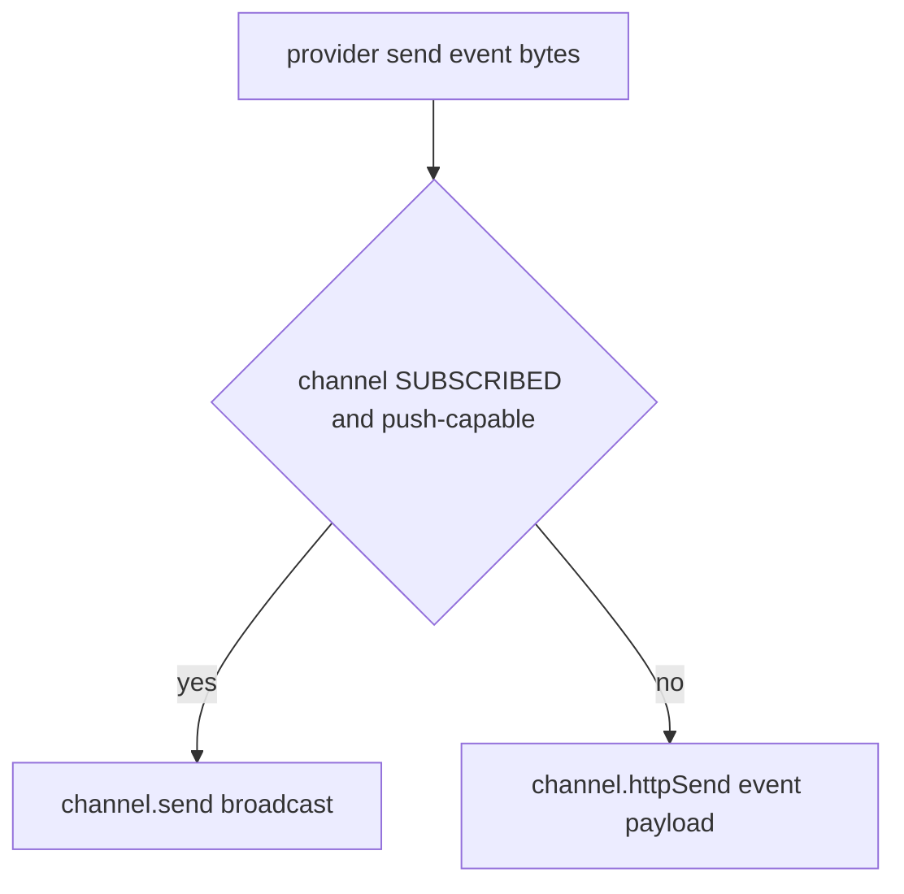

# Phase 09.1 — Realtime Transport Hardening

**Status:** in progress
**Milestone:** M1.1 (precursor hotfix slice, scheduled after M1 merge, before M1b)
**Depends on:** Phase 09 (M1, complete)
**Estimated duration:** 1-2 days, sliced into independent commits
**Blocks:** nothing — M1b does not depend on this phase; it can slip without blocking M1b.1

---

## Objective

Eliminate Supabase Realtime's `falling back to REST` console warning and the associated HTTP load without changing the Yjs collaboration protocol, channel names, event shapes, or conflict-review logic. This is a **transport hardening slice**, not the M3 app-wide realtime bus.

## Why the warning appears today

[supabase-yjs-provider.ts](../apps/web/src/lib/collaboration/supabase-yjs-provider.ts) calls `channel.send()` for all Yjs sync, update, and awareness messages. Supabase Realtime implicitly falls back to a REST call when it cannot push over the WebSocket (`!_canPush()`), logging a warning each time. Two timers keep this happening even when idle:

- `heartbeatAwareness` (`supabase-yjs-provider.ts:756`) — every 2s, re-sets local awareness state to keep `lastUpdated` fresh for peer prune timers, triggering a send even when nothing changed.
- `pruneStaleAwareness` (`supabase-yjs-provider.ts:765`) — every 1s, checks for stale peers; can also trigger sends when removing state.

With 3 open tabs this is a steady broadcast stream. Local Docker often hits the REST fallback path, producing console spam and extra HTTP load — related to prior 502/rate-limit issues during conflict review.

**This is a delivery-transport issue, not a collaboration logic bug.**

## Stack compatibility (verified)

- Docker Realtime: `supabase/realtime:v2.102.3` ([docker-compose.yml](../docker/docker-compose.yml)) — already `>= v2.97.0` required for `httpSend()`. No Docker change needed.
- `@supabase/supabase-js`: currently `^2.49.1` ([package.json](../apps/web/package.json)) — needs `>= 2.107.0` for `channel.httpSend()` and binary payload support. **Upgrade required (slice 1).**
- `@supabase/ssr`: currently `^0.6.1` — verify it still resolves as a peer after the `supabase-js` bump (slice 1).

## Approach

**Principle: keep the same events (`y-sync`, `y-update`, `y-awareness`) and payload shape (`{ data: base64, clientId }`). Only change how bytes reach Realtime — WebSocket when available, explicit `httpSend()` otherwise.**

**Do not change:** channel name `ydoc:${documentId}`, event names, base64 encoding, the `applyEncodedMessage` receive path, or any offline defer/absorb/commit logic.

---

## Slices

Each slice is its own commit, independently testable, and safe to land even if a later slice slips.

### 1. Upgrade client (low risk, required)

- **Touches:** `apps/web/package.json`
- **Change:** bump `@supabase/supabase-js` to `>=2.107.0`; verify `@supabase/ssr` still resolves as a peer dependency. No behavior change — this only unlocks `channel.httpSend()` for slice 3.
- **Commit:** `chore(deps): upgrade supabase-js for httpSend support`
- **Verify:** `pnpm install` succeeds; `pnpm test:offline` green; `pnpm typecheck` (or equivalent) green.

### 2. Track channel-joined state

- **Touches:** `apps/web/src/lib/collaboration/supabase-yjs-provider.ts` (existing `subscribe` callback only)
- **Change:** add a `channelJoined` boolean, set `true` when the subscribe callback reports `status === 'SUBSCRIBED'` and `false` on disconnect/reauth. Read-only addition — `send()` itself is unchanged in this slice.
- **Commit:** `feat(realtime): track channel subscribed state in yjs provider`
- **Verify:** unit test or manual log — flag flips correctly across connect/disconnect/reconnect.

### 3. Explicit transport branch in `send()`

- **Touches:** `apps/web/src/lib/collaboration/supabase-yjs-provider.ts` (`private async send()`, ~L1068)
- **Change:** when `channelJoined` is true and the channel is push-capable, keep the existing `channel.send({ type: 'broadcast', event, payload })` path. Otherwise, call `channel.httpSend(event, { data: uint8ToBase64(bytes), clientId })` — note the signature differs from `send()` (event name first argument, flat payload, no `type`/`broadcast` wrapper). Unify the existing 429 cooldown and auth-error handling so both paths behave the same way on failure.
- **Commit:** `feat(realtime): explicit httpSend fallback when websocket unavailable`
- **Verify:** new unit test with a mocked channel object asserting `httpSend` is called when not joined/push-capable, and `send` is called when joined — this is the one slice in this phase that needs dedicated test coverage since it changes real send behavior.

### 4. Reduce awareness churn

- **Touches:** `apps/web/src/lib/collaboration/supabase-yjs-provider.ts` (`heartbeatAwareness`, `pruneStaleAwareness`)
- **Change:** only re-send heartbeat when local awareness state actually changed (cursor/selection), not on every 2s no-op `setLocalState`; increase the idle heartbeat interval (e.g. 10-15s) or tie it to `selectionchange`/editor focus; debounce awareness sends 50-100ms. Does not touch document sync.
- **Commit:** `perf(realtime): only heartbeat awareness on real state change`
- **Verify:** manual idle 3-tab check — heartbeat/send volume visibly drops in the network panel; `pnpm test:offline` still green.

### 5. (Stretch, optional) outbound queue

- **Touches:** `apps/web/src/lib/collaboration/supabase-yjs-provider.ts`
- **Change:** buffer outbound `y-sync`/`y-update` messages until the channel reaches `SUBSCRIBED` right after connect (awareness may still coalesce/drop, since it's presence, not durable state). Only take this slice if slices 3-4 verification shows a real race window right after connect — do not build speculatively.
- **Commit:** `feat(realtime): buffer outbound updates until channel subscribed`

### 6. Verification pass

Run this checklist manually before considering the phase done; record results in the table below.

| Test | Pass criteria |
|------|---------------|
| Idle 3 tabs, 2 min | No `falling back to REST` warnings (or only briefly during initial connect) |
| Live typing | A→B→C propagation < 500ms typical |
| Offline overlap + second cycle | Conflict UI + Keep cascade still work (re-run [09-m1-exit-collab-offline.md](09-m1-exit-collab-offline.md) steps 3-4) |
| Reconnect after DevTools offline | Cursors return; no doc blanking |
| `pnpm test:offline` | Still green |
| Unit test (slice 3) | Mock channel — `httpSend` called when push unavailable, `send` when joined |

## UAT results (fill in during execution)

| Slice | Result | Notes |
|-------|--------|-------|
| 1 Upgrade client | PASS | `@supabase/supabase-js` 2.110.2; `pnpm test:offline` 70/70 |
| 2 Track channel-joined | PASS | `isChannelJoined` getter + subscribe lifecycle; unit test |
| 3 Explicit transport branch | PASS | `canUseWebSocketPush()` + `httpSend`; 4 transport unit tests |
| 4 Reduce awareness churn | PASS | 5s heartbeat (was 2s), 75ms awareness debounce; `pnpm test:offline` 70/70 |
| 5 Outbound queue (if taken) | SKIP | No race observed in unit tests; defer unless manual UAT finds gap |
| 6 Verification pass | PENDING | Manual: idle 3-tab, live typing, offline conflict, reconnect |

## What this phase explicitly avoids

- Replacing Supabase broadcast with a custom WebSocket server
- Moving Yjs binary transport to Postgres polling
- Downgrading `supabase-js` to silence the warning (hides the problem, blocks the future API)

## Where this fits in the roadmap

Scheduled as a **M1.1 hotfix** (1-2 days) immediately after the M1 merge to `main`, before M1b encryption work begins — keeps collaboration transport stable while M1b's IDB crypto work is built independently. Not part of M3 (app-wide realtime bus).

## Related documents

- [09-m1-exit-collab-offline.md](09-m1-exit-collab-offline.md) — M1 exit UAT script this phase reuses for regression verification
- [09-offline-sync.md](09-offline-sync.md) — Phase 09 spec (complete)
- [25-offline-app-shell.md](25-offline-app-shell.md) — M1b, independent of this phase
- [28-product-roadmap-to-production.md](../docs/28-product-roadmap-to-production.md) — milestone sequencing
