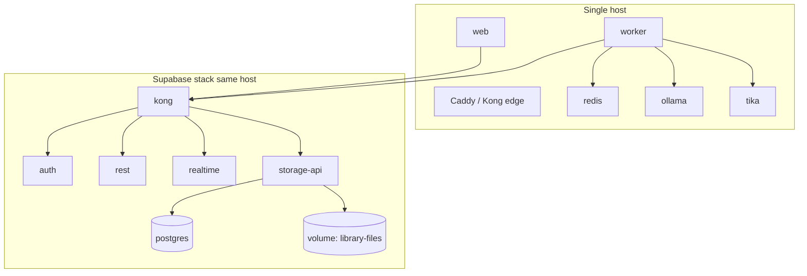
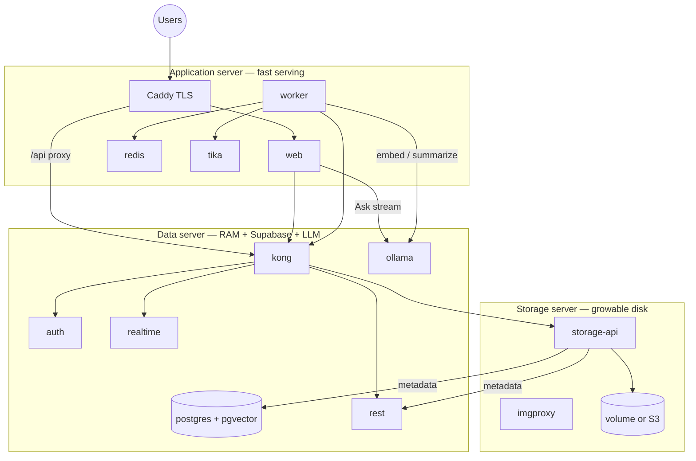
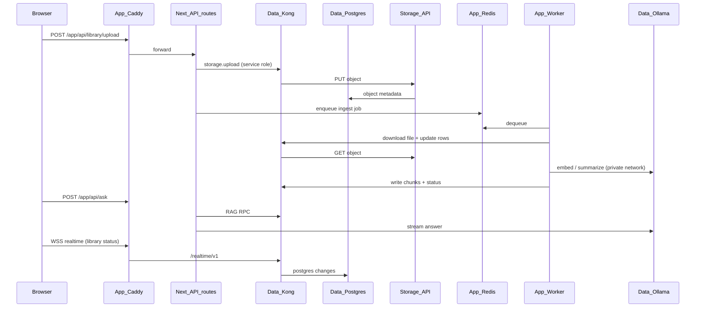

# Phase 12b — Distributed Docker Topology (App / Data / Storage)

**Status:** planned  
**Depends on:** Phase 12 (email, privacy, security hardening complete)  
**Blocks:** Phase 13 (VPS production deploy)  
**Estimated duration:** 4–6 days

---

## Why this phase exists

Today the Rhodes stack runs as **one Docker Compose project** on a single host: Supabase (Postgres, Auth, REST, Realtime, Storage), Redis, Ollama, Tika, plus `apps/web` and `apps/worker` on the host or separate processes. That is correct for local development and acceptable for early production, but it creates scaling bottlenecks:

| Pressure | Symptom on single server |
|----------|--------------------------|
| **Library growth** | Disk fills on the same volume as Postgres and Ollama models |
| **Embeddings / LLM** | Ollama CPU spikes compete with Postgres I/O and Next.js |
| **Upload bursts** | Storage API + Tika + worker ingest saturate one machine |
| **Operational risk** | One failure domain; backup/restore couples DB and blobs |

This phase **does not rewrite the application into microservices**. It introduces **three logical deployment roles** with Compose profiles and env-driven URLs so you can run:

1. **Monolith mode** — all roles on one server (current behaviour; ideal for dev and small prod).
2. **Distributed mode** — three servers (or three Coolify hosts) with private networking between roles.

Phase 13 (VPS) then deploys using the topology you choose, instead of hard-coding a single-node layout.

---

## Canonical spec references

- [13-infrastructure-vps.md](../docs/13-infrastructure-vps.md)
- [adr/001-full-vps-self-hosted.md](../docs/adr/001-full-vps-self-hosted.md)
- [18-non-functional-requirements.md](../docs/18-non-functional-requirements.md)
- Phase 01 — “same containers locally and on VPS” (this phase refines *placement*, not images)

---

## Three deployment roles (purpose-tuned)

Each server is a **separate machine** with its own CPU, RAM, and disk — sized for one job, not a copy of the full stack.

| Role | Profile | Primary purpose | What runs here | Public internet? |
|------|---------|-----------------|----------------|------------------|
| **Application** | `app` | **Fast app serving** — low latency for users | Next.js (`web`), `marketing`, **worker**, Redis, Tika, Caddy (TLS edge) | Yes — HTTPS 443 |
| **Data** | `data` | **Memory & compute for state + AI** | Postgres + pgvector, Supabase (Auth, REST, Realtime, Kong), **Ollama** | No — private network only |
| **Storage** | `storage` | **Durable, growable files** | Supabase Storage API, imgproxy, blob volume (or S3) | No — private network only |

### Design intent (your model)

| Server | Optimise for | De-prioritise |
|--------|--------------|---------------|
| **App** | CPU for Next.js, fast HTTP, stable response times under user load | Large disks, LLM RAM, Postgres |
| **Data** | RAM (Postgres + pgvector embeddings + Ollama models), sustained CPU for inference | Serving static/SSR traffic, library file bulk |
| **Storage** | Disk capacity and expandability (Volumes, Object Storage) | Low-latency CPU; throughput over snappiness |

**Why Ollama lives on Data, not App:** LLM and embedding jobs are RAM- and CPU-heavy. Colocating Ollama with Postgres keeps the **app server free to serve pages and API routes quickly**. The worker (on App) and Ask API (on App) call Ollama over the **private network** (`OLLAMA_HOST=http://data.internal:11434`). Postgres and Ollama still share one machine — size the Data server RAM for both (see sizing below).

**Why Worker stays on App:** The worker is mostly orchestration (queue → fetch file → call Tika → call remote Ollama → write rows via Kong). It belongs with Redis (local queue) and Tika (CPU burst on ingest, but lighter than LLM). It does **not** belong on Storage (I/O bound) or Data (would add job churn next to Postgres).

### Important clarifications

1. **“Frontend server” = Application role** — web, edge TLS, job orchestration. Not the LLM host.

2. **Storage is not a dumb disk.** Supabase Storage API still needs Postgres (metadata) and PostgREST on the **Data** role over private network. Latency Storage ↔ Data should be &lt; 5 ms (same region / VPC).

3. **Browsers** talk to:
   - `https://rhodes.example/app` → Application (Next.js).
   - `https://rhodes.example/api` or `https://api.rhodes.example` → Kong on **Data** (proxied through App Caddy).

Local dev stays **monolith** by default; distributed mode is validated with env overrides or a `docker-compose.distributed.yml` overlay.

---

## Purpose-tuned hardware sizing (Hetzner guide)

Use these as **starting points** when renting three servers. Adjust from metrics after Phase 13.

| Role | Example instance | vCPU | RAM | Disk | Rationale |
|------|------------------|------|-----|------|-----------|
| **App** | CPX21 → CPX31 | 4–8 | 8–16 GB | 80–160 GB NVMe | Next.js + worker + Redis + Tika; no Ollama models (~6 GB saved); small disk OK |
| **Data** | CPX41 → CCX33 | 8–16 | **32–64 GB** | 240–500 GB NVMe | Postgres (~8–25 GB working set + embeddings), Ollama models (~6–10 GB), inference headroom |
| **Storage** | CPX11 + **Volume** | 2–4 | 8 GB | **500 GB–2 TB** Volume (growable) | Storage API is I/O-bound; CPU can be modest; attach Hetzner Volume and expand without touching App/Data |

### RAM budget on Data server (planning)

| Consumer | Rough RAM |
|----------|-----------|
| Postgres + pgvector (300 active users) | 8–16 GB |
| Supabase services (Auth, REST, Realtime, Kong) | 2–4 GB |
| Ollama (8B Q4 + embed model loaded) | 6–10 GB |
| OS + buffer | 4 GB |
| **Minimum comfortable** | **32 GB** |
| **Growth (embeddings + larger models)** | **48–64 GB** |

### Storage growth path

| Stage | Setup |
|-------|--------|
| Early distributed | Storage server + 500 GB Hetzner Volume |
| Library &gt; 500 GB | Expand Volume (no resize of App/Data) or migrate to Object Storage (S3 backend) |
| Cold archive | Object Storage for old PDFs; metadata stays on Data |

App and Data disks **do not** need to grow with library size — only the Storage role does.

---

## Target architecture

### Monolith (default — dev & small prod)



### Distributed (3 servers — purpose-tuned production)



### Traffic & trust boundaries

| Connection | From | To | Protocol | Notes |
|------------|------|-----|----------|-------|
| User → App | Internet | Caddy:443 | HTTPS | Only public entry |
| App → Data API | web, worker | `DATA_KONG_URL` | HTTPS (private) | Service role, migrations runner |
| Storage → Data | storage-api | `POSTGRES_HOST`, `POSTGREST_URL` | TCP / HTTP | Must be private network |
| Browser → Realtime | Browser | `wss://api…/realtime` | WSS | Via Kong; update `NEXT_PUBLIC_SUPABASE_URL` |
| Worker → Ollama | worker, Ask API (web) | `OLLAMA_HOST` on **Data** private IP | HTTP | Inference RAM isolated from app serving |
| Worker → Redis | worker | `REDIS_URL` | TCP | Local to app server |

---

## Objectives

1. Split `docker/` into **Compose profiles** (`app`, `data`, `storage`) while keeping **one shared `docker-compose.yml`** service definitions.
2. Add **`RHODES_TOPOLOGY=monolith|distributed`** and role-specific `.env` templates.
3. Document and implement **env-driven service URLs** — no hardcoded `redis`, `kong`, `db` hostnames in app code.
4. Validate **monolith parity**: `./scripts/dev-up.sh` unchanged for daily dev.
5. Validate **distributed smoke test**: three Compose projects (or three VMs) with library upload → ingest → RAG still working.
6. Update Phase 13 runbooks for single-server vs three-server Coolify deployment.

---

## File checklist

```
docker/
├── docker-compose.yml                 # Service definitions (unchanged images)
├── docker-compose.dev.yml             # Dev ports, Mailpit (monolith)
├── docker-compose.prod.yml            # Resource limits, TLS stubs
├── docker-compose.profile.app.yml     # NEW — app role services only
├── docker-compose.profile.data.yml    # NEW — data role services only
├── docker-compose.profile.storage.yml # NEW — storage role services only
├── docker-compose.monolith.yml        # NEW — alias: all profiles on one network
├── docker-compose.distributed.env.example  # NEW — cross-host URL matrix
├── .env.example                       # Add RHODES_TOPOLOGY, role URLs
└── .env.data.example                  # NEW — data server template
└── .env.storage.example               # NEW — storage server template
└── .env.app.example                   # NEW — app server template

scripts/
├── dev-up.sh                          # Default monolith; document DISTRIBUTED=1
├── deploy-role.sh                     # NEW — deploy app | data | storage
├── health-check.sh                    # Per-role health endpoints
└── sync-web-env.sh                    # Read topology-aware URLs

docs/
├── adr/003-distributed-docker-topology.md  # NEW — decision record
└── runbooks/
    ├── topology-monolith.md           # NEW
    └── topology-distributed-3-node.md   # NEW

implementation_plan/
└── 13-vps-production-and-integration.md  # Update — depends on 12b
```

---

## Step-by-step tasks

### 1. Define Compose profiles

Tag each service in `docker-compose.yml`:

| Service | Profile(s) |
|---------|------------|
| `db`, `auth`, `rest`, `realtime`, `meta`, `supavisor`, `kong`, `studio` (dev), **`ollama`** | `data` |
| `storage`, `imgproxy` | `storage` |
| `redis`, `tika`, *(web/worker run on host or separate containers)* | `app` |
| `mailpit` | `data` or `app` (dev only; keep monolith dev simple) |

Add `docker-compose.profile.*.yml` files that:
- Set `profiles: [app]` etc. on services (or use `COMPOSE_PROFILES`).
- Expose only the ports required per role.
- Use **external network** `rhodes-distributed` when `RHODES_TOPOLOGY=distributed`.

**Monolith command (unchanged ergonomics):**

```bash
docker compose -f docker-compose.yml -f docker-compose.dev.yml -f docker-compose.monolith.yml up -d
```

**Distributed — three hosts:**

```bash
# On data server
COMPOSE_PROFILES=data docker compose -f docker-compose.yml -f docker-compose.profile.data.yml up -d

# On storage server
COMPOSE_PROFILES=storage docker compose -f docker-compose.yml -f docker-compose.profile.storage.yml up -d

# On app server
COMPOSE_PROFILES=app docker compose -f docker-compose.yml -f docker-compose.profile.app.yml up -d
```

### 2. Environment variable contract

Introduce a **topology matrix** in `.env`:

| Variable | Monolith | Distributed |
|----------|----------|-------------|
| `RHODES_TOPOLOGY` | `monolith` | `distributed` |
| `SUPABASE_URL` / `NEXT_PUBLIC_SUPABASE_URL` | `http://localhost:8000` | `https://api.rhodes.example` (Kong on data, via Caddy) |
| `POSTGRES_HOST` | `db` | `10.x.x.x` or private DNS `data.internal` |
| `POSTGRES_PORT` | `5432` | `5432` (firewall: app/storage IPs only) |
| `REDIS_URL` | `redis://redis:6379` | `redis://127.0.0.1:6379` (Redis on app server) |
| `OLLAMA_HOST` | `http://ollama:11434` | `http://10.0.0.2:11434` (**Data** server private IP — not on app) |
| `TIKA_URL` | `http://tika:9998` | `http://127.0.0.1:9998` (Tika on app server, with worker) |
| `TIKA_URL` | `http://tika:9998` | `http://127.0.0.1:9998` |
| `STORAGE_BACKEND` | `file` | `file` or `s3` (storage server volume / Object Storage) |
| `GLOBAL_S3_ENDPOINT` | — | Hetzner Object Storage endpoint (optional Phase 12b+) |

**Rule:** Application code never assumes Docker DNS names (`redis`, `kong`, `db`) in production — only env vars. `scripts/dev-worker.sh` already remaps `redis://redis` → `localhost`; extend pattern to all roles.

### 3. Edge proxy (Application server)

Configure Caddy (or Traefik) on the **app** role:

| Route | Backend |
|-------|---------|
| `/app/*` | Next.js `web` container |
| `/api/*` or `api.rhodes.example` | Reverse proxy → `DATA_KONG_INTERNAL_URL` |
| Marketing `/` | `marketing` container (Phase 14) |

TLS terminates on the app server. Data and storage servers have **no public ports** except SSH/bastion.

### 4. Storage scaling path

| Stage | Backend | When |
|-------|---------|------|
| V1 monolith | `./volumes/storage` bind mount | Dev, &lt;50 GB library |
| V1 distributed | Dedicated volume on storage server | 50–500 GB |
| Scale | Supabase `docker-compose.s3.yml` pattern → Hetzner Object Storage | &gt;500 GB, multi-app replicas |

Library bucket `library-files` and `document-images` remain the same **bucket names**; only the backend path changes.

### 5. Networking & security

- **Private network:** Hetzner Cloud private network, or WireGuard mesh between three VPSs.
- **Firewall:** Data — allow 5432, 8000 from app + storage IPs only. Storage — allow 5000 from Kong IP only.
- **Secrets:** Same keys on all roles (`JWT_SECRET`, `ANON_KEY`, `SERVICE_ROLE_KEY`); distribute via Coolify env sync.
- **Migrations:** Run `pnpm db:migrate` from CI or bastion against `POSTGRES_HOST` on data server — not from storage server.

---

## Application integration contract

**This section is the handoff between Docker topology and application code.** Without it, you can have a correct 3-server Compose layout and a working monolith app that still points at `localhost`, `redis`, or `kong` — and nothing talks to the right host.

### Runtime surfaces (three different callers)

Rhodes is not one process. Each **runtime** has its own network position and must use the correct URL for each backend:

| Runtime | Where it runs | Can reach private IPs? | Uses which env vars |
|---------|---------------|------------------------|---------------------|
| **Browser** | User's machine | No — only public HTTPS | `NEXT_PUBLIC_SUPABASE_URL`, `NEXT_PUBLIC_SUPABASE_ANON_KEY` |
| **Next.js server** (API routes, RSC) | App server container/host | Yes — via VPC | `SUPABASE_URL`, `SUPABASE_SERVICE_ROLE_KEY`, `REDIS_URL`; **`OLLAMA_HOST` → Data** for Ask |
| **Worker** | App server (same role as web) | Yes — via VPC | `SUPABASE_URL`, `REDIS_URL`, `TIKA_URL` (local); **`OLLAMA_HOST` → Data server** |



### The dual-URL problem (most common production bug)

In **distributed** mode, Supabase/Kong often has **two URLs**:

| Variable | Audience | Example | Used by |
|----------|----------|---------|---------|
| `NEXT_PUBLIC_SUPABASE_URL` | Browser | `https://api.rhodes.example` | `lib/supabase/client.ts`, Realtime in `useLibrarySources` |
| `SUPABASE_URL` | Server (web + worker) | `http://10.0.0.2:8000` or `https://api.rhodes.example` | `packages/db` admin client, server Supabase client |

**Phase 12b must implement and document both.** Today `scripts/sync-web-env.sh` hardcodes `http://localhost:8000` for both — fine for monolith, broken for distributed.

**Rules:**

1. Browser **never** uses Docker service names (`kong`, `db`, `storage`).
2. Server **may** use internal URL for lower latency — but signed storage URLs returned to the browser must use the **public** host or be proxied through `/app/api/...`.
3. `createAdminClient()` and `createClient()` (server) read **`SUPABASE_URL`**, not `NEXT_PUBLIC_*`.
4. `createClient()` (browser) reads **`NEXT_PUBLIC_SUPABASE_URL` only**.

### Central config module (new in Phase 12b)

Introduce **`packages/shared/src/env.ts`** (or `packages/db/src/config.ts`) — single source of truth:

```typescript
// Validated at worker/web startup — fail fast if misconfigured
export function rhodesTopology(): "monolith" | "distributed" { ... }
export function supabaseUrlForServer(): string { ... }   // SUPABASE_URL
export function supabaseUrlForBrowser(): string { ... }  // NEXT_PUBLIC_*
export function redisUrl(): string { ... }
export function ollamaHost(): string { ... }
export function tikaUrl(): string { ... }
export function allowLocalLibraryFallback(): boolean {
  return rhodesTopology() === "monolith" && process.env.NODE_ENV !== "production";
}
```

Refactor all direct `process.env.*` reads in web, worker, and `@rhodes/db` to go through this module. Add **`scripts/validate-topology.sh`** that pings each backend from the app host before deploy.

### API routes → backend matrix

Every Next.js route handler must be classified by which remote service it touches. Phase 12b verifies each row works in distributed mode.

| API route | Auth / DB (Data via Kong) | Storage (via Kong → Storage) | Redis (App) | Ollama (**Data**) |
|-----------|---------------------------|------------------------------|-------------|--------------|
| `POST /app/api/auth/*` | GoTrue via Kong | — | — | — |
| `GET/POST /app/api/documents/*` | PostgREST + RLS | — | — | — |
| `PATCH /app/api/documents/[id]` | PostgREST | — | enqueue embed | — |
| `POST /app/api/documents/.../images` | PostgREST | `document-images` bucket | — | — |
| `POST /app/api/documents/images/sign` | RPC + storage signed URL | **Public URL must work in browser** | — | — |
| `GET /app/api/documents/images/serve` | — | proxy read | — | — |
| `GET/POST /app/api/library/*` | `library_sources` | `library-files` bucket | enqueue on upload | — |
| `DELETE /app/api/library/[id]` | delete row + chunks cascade | remove object | cancel jobs | — |
| `POST /app/api/library/[id]/retry` | reset rows | — | enqueue ingest | — |
| `POST /app/api/insights` | `match_workspace_knowledge` RPC | — | — | optional LLM |
| `POST /app/api/ask` | RAG RPC + session | — | — | **stream generate** |
| `GET/POST /app/api/metadata-schemas/*` | PostgREST | — | — | — |
| `GET/POST /app/api/templates/*` | PostgREST | — | — | — |
| `GET /app/api/health` | optional Kong ping | — | optional Redis ping | — |

**Storage-signed URL fix (required):** `documents/images/sign` returns URLs the browser loads. In distributed mode, ensure `createSignedUrl` uses a public storage base or route image reads through `serve` proxy — not `http://storage:5000/...`.

### Worker jobs → backend matrix

| Job | Data (Kong → Postgres/REST) | Storage | App-local | Remote (Data) |
|-----|------------------------------|---------|-----------|---------------|
| `library-ingest` | update `library_sources`, insert chunks | download via storage API | Tika | — |
| `library-embed` | update `library_source_chunks.embedding` | — | — | Ollama embed |
| `library-summarize` | update `library_sources.summary` | — | — | Ollama generate |
| `document-embed` | document chunks table | — | — | Ollama embed |
| `llm-generate` | metadata extraction | — | — | Ollama generate |

Worker **never** connects to Postgres directly — only via `createAdminClient()` → Kong. Worker **never** reads `RHODES_LIBRARY_DATA_DIR` in distributed prod.

### Client-side Supabase (Realtime)

| Hook / component | Transport | Must work in distributed |
|----------------|-----------|--------------------------|
| `useLibrarySources` | Postgres changes on `library_sources` | `wss://api.rhodes.example/realtime/v1/...` |
| Auth session refresh | Browser → Kong → GoTrue | Public URL + correct cookie domain |
| Future offline sync (Phase 09) | Same public URL | Plan for WSS through Caddy |

**Caddy requirement:** WebSocket upgrade headers proxied to Kong (`Connection`, `Upgrade`). Add to Phase 12b smoke test.

### Code changes required in Phase 12b (application layer)

#### 1. Shared env module

| File | Action |
|------|--------|
| `packages/shared/src/env.ts` | **Create** — topology helpers + validation |
| `packages/shared/src/index.ts` | Export env helpers |
| `packages/db/src/client.ts` | Use `supabaseUrlForServer()` |
| `packages/ai/src/ollama.ts` | Use `ollamaHost()` from shared env |
| `apps/worker/src/lib/tika.ts` | Use `tikaUrl()` from shared env |
| `apps/worker/src/connection.ts` | Use `redisUrl()` |
| `apps/web/src/lib/library/queue.ts` | Use `redisUrl()` |
| `apps/web/src/lib/documents/queue.ts` | Use `redisUrl()` |

#### 2. Supabase clients (web)

| File | Action |
|------|--------|
| `apps/web/src/lib/supabase/server.ts` | Document: uses public URL today — OK if internal = public; add optional `SUPABASE_URL` override for server-only internal route |
| `apps/web/src/lib/supabase/client.ts` | Must stay on `NEXT_PUBLIC_SUPABASE_URL` only |
| `apps/web/src/lib/supabase/middleware.ts` (if exists) | Same as server client |

**Recommended pattern:** Server client uses `process.env.SUPABASE_URL ?? process.env.NEXT_PUBLIC_SUPABASE_URL` so one codebase supports internal + public split.

#### 3. Storage paths (remove silent local fallback in prod)

| File | Action |
|------|--------|
| `apps/web/src/app/api/library/upload/route.ts` | Gate `saveLocalLibraryFile` behind `allowLocalLibraryFallback()` |
| `apps/web/src/lib/library/delete-source.ts` | Local unlink only in monolith dev |
| `apps/worker/src/lib/storage.ts` | `readLocalLibraryFile` only when `allowLocalLibraryFallback()` |
| `packages/shared/src/paths.ts` | Document monolith-only |

#### 4. Queue / job cancellation

| File | Action |
|------|--------|
| `apps/web/src/lib/library/queue.ts` | `REDIS_URL` must point to app-server Redis in distributed mode |
| `scripts/requeue-library.js` | Read topology env; no `redis://redis` assumption |

#### 5. Health & startup validation

| File | Action |
|------|--------|
| `apps/web/src/app/api/health/route.ts` | Extend: check Kong, Redis (local), **remote Ollama on Data** |
| `apps/worker/src/index.ts` | On boot: validate `OLLAMA_HOST` reachable on Data server |
| `scripts/validate-topology.sh` | **Create** — curl each endpoint from app server before deploy |

#### 6. Env generation scripts

| File | Action |
|------|--------|
| `scripts/sync-web-env.sh` | Emit `NEXT_PUBLIC_*` (public) + `SUPABASE_URL` (server internal if set) + `RHODES_TOPOLOGY` |
| `scripts/dev-worker.sh` | Load from `docker/.env.app` template |
| `docker/.env.app.example` | **Create** — app-role vars only |
| `docker/.env.data.example` | **Create** — data-role vars only |
| `docker/.env.storage.example` | **Create** — storage-role vars + `POSTGRES_HOST` pointing at data |

### What breaks today if you deploy 3 servers without Phase 12b app work

| Symptom | Root cause |
|---------|------------|
| Library upload 503 / storage error | Web tries local `.data/` fallback or `kong` hostname not resolvable on app server |
| Worker jobs fail / Ask hangs | `OLLAMA_HOST` still `localhost` — Ollama is on **Data**, not App |
| Realtime never updates Library UI | Browser WSS points at `localhost:8000` |
| Worker jobs fail immediately | `REDIS_URL=redis://redis` — Redis hostname not resolvable on app server |
| Ask / Insights empty or 500 | `createAdminClient()` can't reach Kong from worker |
| Signed image URLs 404 in editor | Signed URL host is internal storage, not public |
| Migrations run on wrong host | `DATABASE_URL` still `localhost:5433` |

### Integration test matrix (exit gate)

Run on staging **after** Compose distributed smoke, **before** Phase 12b sign-off:

| # | Test | Proves |
|---|------|--------|
| 1 | Register + login | Browser → Kong → GoTrue |
| 2 | Create document + upload inline image | Storage via Kong; signed URL loads in browser |
| 3 | Upload library PDF | App → Storage tier; metadata on Data tier |
| 4 | Worker ingest completes | Worker → Kong (Data) + Tika (App) + Ollama (**Data**); no local file fallback |
| 5 | Ask question with citation | RAG RPC on Data + Ollama stream on **Data** (called from App) |
| 6 | Library status updates without refresh | Realtime WSS through public API URL |
| 7 | Delete library source | DB cascade + storage object removed + Redis jobs cancelled |
| 8 | `scripts/validate-topology.sh` from app host | All env URLs reachable |

---

## Application & worker migration checklist

Summary of the integration contract above — use as PR checklist during Phase 12b implementation:

### Already topology-aware (verify only)

| Area | Files | Notes |
|------|-------|-------|
| Redis | `apps/worker/src/connection.ts`, `apps/web/src/lib/library/queue.ts`, `apps/web/src/lib/documents/queue.ts` | Must use `redisUrl()` helper after refactor |
| Ollama | `packages/ai/src/ollama.ts`, `apps/web/src/app/api/ask/route.ts` | **`OLLAMA_HOST` → Data server** (private URL) |
| Supabase admin | `packages/db/src/client.ts` | Must use server URL, not browser URL |
| Library local fallback | `packages/shared/src/paths.ts`, upload/download paths | Monolith dev only |
| Worker bootstrap | `scripts/dev-worker.sh` | Template for `deploy-role.sh` |

### Must implement in Phase 12b

| Area | Change |
|------|--------|
| **Shared env module** | `packages/shared/src/env.ts` + startup validation |
| **Dual Supabase URLs** | `sync-web-env.sh`, server client fallback chain |
| **Storage uploads/downloads** | Gate local fallback; storage API only in distributed prod |
| **Signed URL / image proxy** | Public-safe URLs for browser |
| **Realtime WSS** | Caddy proxy config + Library UI smoke test |
| **Health / validate scripts** | `validate-topology.sh`, extended `/api/health` |
| **API route matrix** | Manual or scripted pass of all routes in table above |
| **Worker boot check** | Fail fast if Kong/Redis/Ollama unreachable |
| **Compose depends_on** | External health polling across hosts |
| **DB migrations** | CI/bastion → data server `DATABASE_URL` only |
| **Backups** | Split data vs storage runbooks |
| **Phase 13 Coolify** | Per-role env files injected per host |

### Does **not** change in Phase 12b

- Database schema, RLS policies, or table layout.
- BullMQ queue names or job payloads.
- Ollama models or embedding dimensions.
- Next.js `basePath: '/app'`.
- REST API route paths under `/app/api/*` (only **where** they connect changes).

---

## Deployment modes (operator guide)

| Mode | Servers | Use case | Monthly cost (Hetzner rough) |
|------|---------|----------|--------------------------------|
| **Monolith** | 1 × CPX41 | Dev, solo, &lt;50 users | ~€28 |
| **Distributed (purpose-tuned)** | CPX31 **app** + CPX41/CCX **data** (32 GB+) + CPX11 **storage** + Volume | 50–300 users, library-heavy; scale storage independently | ~€50–80 + volume |
| **Monolith + volume** | 1 server + 500 GB Volume | Middle ground before 3-node | ~€28 + ~€20 volume |

Start monolith in Phase 13; flip to distributed when disk or CPU metrics justify it — **no application redeploy**, only Compose profile + env change.

---

## Testing criteria

### Monolith regression

- [ ] `./scripts/dev-up.sh` starts full stack; `pnpm dev` + `./scripts/dev-worker.sh` work unchanged.
- [ ] Library upload → ingest → ready; Ask returns citations; document save triggers embed job.

### Distributed smoke (staging)

- [ ] Three VMs on Hetzner private network (or three Compose contexts locally with mocked IPs).
- [ ] App server: web + worker + redis + tika healthy; **no Ollama container on app**
- [ ] Data server: Kong, Postgres, **Ollama** healthy; reachable from app over private network
- [ ] Storage server: upload PDF via API; file lands on storage volume; metadata row in Postgres on data server.
- [ ] Delete library source removes blob on storage server and chunks in Postgres.
- [ ] Browser Realtime subscription on library status works through public API URL.

### Performance acceptance (distributed vs monolith)

- [ ] Library ingest p95 acceptable with Ollama on Data (network hop App → Data for embed)
- [ ] Postgres and library blobs on **separate disks** (Data vs Storage) — monitor I/O independently

---

## Exit criteria

1. Compose profiles `app`, `data`, `storage` documented and runnable.
2. `RHODES_TOPOLOGY` documented in `docker/.env.example` with three role templates.
3. **`packages/shared/src/env.ts`** (or equivalent) implemented; web + worker use it — no raw Docker hostnames in prod.
4. **Dual Supabase URL** contract documented and wired (`NEXT_PUBLIC_*` vs `SUPABASE_URL`).
5. **API route + worker job matrices** validated — all rows in integration test matrix pass on staging.
6. Monolith dev path unchanged (`dev-up.sh` passes).
7. Distributed smoke test on three nodes (Compose + app integration tests).
8. `scripts/validate-topology.sh` passes from app server before deploy.
9. ADR 003 merged; Phase 13 updated to list topology choice as first deploy decision.
10. Runbooks: `topology-monolith.md`, `topology-distributed-3-node.md`.

---

## Relationship to other phases

| Phase | Interaction |
|-------|-------------|
| **06–07** | Library + RAG built against monolith — no rework required if env contract is met |
| **09 Offline** | IndexedDB sync uses same public `SUPABASE_URL` — verify WSS through Kong proxy |
| **11 Billing** | Webhooks hit app server Caddy only |
| **12 Email/Privacy** | SMTP and GDPR exports unchanged; export jobs may need `DATABASE_URL` on data tier |
| **13 VPS** | **Blocked until 12b exit criteria** — deploy script chooses topology |
| **14 Marketing** | Lives on app server; no change |

---

## Open decisions (resolve during 12b)

| ID | Question | Recommendation |
|----|----------|----------------|
| D-030 | Kong on data vs split API gateway on app? | Kong stays on **data**; app Caddy proxies — fewer JWT/route duplicates |
| D-031 | S3 in 12b or defer to first storage scale event? | Defer S3; use **storage server volume** in 12b; add `docker-compose.s3.yml` in 13 when &gt;200 GB |
| D-032 | Split Ollama to a fourth “compute-only” server? | Defer until **Data** server RAM &gt;80% sustained with Postgres + Ollama together |
| D-033 | WireGuard vs Hetzner private network? | Hetzner private network for same-region; WireGuard for multi-region later |

Log resolutions in [docs/19-open-decisions.md](../docs/19-open-decisions.md).

---

## Estimated effort breakdown

| Task | Days |
|------|------|
| Compose profiles + monolith wrapper | 1–1.5 |
| Shared env module + dual URL wiring | 0.5–1 |
| API/worker integration tests + validate-topology.sh | 1 |
| Caddy split routing + distributed Compose smoke | 1–1.5 |
| Docs, ADR, runbooks, Phase 13 update | 0.5–1 |
| **Total** | **4–6** |

---

## Summary for stakeholders

You asked for **three servers: frontend, database, storage** — each with its own CPU, RAM, and disk, tuned to its job:

- **Application server** — optimised for **fast app serving** (web, worker, queues, Tika). Light disk. No LLM.
- **Data server** — optimised for **RAM**: Supabase (Postgres, auth, API) **plus Ollama** for embeddings and chat. Sized for embeddings growth.
- **Storage server** — optimised for **growable disk** (library PDFs, images). CPU can be modest; attach Volumes or Object Storage without resizing App or Data.

Monolith mode remains for dev and early prod. When you outgrow one machine, rent three purpose-built servers, set `RHODES_TOPOLOGY=distributed`, and wire `OLLAMA_HOST` to the Data box — the app code already calls Ollama by URL, not by colocation.
