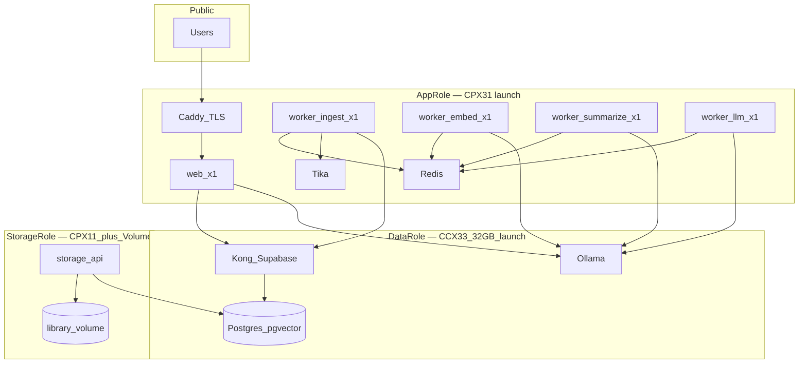
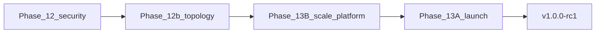

# Phase 13b — Scale-Ready Production Infrastructure

**Status:** planned  
**Depends on:** [Phase 12b](12b-distributed-docker-topology.md), [Phase 13](13-vps-production-and-integration.md) (parallel with 13A launch tasks)  
**Parent phase:** [13-vps-production-and-integration.md](13-vps-production-and-integration.md)  
**Blocks:** V1 release (`v1.0.0-rc1`)  
**Estimated duration:** 6–10 days (overlaps Phase 13A)

---

## Purpose

Expand Phase 13 beyond a single-server V1 deploy into a **scale-ready production platform** prepared for **10,000+ users**, with a formal **5,000-user review checkpoint** — not reactive rescaling every +100 users.

Phase 12b provides **topology** (App / Data / Storage roles). Phase 13A covers TLS, Coolify, billing, email, and integration testing. **Phase 13b** covers worker orchestration, queue separation, observability, and horizontal scaling paths.

Both tracks ship together before `v1.0.0-rc1`.

| Track | Document | Purpose |
|-------|----------|---------|
| **13A — Production launch** | [13-vps-production-and-integration.md](13-vps-production-and-integration.md) | TLS, Coolify, billing/email, integration checklist |
| **13B — Scale-ready platform** | This document | Worker topology, queue orchestration, observability, scaling runbooks to 10k+ |

**Production topology decision:** **distributed 3-role from day 1** (~€80–120/mo minimal). Code and ops are 10k-ready; capacity grows by **replicas and disk** at the **5k review checkpoint**.

---

## Canonical spec references

- [12b-distributed-docker-topology.md](12b-distributed-docker-topology.md)
- [13-infrastructure-vps.md](../docs/13-infrastructure-vps.md)
- [16-ingestion-pipeline.md](../docs/16-ingestion-pipeline.md)
- [18-non-functional-requirements.md](../docs/18-non-functional-requirements.md)
- [adr/002-ollama-cpu-only.md](../docs/adr/002-ollama-cpu-only.md)

---

## Target architecture (launch → 10k+)

Same logical architecture at all scales; capacity grows by **replicas and disk**, not redesign.



### Resource separation principle

| Stage | Queue | Worker role | Bottleneck | Scales by |
|-------|-------|-------------|------------|-----------|
| Upload | *(sync API)* | web | network/storage | web replicas |
| Extract+chunk | `library-ingest` | `worker-ingest` | Tika CPU, disk I/O | ingest replicas |
| Embed | `library-embed` | `worker-embed` | Ollama RAM/CPU | embed replicas + Ollama |
| Summarize | `library-summarize` | `worker-summarize` | Ollama RAM/CPU | summarize replicas (low priority) |
| Doc metadata | `llm` | `worker-llm` | Ollama | llm replicas |
| Doc embed | `document-embed` | `worker-embed` | Ollama | shared embed pool |
| Ask (sync) | *(API stream)* | web → Ollama | Ollama | rate limits + Ollama scale |

**Critical rule:** never run library embed and summarize concurrently against a single Ollama with `OLLAMA_MAX_LOADED_MODELS=1`. Summarize chains after embed (`apps/worker/src/jobs/embed.ts`).

**Next split:** extract Tika into `library-extract` queue (constant stubbed in `packages/shared/src/constants.ts`) so JVM-heavy work scales independently from Ollama workers.

---

## Capacity model (planning numbers)

Assumptions for **10,000 registered users**, ~20% active (2,000), ~50 MB library/active user average:

| Resource | Launch (day 1) | 5k review gate | 10k target |
|----------|----------------|----------------|------------|
| **App** | 1× CPX31 (4 vCPU, 8 GB) | 2× CPX31 or 1× CPX41 | 2–3× app nodes behind Caddy |
| **Data** | 1× CCX33 (8 vCPU, 32 GB) | 48 GB RAM, tune Postgres | 64 GB + PgBouncer; optional 2nd Ollama host |
| **Storage** | CPX11 + 500 GB Volume | 1 TB Volume | Object Storage (S3) + 2 TB |
| **Postgres data** | ~5–15 GB | ~40 GB embeddings | ~100–150 GB |
| **Library blobs** | <50 GB | ~250 GB | ~1 TB+ |

**You do not pay for 10k capacity on day 1.** You pay for minimal 3-node distributed (~€80–120/mo) and scale when metrics hit thresholds below.

---

## Code changes (build now, not at 5k)

### 1. Worker role entrypoint

Refactor `apps/worker/src/index.ts` from one process running all queues to role-based startup:

```env
WORKER_ROLE=ingest|embed|summarize|llm|all   # all = dev only
WORKER_CONCURRENCY_INGEST=2
WORKER_CONCURRENCY_EMBED=1
WORKER_CONCURRENCY_SUMMARIZE=1
WORKER_CONCURRENCY_LLM=1
```

- **`all`** — local dev only (`scripts/dev-worker.sh`)
- **Production** — one Coolify service per role, same Docker image, different env

### 2. Global Ollama admission control

Add Redis-based semaphore (e.g. `ollama:inflight`, max 2 cluster-wide) in `packages/ai/src/ollama.ts` or a thin wrapper used by embed/summarize/llm jobs and Ask API.

Prevents worker replicas from stampeding one Ollama instance.

### 3. Per-workspace indexing fairness

BullMQ job options on library enqueue (`apps/web/src/lib/library/queue.ts`):

- Max **N concurrent ingest jobs per workspace** (e.g. 2)
- Priority: `document-embed` > `library-embed` > `library-summarize`
- Dead-letter queue + admin requeue script (extend `scripts/requeue-library.js`)

### 4. Pipeline status

Granular Library UI stages in `apps/web/src/lib/library/pipeline.ts`: Queued → Reading → Indexing → Analyzing → Ready.

**13B addition:** promote `metadata.pipeline_stage` to a first-class DB column `indexing_stage` in migration `00022` for reliable Realtime + analytics (recommended before prod).

### 5. Shared env module (Phase 12b prerequisite)

Implement `packages/shared/src/env.ts` per [12b matrix](12b-distributed-docker-topology.md): `RHODES_TOPOLOGY`, `ollamaHost()`, `redisUrl()`, `tikaUrl()`. Required before distributed prod.

### 6. Health and metrics endpoints

Extend `apps/web/src/app/api/health/route.ts`:

```json
{
  "queues": { "library-ingest": 12, "library-embed": 4 },
  "ollama": { "reachable": true, "models": [] },
  "postgres": { "reachable": true }
}
```

Add `scripts/queue-metrics.sh` for Uptime Kuma / cron.

---

## Infrastructure deliverables

### Compose and Coolify (extend `docker/docker-compose.prod.yml`)

| Coolify service | Role host | Image |
|-----------------|-----------|-------|
| `web` | App | `apps/web` Dockerfile *(create in 13)* |
| `worker-ingest` | App | `apps/worker` Dockerfile, `WORKER_ROLE=ingest` |
| `worker-embed` | App | same image, `WORKER_ROLE=embed` |
| `worker-summarize` | App | same image, `WORKER_ROLE=summarize` |
| `worker-llm` | App | same image, `WORKER_ROLE=llm` |
| `redis`, `tika` | App | compose profiles |
| `supabase-*`, `ollama` | Data | compose profile `data` |
| `storage-api` | Storage | compose profile `storage` |

Env templates (new files):

- `docker/.env.app.example`
- `docker/.env.data.example`
- `docker/.env.storage.example`

### Ollama production config (Data role)

```env
OLLAMA_MAX_LOADED_MODELS=1
OLLAMA_NUM_PARALLEL=2
OLLAMA_KEEP_ALIVE=10m
OLLAMA_EMBED_TIMEOUT_MS=120000
OLLAMA_SUMMARY_TIMEOUT_MS=180000
OLLAMA_GENERATE_TIMEOUT_MS=120000
```

### Postgres tuning (Data role, 32 GB launch)

- Enable **PgBouncer** in front of Postgres (transaction pooling for PostgREST)
- **pgvector HNSW index** on `library_source_chunks.embedding` when chunk count > 100k (migration + runbook)
- `shared_buffers` ~8 GB, `work_mem` tuned for `match_workspace_knowledge` (<80ms @ 10k chunks per NFR)

### Storage path (Storage role)

- Launch: Hetzner Volume mounted at library path
- Architecture-ready for **Hetzner Object Storage (S3)** — gate in `apps/worker/src/lib/storage.ts` and upload route; no app rewrite at migration time

---

## Observability and the 5k review checkpoint

### Alerts (Uptime Kuma + email/Slack)

| Metric | Warning | Critical (trigger scale review) |
|--------|---------|----------------------------------|
| Queue depth `library-embed` | >50 | >200 for 15 min |
| Queue depth `library-ingest` | >30 | >100 for 15 min |
| Ollama p95 latency | >60s | >120s |
| Data disk usage | >70% | >85% |
| Storage volume usage | >70% | >85% |
| Postgres connections | >60% max | >80% |
| API error rate | >0.5% | >1% / 5 min |

### 5k user review playbook (new runbook)

`docs/runbooks/scale-review-5k.md`:

1. Export 30-day metrics (queue depth, Ollama wait, ingest p95, storage growth)
2. Decision tree:
   - **Queue backlog** → add worker replicas (ingest/embed first), never bump Ollama parallel blindly
   - **Ollama wait** → Data RAM rescale or dedicated embed-only Ollama host
   - **Disk** → expand Storage Volume or enable S3 backend
   - **Postgres slow search** → HNSW index, PgBouncer pool size, RAM rescale
3. Load test: simulate 50 concurrent library uploads + 20 Ask streams
4. Document outcome; next gate at **10k**

No infra change required if all metrics green — only documentation.

---

## Phase dependency graph



**12b must complete first** (env module, compose profiles, distributed smoke test). **13B code** (worker roles, Ollama semaphore, metrics) can parallel 12b app work. **13A deploy** uses 13B artifacts.

---

## Implementation order (suggested waves)

### Wave 1 — Foundation (before prod deploy)

- Phase 12b exit: `env.ts`, compose profiles, `validate-topology.sh`, distributed smoke test
- Worker role split + Dockerfiles for web/worker
- Ollama Redis semaphore
- Health endpoint with queue depths
- `docker-compose.prod.yml` + Coolify role templates

### Wave 2 — Production launch (13A)

- 3 Hetzner servers provisioned (App CPX31, Data CCX33 32GB, Storage CPX11 + 500GB Volume)
- Coolify deploy all services
- Integration checklist on staging
- Backups (pg_dump + restic), Uptime Kuma alerts
- Tag `v1.0.0-rc1`

### Wave 3 — Hardening (post-launch, pre-5k)

- `library-extract` queue split from ingest
- `indexing_stage` DB column migration
- Per-workspace rate limits
- Load test script (`scripts/load-test-indexing.mjs`)
- HNSW index migration (when chunk count warrants)

### Wave 4 — 5k review (operational, not code)

- Run scale-review playbook
- Add replicas / RAM / volume per metrics
- Document 10k path (second app node, Object Storage, optional Ollama split)

---

## What we explicitly avoid

- **Monolith prod** for Rhodes (dev only)
- **Vertical rescale every N users** — only at review gates or critical alerts
- **Microservices rewrite** — same BullMQ + worker image, more processes
- **GPU dependency** — stays CPU/Ollama per ADR 002
- **Managed vector DB** until Postgres pgvector proves insufficient (likely after 10k+ with heavy libraries)

---

## Task checklist

- [ ] Complete Phase 12b: `env.ts`, compose profiles, `validate-topology.sh`, distributed smoke test
- [ ] Refactor worker into `WORKER_ROLE` entrypoint; create worker Dockerfile; update `dev-worker.sh`
- [ ] Add Redis-based global Ollama admission control
- [ ] Per-workspace ingest limits, job priorities, dead-letter + metrics in `/api/health`
- [ ] Split `library-extract` queue from ingest
- [ ] Fill `docker-compose.prod.yml` + `.env.app` / `.env.data` / `.env.storage` examples
- [ ] Provision Hetzner App + Data + Storage (private network)
- [ ] Uptime Kuma alerts, `queue-metrics.sh`, runbooks: `scale-review-5k`, `worker-roles`, `topology-distributed-minimal`
- [ ] Staging integration checklist → production deploy → `v1.0.0-rc1` tag

---

## Exit criteria

1. Distributed 3-role production live at `rhodes.quinsy.app` with TLS
2. Four worker roles deployed separately in Coolify (ingest, embed, summarize, llm)
3. Library upload shows pipeline stages; ingest → embed → summarize chain works
4. `/api/health` reports queue depths; alerts configured
5. Integration checklist passes on staging
6. Runbooks: deploy, rollback, backup, Ollama OOM, **scale-review-5k**, worker-roles
7. `validate-topology.sh` passes from app server before every deploy
8. `v1.0.0-rc1` tagged

---

## Related documentation updates

| File | Change |
|------|--------|
| [13-vps-production-and-integration.md](13-vps-production-and-integration.md) | References this doc; default topology = distributed minimal |
| [00-README.md](00-README.md) | Phase index includes 13b |
| [docs/13-infrastructure-vps.md](../docs/13-infrastructure-vps.md) | Extend user tiers to 10k; worker role table |
| [docs/18-non-functional-requirements.md](../docs/18-non-functional-requirements.md) | Add 5k/10k scale gates |
| [docs/16-ingestion-pipeline.md](../docs/16-ingestion-pipeline.md) | Chained queues, pipeline stages |
| `docs/runbooks/scale-review-5k.md` | New |
| `docs/runbooks/worker-roles.md` | New |
| `docs/runbooks/topology-distributed-minimal.md` | New |
