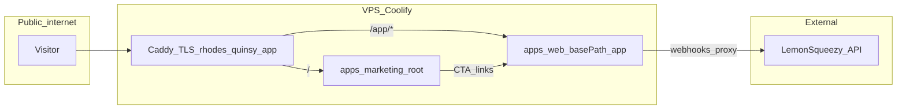

# Phase 14 — Marketing Website

**Status:** planned  
**Depends on:** Phase 01 (repo), Phase 04 recommended (design tokens finalized in app)  
**Can parallel with:** Phases 04–12 (decoupled from product app)  
**Blocks:** Phase 13 (VPS — marketing site deploys with product)  
**Estimated duration:** 7–10 days

---

## Objectives

1. Build a **decoupled marketing website** (`apps/marketing`) separate from the Rhodes product app (`apps/web`).
2. Communicate Rhodes value with **truthful, spec-backed copy** — no invented features.
3. Reuse **Rhodes design language** (CSS tokens, typography, Lucide icons) for brand consistency.
4. Ship **interactive mock experiences** on the homepage and each feature landing page so visitors can explore before signing up.
5. Display **dynamic pricing pods** (LemonSqueezy API when live; static fallback in dev).
6. Publish legal pages: Terms, Privacy Policy, Imprint.

---

## Prerequisites

- Phase 01 exit criteria met (repo, Docker, git branches).
- [`ui-mock/src/styles/tokens.css`](../ui-mock/src/styles/tokens.css) available as design source.
- Product specs read for copy accuracy ([`01-vision-and-scope.md`](../docs/01-vision-and-scope.md), [`17-business-model.md`](../docs/17-business-model.md)).

**Optional before launch:** Phase 11 (live LemonSqueezy pricing API). Until then, use static pricing from business model doc with "pricing TBD" banner if amounts unset.

---

## Canonical spec references

| Doc | Use for |
|-----|---------|
| [01-vision-and-scope.md](../docs/01-vision-and-scope.md) | Vision, V1 scope, out-of-scope guardrails |
| [17-business-model.md](../docs/17-business-model.md) | Tier limits, pricing placeholders |
| [03a-design-language.md](../docs/03a-design-language.md) | Principles, spacing, typography |
| [03b-design-references.md](../docs/03b-design-references.md) | Tokens, wireframes |
| [26-ui-mock-reference.md](../docs/26-ui-mock-reference.md) | Interactive mock component inventory |
| [25-billing-lemonsqueezy.md](../docs/25-billing-lemonsqueezy.md) | Checkout URLs, variant IDs |
| [15-security-and-privacy.md](../docs/15-security-and-privacy.md) | Privacy policy content |
| [21-i18n.md](../docs/21-i18n.md) | Locales (marketing: EN first at launch) |

---

## Architecture

**Domain decision (D-012):** Rhodes launches on the Quinsy subdomain. Marketing and product share one host; the product app is mounted at `/app`.

**Future option (O-018):** `rhodes.app` may be acquired later — **not validated yet**. Do not block launch on it. When building, use **environment-driven canonical URLs** so switching primary domain is a DNS + env change, not a refactor.

| Surface | Launch URL (validated) | If `rhodes.app` acquired later |
|---------|----------------------|--------------------------------|
| Marketing site | `https://rhodes.quinsy.app/` | `https://rhodes.app/` (same `/` + `/app` split) |
| Product app | `https://rhodes.quinsy.app/app` | `https://rhodes.app/app` |
| Product API | `https://rhodes.quinsy.app/app/api/*` | `https://rhodes.app/app/api/*` |
| Auth pages | `https://rhodes.quinsy.app/app/auth/*` | `https://rhodes.app/app/auth/*` |

Parent domain `quinsy.app` is owned by Quinsy. **`rhodes.app` is optional** — treat as brand upgrade path, not V1 dependency.

### Domain env vars (domain-agnostic code)

All apps read canonical URLs from env — never hardcode hostnames in components:

```env
# Launch (validated)
CANONICAL_HOST=rhodes.quinsy.app
NEXT_PUBLIC_SITE_URL=https://rhodes.quinsy.app
NEXT_PUBLIC_APP_URL=https://rhodes.quinsy.app/app
APP_URL=https://rhodes.quinsy.app/app
GOTRUE_SITE_URL=https://rhodes.quinsy.app/app

# After rhodes.app acquisition (example — flip env only)
# CANONICAL_HOST=rhodes.app
# NEXT_PUBLIC_SITE_URL=https://rhodes.app
# NEXT_PUBLIC_APP_URL=https://rhodes.app/app
```

### Migration path if `rhodes.app` is acquired

1. Point `rhodes.app` DNS to same VPS as `rhodes.quinsy.app`.
2. Add Caddy block for `rhodes.app` (identical routing: `/` → marketing, `/app` → product).
3. Update env vars to `rhodes.app`; redeploy web + marketing.
4. Add **301 redirects** from `rhodes.quinsy.app` → `rhodes.app` (preserve path + query).
5. Update LemonSqueezy webhook URL, GoTrue `SITE_URL`, email `From` domains, and legal page canonical URLs.
6. Keep `rhodes.quinsy.app` redirecting for at least 12 months.

**Recommended if acquired:** same path structure on both domains during transition — only the hostname changes. No move to `app.rhodes.app` unless explicitly decided later.

| Surface | URL | App |
|---------|-----|-----|
| Marketing site | `https://rhodes.quinsy.app/` | `apps/marketing` |
| Product app | `https://rhodes.quinsy.app/app` | `apps/web` (`basePath: '/app'`) |
| Product API | `https://rhodes.quinsy.app/app/api/*` | `apps/web` API routes |
| Auth pages | `https://rhodes.quinsy.app/app/auth/*` | `apps/web` |



**Caddy routing (single subdomain):**

```caddyfile
rhodes.quinsy.app {
  handle /app* {
    reverse_proxy web:3000
  }
  handle {
    reverse_proxy marketing:3000
  }
}
```

**Next.js product config** (`apps/web/next.config.ts`):

```typescript
const nextConfig = {
  basePath: '/app',
  // assetPrefix: '/app' — only if static assets break behind proxy; test first
};
```

**Local dev:**

| Surface | URL |
|---------|-----|
| Marketing | `http://localhost:3000` |
| Product | `http://localhost:3001/app` (separate ports in dev; Caddy unifies in prod) |

Resolve open decision O-001 — **closed** as D-012. Optional `rhodes.app` tracked as O-018.

**Tech stack:** Next.js 15 (App Router, static/ISR) — same monorepo, shared `packages/shared` for tier constants. No Supabase, no Ollama on marketing app.

**Deploy:** Separate Coolify service; static export or SSR with minimal API routes (`/api/pricing` proxy only).

---

## Repository structure

```
apps/marketing/
├── package.json
├── next.config.ts
├── public/
│   └── illustrations/              # SVG scenes (see Illustration brief)
├── src/
│   ├── styles/
│   │   ├── tokens.css              # Copy from ui-mock (single source)
│   │   ├── marketing.css           # Marketing-only layout utilities
│   │   └── global.css
│   ├── components/
│   │   ├── marketing/              # Marketing-specific components
│   │   │   ├── SiteHeader.tsx
│   │   │   ├── SiteFooter.tsx
│   │   │   ├── Hero.tsx
│   │   │   ├── PricingPod.tsx
│   │   │   ├── PricingGrid.tsx
│   │   │   ├── FeatureCard.tsx
│   │   │   ├── CTAButton.tsx
│   │   │   ├── LegalLayout.tsx
│   │   │   └── Section.tsx
│   │   ├── demos/                  # Interactive mocks (client-only)
│   │   │   ├── HomeDemo.tsx        # Homepage explorer
│   │   │   ├── EditorDemo.tsx
│   │   │   ├── InsightsDemo.tsx
│   │   │   ├── LibraryDemo.tsx
│   │   │   ├── TeamsDemo.tsx
│   │   │   └── DemoChrome.tsx      # Shared mini app frame
│   │   └── ui/                     # Ported from ui-mock (subset)
│   │       ├── Button.tsx
│   │       ├── TabBar.tsx
│   │       └── ...
│   ├── content/
│   │   ├── copy.ts                 # All marketing strings (single source)
│   │   ├── features.ts             # Feature definitions + truth flags
│   │   ├── pricing.ts              # Tier metadata (sync with 17-business-model)
│   │   └── legal/
│   │       ├── terms.md
│   │       ├── privacy.md
│   │       └── imprint.md
│   ├── app/
│   │   ├── layout.tsx
│   │   ├── page.tsx                # Homepage
│   │   ├── pricing/page.tsx
│   │   ├── features/
│   │   │   ├── editor/page.tsx
│   │   │   ├── insights/page.tsx
│   │   │   ├── library/page.tsx
│   │   │   ├── teams/page.tsx
│   │   │   ├── offline/page.tsx
│   │   │   └── privacy/page.tsx    # Data sovereignty angle
│   │   ├── terms/page.tsx
│   │   ├── privacy/page.tsx
│   │   ├── imprint/page.tsx
│   │   └── api/pricing/route.ts    # LemonSqueezy proxy (optional)
│   └── lib/
│       └── pricing.ts              # Fetch + cache LS prices
└── messages/
    └── en.json                     # i18n later (Phase 10 parity)
```

---

## Page inventory

| Route | Purpose | Interactive mock |
|-------|---------|------------------|
| `/` | Hero, value prop, problem/solution, feature overview, social proof placeholder, pricing preview, CTA | **HomeDemo** — full mini flow |
| `/pricing` | Full pricing grid, FAQ, compare tiers | PricingPods only |
| `/features/editor` | Editor-first, distraction-free writing, templates, slash commands | **EditorDemo** |
| `/features/insights` | Semantic matches while writing, Ask chat, citations | **InsightsDemo** |
| `/features/library` | PDF/DOCX/TXT import, indexing, search | **LibraryDemo** |
| `/features/teams` | Team spaces, roles, shared knowledge | **TeamsDemo** |
| `/features/offline` | Local-first writing, sync on reconnect | Static diagram + short demo animation |
| `/features/privacy` | Self-hosted, local AI, no cloud LLM, EU hosting | Architecture diagram (no fake cert badges) |
| `/terms` | Terms of Service | — |
| `/privacy` | Privacy Policy (GDPR) | — |
| `/imprint` | Imprint / Impressum (legal entity TBD O-015) | — |

**Global chrome:** `SiteHeader` (logo, Features dropdown, Pricing, Login → `/app/auth/login`, Get started → `/app/auth/register`). Use `NEXT_PUBLIC_APP_URL` for absolute URLs in emails/OG tags. `SiteFooter` (legal links, language selector stub).

---

## Truth policy — what we may and may not claim

All copy in `content/copy.ts` must reference `content/features.ts` where `verified: true` means explicitly listed in V1 specs.

### May claim (V1 — verified)

| Feature | Source | Notes for copy |
|---------|--------|----------------|
| Editor-first distraction-free writing | 01, 03 | No permanent sidebar; header auto-hides |
| TipTap editor, slash commands, templates | 11, 10 | Blank, Meeting Minutes, Report, Product Spec |
| Semantic insights while writing | 05, 06 | Debounced; surfaces docs + library chunks |
| "Why relevant?" explanations | 05 | Local LLM; streamed; may take several seconds on CPU |
| Ask chat scoped to workspace | 06 | Cites retrieved sources; refuses to invent sources |
| Quote insert with citation block | 11 | Backlink to library or document |
| Library: PDF, DOCX, TXT upload | 16 | Not web URLs, not scanned OCR (V2) |
| Private + Team spaces | 07 | RLS isolation; roles owner/admin/member |
| Self-hosted on your VPS | 13, ADR 001 | EU hosting (Hetzner); Coolify |
| Local AI — no cloud LLM in V1 | ADR 001, 002 | Ollama CPU-only; data stays on your server |
| Offline writing with sync | 12 | Last-write-wins; conflict saved to history |
| Light + Dark mode | 03a | System preference supported |
| UI in EN, ES, DE, FR, IT | 21 | App UI only; not user document content |
| GDPR export + account deletion | 24 | Self-service in Settings |

### Must NOT claim

| Do not say | Why | Say instead |
|------------|-----|---------------|
| "Real-time collaboration" / "Google Docs-style" | Out of V1 scope | "Team spaces with shared knowledge" |
| "Edit together live" | No CRDT | "Your team sees the same library and documents" |
| "Import any website" / "Web crawler" | Out of scope | "Import PDF, Word, and text files" |
| "Mobile app" | Out of scope | "Works in modern browsers" |
| "GPU-accelerated AI" | CPU-only ADR | "Runs on standard VPS hardware" |
| "Instant AI responses" | NFR: 8–20s on CPU | "Streams answers; tuned for private infrastructure" |
| "ChatGPT-powered" / "OpenAI" | No cloud LLM | "Local AI on your server" |
| "Unlimited everything" on Free | Tier limits exist | Use exact limits from pricing table |
| "SOC 2 certified" / "ISO 27001" | Not in specs | Omit unless actually obtained |
| "Magic link login" / "Sign in with Google" | V1.5 | "Email and password" only for V1 launch copy |

**Review gate:** Every feature bullet on the marketing site must cite a `feature_id` in `features.ts`. CI script fails if copy references unverified features.

---

## Approved marketing copy (EN — v1 draft)

Use these as the baseline in `content/copy.ts`. Refine tone but do not change factual claims without spec update.

### Homepage hero

**Headline:** Write with your whole knowledge behind you.

**Subhead:** Rhodes is an editor-first workspace that surfaces relevant documents and PDFs while you write — powered by local AI on infrastructure you control.

**CTA primary:** Start free → `https://rhodes.quinsy.app/app/auth/register`  
**CTA secondary:** Explore the product ↓ (scroll to HomeDemo)

### Problem strip (three columns)

1. **Scattered knowledge** — Specs, research, and PDFs pile up. Nobody has time to search before every sentence.
2. **Cold start** — New documents start empty. Context from last quarter stays buried.
3. **Privacy pressure** — Sending company knowledge to third-party AI APIs is a non-starter for many teams.

### Solution strip

**One line:** Rhodes connects writing and retrieval in a single calm editor — with semantic matches in a panel that appears only when you need it.

### Feature cards (homepage — link to landing pages)

| Card | One-liner |
|------|-----------|
| Editor | A writing surface that stays out of your way. 720px column, minimal chrome, templates when you want structure. |
| Insights | While you type, Rhodes finds related notes and library sources in your workspace — with citations, not guesses. |
| Library | Upload PDFs, Word files, and text. Rhodes indexes them for search and insights — on your server. |
| Teams | Team spaces with isolated knowledge pools. When a PO writes a spec, Rhodes can surface architecture notes from last week. |
| Privacy | Self-hosted. Local embeddings and inference. No cloud LLM. Your data stays on your VPS. |

### Homepage demo (HomeDemo) — interactive script

Pre-scripted experience — **no backend, no real AI**:

1. **State 0:** Mini editor with sample paragraph about "Q3 onboarding experiment."
2. **User types** (or clicks "Try typing") → after 2s debounce, insight dot pulses.
3. **User clicks insight dot** → right panel slides in with 3 pre-loaded matches:
   - "Post-experiment readout (March)" — 87% relevance
   - "Onboarding framework.pdf" — page 12 — 81%
4. **User clicks "Why relevant?"** → streams canned 1-sentence explanation (typewriter effect).
5. **User selects text in match** → "Insert quote" → citation block appears in editor.

Label clearly: **Interactive preview — sample data.**

### Pricing preview tagline

**Free to start. Upgrade when your library and team grow.**

---

## Feature landing pages — copy + demo spec

### `/features/editor`

**Headline:** A writing tool, not a dashboard.

**Body:** Rhodes opens to your last document. The header fades while you write. Format with a selection bubble menu or `/` slash commands. Pick a template when you need structure — not every time you sit down.

**Demo (EditorDemo):** Editable title, 2 paragraphs, bubble menu on selection (B/I/link), slash menu opens on `/`. No save — resets on leave.

**Do not claim:** Block drag-and-drop unless shipped in product at launch (check Phase 05/08 status before launch).

---

### `/features/insights`

**Headline:** Context finds you while you write.

**Body:** After a brief pause, Rhodes checks your workspace for related documents and library excerpts. Matches appear in a side panel with relevance scores. Ask follow-up questions scoped to your workspace — answers cite sources Rhodes actually retrieved.

**Demo (InsightsDemo):** Split view — editor left, insights right. Pre-loaded matches; Ask tab with 2-turn canned conversation.

**Honest caveat (footer note):** AI runs on your server's CPU. Complex answers may take a few seconds and stream in gradually.

---

### `/features/library`

**Headline:** Your PDFs and docs, searchable in minutes.

**Body:** Drag PDF, DOCX, or TXT files into your library. Rhodes extracts text, chunks it, and indexes it for semantic search and writing-time insights. Status shows indexing progress — ready when processing completes.

**Demo (LibraryDemo):** Drop zone animation → file card appears → status pill: Processing → Ready. Click card → summary text (sample).

**Formats line:** PDF, DOCX, TXT — V1.  
**Not supported:** Web pages, scanned PDFs without OCR (planned evaluation V2).

---

### `/features/teams`

**Headline:** Shared knowledge without shared noise.

**Body:** Create a team space for a project. Invite colleagues as owners, admins, or members. Rhodes searches only within the active space — your private notes stay private.

**Demo (TeamsDemo):** Scope switcher toggles Private ↔ "Growth Team"; document list changes; insight match cites teammate's doc.

**Do not claim:** Live co-editing. Same document, different sessions — not simultaneous cursors.

---

### `/features/offline`

**Headline:** Keep writing when the connection drops.

**Body:** Rhodes saves your work locally first and syncs when you're back online. If a document changed elsewhere, your version is preserved in history — you're notified once.

**Demo:** Toggle "Offline" switch → edit text → toggle "Online" → "Synced" indicator. No real IndexedDB required on marketing site — simulated state machine.

---

### `/features/privacy`

**Headline:** Your knowledge stays on your server.

**Body:** Rhodes is designed for self-hosting on a private VPS. Embeddings and AI inference run locally via Ollama — V1 does not send document content to OpenAI, Anthropic, or other cloud LLM APIs. You choose the region and the provider.

**Diagram:** Browser → Your VPS (App + Database + Local AI) — no third-party AI cloud.

**Do not claim:** "Military-grade encryption" or specific compliance certifications unless documented in [15-security-and-privacy.md](../docs/15-security-and-privacy.md).

---

## Pricing pods

### Tier data (from [17-business-model.md](../docs/17-business-model.md))

Sync `content/pricing.ts` with this table. Resolve discrepancies with Phase 11 implementation before launch.

| | Free | Pro | Team |
|---|------|-----|------|
| **Price** | €0 | ~€12/mo (TBD) | ~€10/seat/mo, min 3 (TBD) |
| Private spaces | 1 | Unlimited | Unlimited |
| Team spaces | — | — | Unlimited |
| Library imports / month | 5 | Unlimited | Unlimited |
| Library storage | 100 MB | 2 GB | 10 GB / seat |
| Semantic insights | Yes (slower, top 3) | Full (top 8) | Full |
| AI chat messages / day | 10 | Unlimited | Unlimited |
| Document versions | 10 | 50 | 100 |
| Knowledge Bridge email | Monthly | Weekly | Weekly |

**Pricing pod component (`PricingPod.tsx`):**
- Tier name, price (dynamic), billing period
- Feature checklist (from table above)
- CTA: Free → Register; Pro/Team → LemonSqueezy checkout (when Phase 11 live)
- Highlight Pro as "Recommended" for solo power users
- Team pod notes "per seat, minimum 3 seats"

### Dynamic pricing API

**`GET /api/pricing`** (marketing app, server-side):

```typescript
// Fetch from LemonSqueezy API (cached 1h)
// Fallback to content/pricing.ts static values if API unavailable
// Never expose LEMONSQUEEZY_API_KEY to client
```

Until Phase 11: render static prices with `pricingStatus: 'placeholder'` and show "Final pricing at launch" if amounts still TBD (O-004).

---

## Design system

### Tokens

Copy [`ui-mock/src/styles/tokens.css`](../ui-mock/src/styles/tokens.css) into `apps/marketing/src/styles/tokens.css`. **Same variable names** — no marketing-specific color palette.

| Token | Marketing use |
|-------|---------------|
| `--color-accent` | CTAs, links, insight dot in demos |
| `--color-bg`, `--color-surface` | Page backgrounds, cards |
| `--space-*` | Section padding, card gaps |
| `--font-*` / typography utilities | Headlines, body |
| `--shadow-float-chrome` | Demo panels, pricing cards |

### Marketing-only CSS (`marketing.css`)

- `.marketing-section` — max-width 1120px, centered
- `.marketing-hero` — generous vertical rhythm (`--space-2xl`)
- `.demo-frame` — bordered frame, subtle shadow, 16:10 aspect ratio desktop
- `.legal-prose` — readable measure for terms/privacy

### Marketing UI components (not in product app)

| Component | Purpose |
|---------|---------|
| `SiteHeader` | Logo, nav, CTAs — more links than product header |
| `SiteFooter` | Legal, social placeholders |
| `Hero` | Headline + sub + CTAs + optional illustration |
| `Section` | Title + description + children |
| `FeatureCard` | Icon + title + one-liner + link |
| `PricingPod` | Tier card with feature list |
| `PricingGrid` | 3-column responsive grid |
| `CTAButton` | primary/secondary variants (wraps `Button`) |
| `LegalLayout` | Narrow column, updated date, print-friendly |
| `DemoChrome` | Mini AppHeader + canvas — reused by all demos |

Port `Button`, `TabBar`, `StatusPill`, `ListRow` from ui-mock for demos — do not fork styles.

### Icons

**Lucide only** — same rule as product. No emojis in marketing UI.

---

## Illustrations

### Style brief

- **Tone:** Calm, precise, editorial — not playful SaaS blobs or AI brain clipart
- **Palette:** Rhodes tokens only (violet accent, neutrals)
- **Format:** SVG inline or `/public/illustrations/*.svg`
- **Content:** Abstract UI wire-scenes — editor column, panel slide, document stack, server rack subtle — **never depict features that don't exist**

### Required illustrations

| Asset | Page | Depicts |
|-------|------|---------|
| `hero-editor-insights.svg` | Homepage hero | Editor + side panel silhouette |
| `library-stack.svg` | Library feature | PDF/DOCX files → indexed chunks (abstract) |
| `team-spaces.svg` | Teams feature | Two scope labels, shared pool |
| `self-hosted.svg` | Privacy feature | Single VPS boundary, no cloud AI arrow leaving box |
| `offline-sync.svg` | Offline feature | Laptop ↔ server dashed sync arrow |

**Optional:** Lottie for insight dot pulse — respect `prefers-reduced-motion`.

### What illustrations must not show

- Mobile phone mockups (no mobile app)
- Multiple cursors on same doc (no realtime collab)
- ChatGPT/OpenAI logos
- Globe-with-data-streams-to-Silicon-Valley imagery

---

## Interactive demos — technical spec

### Shared rules

1. **Client-only** — `'use client'`; no API calls; no Supabase
2. **Sample data** in `content/demo-data.ts` — fictional company names OK; feature behavior must match product
3. **Badge:** "Interactive preview" in corner of every demo frame
4. **Reset button** on each demo
5. **Mobile:** demos stack vertically; panel becomes bottom sheet under 768px
6. Reuse `DemoChrome` for consistent mini-header

### HomeDemo

The richest demo — combines editor + insights flow (see Homepage demo script above).

**Max width:** 960px. **Height:** 560px fixed; internal scroll.

### Feature page demos

Each feature landing page leads with headline + one paragraph, then **demo first** (above fold on desktop), then 3 benefit bullets, then pricing pod (single tier highlight or link to `/pricing`), then CTA.

---

## Legal pages

### Terms of Service (`/terms`)

Sections: acceptance, account, acceptable use, subscription/billing (LemonSqueezy MoR), self-hosted responsibilities, IP, limitation of liability, termination, governing law (EU/Germany TBD O-015).

**Source:** Draft from [`15-security-and-privacy.md`](../docs/15-security-and-privacy.md) + legal review before launch.

### Privacy Policy (`/privacy`)

GDPR Art. 13/14 disclosures: controller identity, data processed, legal bases, retention, subprocessors (LemonSqueezy, Resend/SES), user rights, contact DPO/email.

Align with [`24-privacy-user-tools.md`](../docs/24-privacy-user-tools.md).

### Imprint (`/imprint`)

Required for DE/EU: legal entity name, address, contact, VAT if applicable. **Blocked on O-015** — use Quinsy placeholder pattern from Clara until entity confirmed.

### Markdown → page

Store legal content in `content/legal/*.md`; render with `legal-prose` styles at build time. `lastUpdated` date in frontmatter.

---

## i18n

**Launch:** English only for marketing.  
**V1.1:** Add ES, DE, FR, IT when app i18n (Phase 10) completes — reuse `messages/` structure.

Do not machine-translate legal pages without legal review.

---

## SEO and meta

| Page | title | description |
|------|-------|-------------|
| `/` | Rhodes — Write with your knowledge behind you | Editor-first workspace with local AI insights. Self-hosted. |
| `/pricing` | Pricing — Rhodes | Free, Pro, and Team plans. |
| `/features/*` | {Feature} — Rhodes | Feature-specific one-liner |

`robots.txt`, `sitemap.xml` generated at build. `og:image` per page — screenshot of relevant demo frame.

---

## Environment variables

```env
# Marketing app
NEXT_PUBLIC_APP_URL=https://rhodes.quinsy.app/app
NEXT_PUBLIC_SITE_URL=https://rhodes.quinsy.app

# Product app (apps/web)
APP_URL=https://rhodes.quinsy.app/app
GOTRUE_SITE_URL=https://rhodes.quinsy.app/app

# Dynamic pricing (Phase 11+)
LEMONSQUEEZY_API_KEY=           # Server only
LEMONSQUEEZY_STORE_ID=
LEMONSQUEEZY_VARIANT_PRO_MONTHLY=
LEMONSQUEEZY_VARIANT_TEAM_SEAT_MONTHLY=

# Analytics (optional, GDPR-consent gated)
# PLAUSIBLE_DOMAIN=rhodes.quinsy.app
```

No Supabase keys on marketing app.

---

## Step-by-step tasks

### 1. Scaffold `apps/marketing`
- `pnpm create next-app` in monorepo; add to `pnpm-workspace.yaml`
- Copy tokens + base styles from ui-mock
- Configure `transpilePackages` if sharing `packages/shared`

### 2. Build marketing component library
- SiteHeader, SiteFooter, Hero, Section, FeatureCard, CTAButton, LegalLayout
- Port Button + minimal ui-mock components for demos

### 3. Create `content/copy.ts` and `content/features.ts`
- All strings centralized; truth flags per feature
- `scripts/validate-marketing-copy.ts` — CI check

### 4. Build HomeDemo
- Highest priority; defines demo patterns for feature pages

### 5. Build feature landing pages (6) + demos
- One page per verified feature area
- Each demo scoped to that feature

### 6. Build `/pricing` with PricingGrid
- Static first; wire LemonSqueezy API after Phase 11

### 7. Write legal markdown drafts
- Terms, Privacy, Imprint placeholder

### 8. Create illustrations (SVG)
- Follow illustration brief; token colors only

### 9. Wire CTAs to product app
- All signup/login links → `https://rhodes.quinsy.app/app/auth/register` (via `NEXT_PUBLIC_APP_URL`)

### 10. Lighthouse + accessibility pass
- Target 90+ performance (static/ISR)
- Keyboard nav through demos; `prefers-reduced-motion`

### 11. Deploy with Phase 13
- Coolify service for marketing; Caddy routes by host

---

## Testing checklist

- [ ] Every feature bullet maps to `features.ts` with `verified: true`
- [ ] No copy from "Must NOT claim" table
- [ ] HomeDemo completes full insight flow without errors
- [ ] Each feature page demo works in Chrome, Firefox, Safari
- [ ] Pricing pods show correct tier limits from business model doc
- [ ] Dynamic pricing API falls back gracefully when LS unavailable
- [ ] CTAs link to correct app URLs
- [ ] Legal pages render; imprint shows placeholder warning if entity TBD
- [ ] Light + dark mode via `data-theme` toggle in footer
- [ ] `prefers-reduced-motion` disables demo animations
- [ ] Lighthouse performance ≥ 90 on homepage
- [ ] `validate-marketing-copy.ts` passes in CI
- [ ] og:image and meta tags present on all pages

---

## Exit criteria

1. Decoupled `apps/marketing` deployed at `https://rhodes.quinsy.app/`.
2. Product app at `https://rhodes.quinsy.app/app` with `basePath: '/app'`.
2. Homepage with interactive HomeDemo live.
3. Six feature landing pages with focused demos.
4. Pricing page with accurate tier limits; dynamic prices when Phase 11 complete.
5. Terms, Privacy, Imprint published (imprint may be placeholder pending O-015).
6. All copy passes truth policy review.
7. Design uses Rhodes tokens; visually consistent with product ui-mock.

---

## Risks and mitigations

| Risk | Mitigation |
|------|------------|
| Marketing promises ahead of product | `features.ts` CI gate; launch checklist vs Phase 05–08 exit criteria |
| Pricing mismatch app vs site | Single `packages/shared/src/tiers.ts` source |
| Demo feels "fake" | Label as preview; behavior must mirror real product |
| Legal pages incomplete | Block public launch until privacy reviewed; imprint placeholder OK short-term |
| Duplicate component maintenance | Share tokens; port minimal ui subset; consider `@rhodes/ui` package later |

---

## Relationship to other phases

| Phase | Relationship |
|-------|--------------|
| 04 | Share tokens and Button components |
| 10 | Marketing i18n after app i18n |
| 11 | Dynamic pricing API + checkout URLs on pods |
| 12 | Privacy policy content alignment |
| 13 | Deploy marketing + app on VPS with Caddy routing |

**Recommended start:** After Phase 04 (tokens in app) or in parallel using ui-mock tokens directly from Phase 02.

---

## Deliverables

- `apps/marketing` Next.js site
- Marketing component library + 6 interactive demos
- `content/copy.ts`, `features.ts`, `pricing.ts`
- SVG illustrations (5+)
- Legal pages (terms, privacy, imprint)
- `scripts/validate-marketing-copy.ts`
- Deploy config for Coolify (Phase 13)

**Merge:** PR `feature/phase-14-marketing` → `dev` → `main` before or with Phase 13 VPS deploy.
